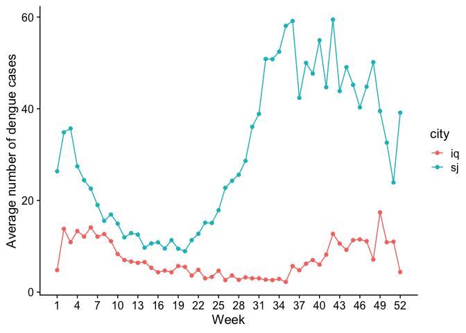
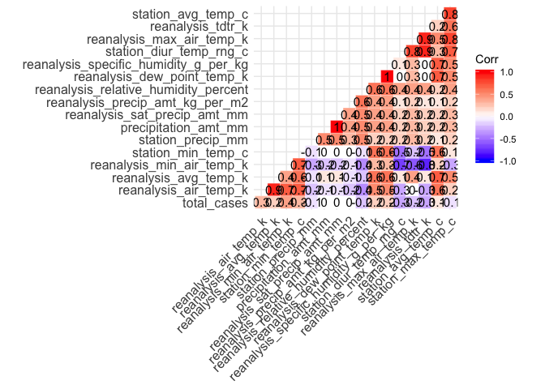
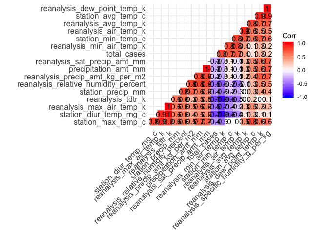

Takehome Midterm
================
Rob Han
04 Mar 2020

# Introduction

For the takehome midterm you will have 48 hours to complete the
objectives listed below. The deadline for submission is 18 March 2020 at
2pm EST.

Date/Time started: March 15, 2020 11:30 AM Date/Time completed: March
16, 2020 10:45 PM

You will be graded on the following criteria:

  - Completion of the objectives
  - Successful knitting of the pdf
  - Readability (tidyness) of Rmd code
  - Acknowledgement of resources

## Loading Libraries

Load all of your libraries in this code block. Indicate why each library
is necessary.

## Objectives for Midterm Exam

  - \[ \] Import, clean, merge data tables
  - \[ \] Present graphical summary of Dengue incidence data
  - \[ \] Data exploration of potential explanatory variables
  - \[ \] Test Benchmark model of Dengue incidence
  - \[ \] Improve model of Dengue incidence

## Background

This dataset should be familiar from Lab 6. We will be using the Dengue
dataset from a Driven Data competition:
<https://www.drivendata.org/competitions/44/dengai-predicting-disease-spread/>

The data for this competition comes from multiple sources aimed at
supporting the Predict the Next Pandemic Initiative
(<https://www.whitehouse.gov/blog/2015/06/05/back-future-using-historical-dengue-data-predict-next-epidemic>).
Dengue surveillance data is provided by the U.S. Centers for Disease
Control and prevention, as well as the Department of Defense’s Naval
Medical Research Unit 6 and the Armed Forces Health Surveillance Center,
in collaboration with the Peruvian government and U.S. universities.
Environmental and climate data is provided by the National Oceanic and
Atmospheric Administration (NOAA), an agency of the U.S. Department of
Commerce.

The data is provided in two separate files:

1.  dengue\_features\_train: weekly weather and vegetation data for two
    cities
2.  dengue\_labels\_train: weekly number of dengue cases in each city

There are two cities, San Juan, Puerto Rico and Iquitos, Peru, with test
data for each city spanning 5 and 3 years respectively. The data for
each city have been concatenated along with a city column indicating the
source: *sj* for San Juan and *iq* for
Iquitos.

``` r
dengue_features_train <- read_csv("https://s3.amazonaws.com/drivendata/data/44/public/dengue_features_train.csv")
```

    ## Parsed with column specification:
    ## cols(
    ##   .default = col_double(),
    ##   city = col_character(),
    ##   week_start_date = col_date(format = "")
    ## )

    ## See spec(...) for full column specifications.

``` r
dengue_labels_train <- read_csv("https://s3.amazonaws.com/drivendata/data/44/public/dengue_labels_train.csv")
```

    ## Parsed with column specification:
    ## cols(
    ##   city = col_character(),
    ##   year = col_double(),
    ##   weekofyear = col_double(),
    ##   total_cases = col_double()
    ## )

## Feature Descriptions

You are provided the following set of information on a (year,
weekofyear) timescale:

(Where appropriate, units are provided as a \_unit suffix on the feature
name.)

City and date indicators

  - city – City abbreviations: sj for San Juan and iq for Iquitos
  - week\_start\_date – Date given in yyyy-mm-dd format

NOAA’s GHCN daily climate data weather station measurements

  - station\_max\_temp\_c – Maximum temperature
  - station\_min\_temp\_c – Minimum temperature
  - station\_avg\_temp\_c – Average temperature
  - station\_precip\_mm – Total precipitation
  - station\_diur\_temp\_rng\_c – Diurnal temperature range

PERSIANN satellite precipitation measurements (0.25x0.25 degree scale)

  - precipitation\_amt\_mm – Total precipitation

NOAA’s NCEP Climate Forecast System Reanalysis measurements (0.5x0.5
degree scale)

  - reanalysis\_sat\_precip\_amt\_mm – Total precipitation
  - reanalysis\_dew\_point\_temp\_k – Mean dew point temperature
  - reanalysis\_air\_temp\_k – Mean air temperature
  - reanalysis\_relative\_humidity\_percent – Mean relative humidity
  - reanalysis\_specific\_humidity\_g\_per\_kg – Mean specific humidity
  - reanalysis\_precip\_amt\_kg\_per\_m2 – Total precipitation
  - reanalysis\_max\_air\_temp\_k – Maximum air temperature
  - reanalysis\_min\_air\_temp\_k – Minimum air temperature
  - reanalysis\_avg\_temp\_k – Average air temperature
  - reanalysis\_tdtr\_k – Diurnal temperature range

Satellite vegetation - Normalized difference vegetation index (NDVI) -
NOAA’s CDR Normalized Difference Vegetation Index (0.5x0.5 degree scale)
measurements

  - ndvi\_se – Pixel southeast of city centroid
  - ndvi\_sw – Pixel southwest of city centroid
  - ndvi\_ne – Pixel northeast of city centroid
  - ndvi\_nw – Pixel northwest of city centroid

# Takehome Exam Begins here

As a reminder, you may consult your previous homework and group
projects, textbook and other readings, and online resources. Online
resources may be used to research ways to solve each problem, but you
may not pose questions in online forums about the specific assignment.
You may consult with Prof. Field or with other classmates about
technical problems (e.g. where to find a file), but not about how to
answer any of the questions.

## (1) Data Wrangling

Use this section to manipulate the two data frames. 1. Follow the
Exploratory Data Analysis Checklist (below) to verify the imported data
a. Check that each variable is the appropriate data class and has values
that makes sense b. For external verification, at a minimum, check that
the annual Dengue incidence numbers for each city are realistic 2. Merge
the two data frames, verifying that no information was lost during the
merge 3. Check the data for NAs both before and after the merge (note
that eliminating all rows or columns with NAs will have consequences)

Import for this data frame looks good, everything seems to have come in
intact with appropriate items in each row/column. We count 548
    NA’s

``` r
str(dengue_features_train)
```

    ## Classes 'spec_tbl_df', 'tbl_df', 'tbl' and 'data.frame': 1456 obs. of  24 variables:
    ##  $ city                                 : chr  "sj" "sj" "sj" "sj" ...
    ##  $ year                                 : num  1990 1990 1990 1990 1990 1990 1990 1990 1990 1990 ...
    ##  $ weekofyear                           : num  18 19 20 21 22 23 24 25 26 27 ...
    ##  $ week_start_date                      : Date, format: "1990-04-30" "1990-05-07" ...
    ##  $ ndvi_ne                              : num  0.1226 0.1699 0.0323 0.1286 0.1962 ...
    ##  $ ndvi_nw                              : num  0.104 0.142 0.173 0.245 0.262 ...
    ##  $ ndvi_se                              : num  0.198 0.162 0.157 0.228 0.251 ...
    ##  $ ndvi_sw                              : num  0.178 0.155 0.171 0.236 0.247 ...
    ##  $ precipitation_amt_mm                 : num  12.42 22.82 34.54 15.36 7.52 ...
    ##  $ reanalysis_air_temp_k                : num  298 298 299 299 300 ...
    ##  $ reanalysis_avg_temp_k                : num  298 298 299 299 300 ...
    ##  $ reanalysis_dew_point_temp_k          : num  292 294 295 295 296 ...
    ##  $ reanalysis_max_air_temp_k            : num  300 301 300 301 302 ...
    ##  $ reanalysis_min_air_temp_k            : num  296 296 297 297 298 ...
    ##  $ reanalysis_precip_amt_kg_per_m2      : num  32 17.9 26.1 13.9 12.2 ...
    ##  $ reanalysis_relative_humidity_percent : num  73.4 77.4 82.1 80.3 80.5 ...
    ##  $ reanalysis_sat_precip_amt_mm         : num  12.42 22.82 34.54 15.36 7.52 ...
    ##  $ reanalysis_specific_humidity_g_per_kg: num  14 15.4 16.8 16.7 17.2 ...
    ##  $ reanalysis_tdtr_k                    : num  2.63 2.37 2.3 2.43 3.01 ...
    ##  $ station_avg_temp_c                   : num  25.4 26.7 26.7 27.5 28.9 ...
    ##  $ station_diur_temp_rng_c              : num  6.9 6.37 6.49 6.77 9.37 ...
    ##  $ station_max_temp_c                   : num  29.4 31.7 32.2 33.3 35 34.4 32.2 33.9 33.9 33.9 ...
    ##  $ station_min_temp_c                   : num  20 22.2 22.8 23.3 23.9 23.9 23.3 22.8 22.8 24.4 ...
    ##  $ station_precip_mm                    : num  16 8.6 41.4 4 5.8 39.1 29.7 21.1 21.1 1.1 ...
    ##  - attr(*, "spec")=
    ##   .. cols(
    ##   ..   city = col_character(),
    ##   ..   year = col_double(),
    ##   ..   weekofyear = col_double(),
    ##   ..   week_start_date = col_date(format = ""),
    ##   ..   ndvi_ne = col_double(),
    ##   ..   ndvi_nw = col_double(),
    ##   ..   ndvi_se = col_double(),
    ##   ..   ndvi_sw = col_double(),
    ##   ..   precipitation_amt_mm = col_double(),
    ##   ..   reanalysis_air_temp_k = col_double(),
    ##   ..   reanalysis_avg_temp_k = col_double(),
    ##   ..   reanalysis_dew_point_temp_k = col_double(),
    ##   ..   reanalysis_max_air_temp_k = col_double(),
    ##   ..   reanalysis_min_air_temp_k = col_double(),
    ##   ..   reanalysis_precip_amt_kg_per_m2 = col_double(),
    ##   ..   reanalysis_relative_humidity_percent = col_double(),
    ##   ..   reanalysis_sat_precip_amt_mm = col_double(),
    ##   ..   reanalysis_specific_humidity_g_per_kg = col_double(),
    ##   ..   reanalysis_tdtr_k = col_double(),
    ##   ..   station_avg_temp_c = col_double(),
    ##   ..   station_diur_temp_rng_c = col_double(),
    ##   ..   station_max_temp_c = col_double(),
    ##   ..   station_min_temp_c = col_double(),
    ##   ..   station_precip_mm = col_double()
    ##   .. )

``` r
cat("rows", nrow(dengue_features_train))
```

    ## rows 1456

``` r
cat("\ncolumns", ncol(dengue_features_train))
```

    ## 
    ## columns 24

``` r
cat("\nNA's", sum(is.na(dengue_features_train)))
```

    ## 
    ## NA's 548

``` r
head(dengue_features_train)
```

    ## # A tibble: 6 x 24
    ##   city   year weekofyear week_start_date ndvi_ne ndvi_nw ndvi_se ndvi_sw
    ##   <chr> <dbl>      <dbl> <date>            <dbl>   <dbl>   <dbl>   <dbl>
    ## 1 sj     1990         18 1990-04-30       0.123    0.104   0.198   0.178
    ## 2 sj     1990         19 1990-05-07       0.170    0.142   0.162   0.155
    ## 3 sj     1990         20 1990-05-14       0.0322   0.173   0.157   0.171
    ## 4 sj     1990         21 1990-05-21       0.129    0.245   0.228   0.236
    ## 5 sj     1990         22 1990-05-28       0.196    0.262   0.251   0.247
    ## 6 sj     1990         23 1990-06-04      NA        0.175   0.254   0.182
    ## # … with 16 more variables: precipitation_amt_mm <dbl>,
    ## #   reanalysis_air_temp_k <dbl>, reanalysis_avg_temp_k <dbl>,
    ## #   reanalysis_dew_point_temp_k <dbl>, reanalysis_max_air_temp_k <dbl>,
    ## #   reanalysis_min_air_temp_k <dbl>, reanalysis_precip_amt_kg_per_m2 <dbl>,
    ## #   reanalysis_relative_humidity_percent <dbl>,
    ## #   reanalysis_sat_precip_amt_mm <dbl>,
    ## #   reanalysis_specific_humidity_g_per_kg <dbl>, reanalysis_tdtr_k <dbl>,
    ## #   station_avg_temp_c <dbl>, station_diur_temp_rng_c <dbl>,
    ## #   station_max_temp_c <dbl>, station_min_temp_c <dbl>, station_precip_mm <dbl>

``` r
tail(dengue_features_train)
```

    ## # A tibble: 6 x 24
    ##   city   year weekofyear week_start_date ndvi_ne ndvi_nw ndvi_se ndvi_sw
    ##   <chr> <dbl>      <dbl> <date>            <dbl>   <dbl>   <dbl>   <dbl>
    ## 1 iq     2010         20 2010-05-21        0.263   0.272   0.258   0.244
    ## 2 iq     2010         21 2010-05-28        0.343   0.319   0.256   0.293
    ## 3 iq     2010         22 2010-06-04        0.160   0.160   0.136   0.226
    ## 4 iq     2010         23 2010-06-11        0.247   0.146   0.250   0.234
    ## 5 iq     2010         24 2010-06-18        0.334   0.246   0.279   0.325
    ## 6 iq     2010         25 2010-06-25        0.298   0.233   0.274   0.316
    ## # … with 16 more variables: precipitation_amt_mm <dbl>,
    ## #   reanalysis_air_temp_k <dbl>, reanalysis_avg_temp_k <dbl>,
    ## #   reanalysis_dew_point_temp_k <dbl>, reanalysis_max_air_temp_k <dbl>,
    ## #   reanalysis_min_air_temp_k <dbl>, reanalysis_precip_amt_kg_per_m2 <dbl>,
    ## #   reanalysis_relative_humidity_percent <dbl>,
    ## #   reanalysis_sat_precip_amt_mm <dbl>,
    ## #   reanalysis_specific_humidity_g_per_kg <dbl>, reanalysis_tdtr_k <dbl>,
    ## #   station_avg_temp_c <dbl>, station_diur_temp_rng_c <dbl>,
    ## #   station_max_temp_c <dbl>, station_min_temp_c <dbl>, station_precip_mm <dbl>

Good import here as well, no NA’s
    found.

``` r
str(dengue_labels_train)
```

    ## Classes 'spec_tbl_df', 'tbl_df', 'tbl' and 'data.frame': 1456 obs. of  4 variables:
    ##  $ city       : chr  "sj" "sj" "sj" "sj" ...
    ##  $ year       : num  1990 1990 1990 1990 1990 1990 1990 1990 1990 1990 ...
    ##  $ weekofyear : num  18 19 20 21 22 23 24 25 26 27 ...
    ##  $ total_cases: num  4 5 4 3 6 2 4 5 10 6 ...
    ##  - attr(*, "spec")=
    ##   .. cols(
    ##   ..   city = col_character(),
    ##   ..   year = col_double(),
    ##   ..   weekofyear = col_double(),
    ##   ..   total_cases = col_double()
    ##   .. )

``` r
cat("rows", nrow(dengue_labels_train))
```

    ## rows 1456

``` r
cat("\ncolumns", ncol(dengue_labels_train))
```

    ## 
    ## columns 4

``` r
cat("\nNA's", sum(is.na(dengue_labels_train)))
```

    ## 
    ## NA's 0

``` r
head(dengue_labels_train)
```

    ## # A tibble: 6 x 4
    ##   city   year weekofyear total_cases
    ##   <chr> <dbl>      <dbl>       <dbl>
    ## 1 sj     1990         18           4
    ## 2 sj     1990         19           5
    ## 3 sj     1990         20           4
    ## 4 sj     1990         21           3
    ## 5 sj     1990         22           6
    ## 6 sj     1990         23           2

``` r
tail(dengue_labels_train)
```

    ## # A tibble: 6 x 4
    ##   city   year weekofyear total_cases
    ##   <chr> <dbl>      <dbl>       <dbl>
    ## 1 iq     2010         20           6
    ## 2 iq     2010         21           5
    ## 3 iq     2010         22           8
    ## 4 iq     2010         23           1
    ## 5 iq     2010         24           1
    ## 6 iq     2010         25           4

### Validate with at least one external data source

We have a publication from the CDC stating San Juan reported had 4,677
diagnosed cases of dengue in 1998 our dataset when we filter for San
Juan in 1998 says we have 4,595 cases which appears close enough to what
was reported by the
CDC.

<https://www.cdc.gov/mmwr/preview/mmwrhtml/00055624.htm>

``` r
sanjuan1994 <- dplyr::filter(dengue_labels_train, year == "1998"&city == "sj")
sum(sanjuan1994$total_cases)
```

    ## [1] 4595

### Merging the features and labels data frames

Although there are dplyr functions for data frame merging, the base
`merge()` function is easier to use.

Taking a cursory look at the two data frames, it looks like the only
column that needs to be merged is total\_cases in dengue\_labels\_train.

``` r
dengue_features_train$total_cases <- dengue_labels_train$total_cases
head(dengue_features_train)
```

    ## # A tibble: 6 x 25
    ##   city   year weekofyear week_start_date ndvi_ne ndvi_nw ndvi_se ndvi_sw
    ##   <chr> <dbl>      <dbl> <date>            <dbl>   <dbl>   <dbl>   <dbl>
    ## 1 sj     1990         18 1990-04-30       0.123    0.104   0.198   0.178
    ## 2 sj     1990         19 1990-05-07       0.170    0.142   0.162   0.155
    ## 3 sj     1990         20 1990-05-14       0.0322   0.173   0.157   0.171
    ## 4 sj     1990         21 1990-05-21       0.129    0.245   0.228   0.236
    ## 5 sj     1990         22 1990-05-28       0.196    0.262   0.251   0.247
    ## 6 sj     1990         23 1990-06-04      NA        0.175   0.254   0.182
    ## # … with 17 more variables: precipitation_amt_mm <dbl>,
    ## #   reanalysis_air_temp_k <dbl>, reanalysis_avg_temp_k <dbl>,
    ## #   reanalysis_dew_point_temp_k <dbl>, reanalysis_max_air_temp_k <dbl>,
    ## #   reanalysis_min_air_temp_k <dbl>, reanalysis_precip_amt_kg_per_m2 <dbl>,
    ## #   reanalysis_relative_humidity_percent <dbl>,
    ## #   reanalysis_sat_precip_amt_mm <dbl>,
    ## #   reanalysis_specific_humidity_g_per_kg <dbl>, reanalysis_tdtr_k <dbl>,
    ## #   station_avg_temp_c <dbl>, station_diur_temp_rng_c <dbl>,
    ## #   station_max_temp_c <dbl>, station_min_temp_c <dbl>,
    ## #   station_precip_mm <dbl>, total_cases <dbl>

Checking the data frame post merge we see everything looks as we’d
expect.

``` r
str(dengue_features_train)
```

    ## Classes 'spec_tbl_df', 'tbl_df', 'tbl' and 'data.frame': 1456 obs. of  25 variables:
    ##  $ city                                 : chr  "sj" "sj" "sj" "sj" ...
    ##  $ year                                 : num  1990 1990 1990 1990 1990 1990 1990 1990 1990 1990 ...
    ##  $ weekofyear                           : num  18 19 20 21 22 23 24 25 26 27 ...
    ##  $ week_start_date                      : Date, format: "1990-04-30" "1990-05-07" ...
    ##  $ ndvi_ne                              : num  0.1226 0.1699 0.0323 0.1286 0.1962 ...
    ##  $ ndvi_nw                              : num  0.104 0.142 0.173 0.245 0.262 ...
    ##  $ ndvi_se                              : num  0.198 0.162 0.157 0.228 0.251 ...
    ##  $ ndvi_sw                              : num  0.178 0.155 0.171 0.236 0.247 ...
    ##  $ precipitation_amt_mm                 : num  12.42 22.82 34.54 15.36 7.52 ...
    ##  $ reanalysis_air_temp_k                : num  298 298 299 299 300 ...
    ##  $ reanalysis_avg_temp_k                : num  298 298 299 299 300 ...
    ##  $ reanalysis_dew_point_temp_k          : num  292 294 295 295 296 ...
    ##  $ reanalysis_max_air_temp_k            : num  300 301 300 301 302 ...
    ##  $ reanalysis_min_air_temp_k            : num  296 296 297 297 298 ...
    ##  $ reanalysis_precip_amt_kg_per_m2      : num  32 17.9 26.1 13.9 12.2 ...
    ##  $ reanalysis_relative_humidity_percent : num  73.4 77.4 82.1 80.3 80.5 ...
    ##  $ reanalysis_sat_precip_amt_mm         : num  12.42 22.82 34.54 15.36 7.52 ...
    ##  $ reanalysis_specific_humidity_g_per_kg: num  14 15.4 16.8 16.7 17.2 ...
    ##  $ reanalysis_tdtr_k                    : num  2.63 2.37 2.3 2.43 3.01 ...
    ##  $ station_avg_temp_c                   : num  25.4 26.7 26.7 27.5 28.9 ...
    ##  $ station_diur_temp_rng_c              : num  6.9 6.37 6.49 6.77 9.37 ...
    ##  $ station_max_temp_c                   : num  29.4 31.7 32.2 33.3 35 34.4 32.2 33.9 33.9 33.9 ...
    ##  $ station_min_temp_c                   : num  20 22.2 22.8 23.3 23.9 23.9 23.3 22.8 22.8 24.4 ...
    ##  $ station_precip_mm                    : num  16 8.6 41.4 4 5.8 39.1 29.7 21.1 21.1 1.1 ...
    ##  $ total_cases                          : num  4 5 4 3 6 2 4 5 10 6 ...
    ##  - attr(*, "spec")=
    ##   .. cols(
    ##   ..   city = col_character(),
    ##   ..   year = col_double(),
    ##   ..   weekofyear = col_double(),
    ##   ..   week_start_date = col_date(format = ""),
    ##   ..   ndvi_ne = col_double(),
    ##   ..   ndvi_nw = col_double(),
    ##   ..   ndvi_se = col_double(),
    ##   ..   ndvi_sw = col_double(),
    ##   ..   precipitation_amt_mm = col_double(),
    ##   ..   reanalysis_air_temp_k = col_double(),
    ##   ..   reanalysis_avg_temp_k = col_double(),
    ##   ..   reanalysis_dew_point_temp_k = col_double(),
    ##   ..   reanalysis_max_air_temp_k = col_double(),
    ##   ..   reanalysis_min_air_temp_k = col_double(),
    ##   ..   reanalysis_precip_amt_kg_per_m2 = col_double(),
    ##   ..   reanalysis_relative_humidity_percent = col_double(),
    ##   ..   reanalysis_sat_precip_amt_mm = col_double(),
    ##   ..   reanalysis_specific_humidity_g_per_kg = col_double(),
    ##   ..   reanalysis_tdtr_k = col_double(),
    ##   ..   station_avg_temp_c = col_double(),
    ##   ..   station_diur_temp_rng_c = col_double(),
    ##   ..   station_max_temp_c = col_double(),
    ##   ..   station_min_temp_c = col_double(),
    ##   ..   station_precip_mm = col_double()
    ##   .. )

``` r
cat("rows", nrow(dengue_features_train))
```

    ## rows 1456

``` r
cat("\ncolumns", ncol(dengue_features_train))
```

    ## 
    ## columns 25

``` r
cat("\nNA's", sum(is.na(dengue_features_train)))
```

    ## 
    ## NA's 548

``` r
head(dengue_features_train)
```

    ## # A tibble: 6 x 25
    ##   city   year weekofyear week_start_date ndvi_ne ndvi_nw ndvi_se ndvi_sw
    ##   <chr> <dbl>      <dbl> <date>            <dbl>   <dbl>   <dbl>   <dbl>
    ## 1 sj     1990         18 1990-04-30       0.123    0.104   0.198   0.178
    ## 2 sj     1990         19 1990-05-07       0.170    0.142   0.162   0.155
    ## 3 sj     1990         20 1990-05-14       0.0322   0.173   0.157   0.171
    ## 4 sj     1990         21 1990-05-21       0.129    0.245   0.228   0.236
    ## 5 sj     1990         22 1990-05-28       0.196    0.262   0.251   0.247
    ## 6 sj     1990         23 1990-06-04      NA        0.175   0.254   0.182
    ## # … with 17 more variables: precipitation_amt_mm <dbl>,
    ## #   reanalysis_air_temp_k <dbl>, reanalysis_avg_temp_k <dbl>,
    ## #   reanalysis_dew_point_temp_k <dbl>, reanalysis_max_air_temp_k <dbl>,
    ## #   reanalysis_min_air_temp_k <dbl>, reanalysis_precip_amt_kg_per_m2 <dbl>,
    ## #   reanalysis_relative_humidity_percent <dbl>,
    ## #   reanalysis_sat_precip_amt_mm <dbl>,
    ## #   reanalysis_specific_humidity_g_per_kg <dbl>, reanalysis_tdtr_k <dbl>,
    ## #   station_avg_temp_c <dbl>, station_diur_temp_rng_c <dbl>,
    ## #   station_max_temp_c <dbl>, station_min_temp_c <dbl>,
    ## #   station_precip_mm <dbl>, total_cases <dbl>

``` r
tail(dengue_features_train)
```

    ## # A tibble: 6 x 25
    ##   city   year weekofyear week_start_date ndvi_ne ndvi_nw ndvi_se ndvi_sw
    ##   <chr> <dbl>      <dbl> <date>            <dbl>   <dbl>   <dbl>   <dbl>
    ## 1 iq     2010         20 2010-05-21        0.263   0.272   0.258   0.244
    ## 2 iq     2010         21 2010-05-28        0.343   0.319   0.256   0.293
    ## 3 iq     2010         22 2010-06-04        0.160   0.160   0.136   0.226
    ## 4 iq     2010         23 2010-06-11        0.247   0.146   0.250   0.234
    ## 5 iq     2010         24 2010-06-18        0.334   0.246   0.279   0.325
    ## 6 iq     2010         25 2010-06-25        0.298   0.233   0.274   0.316
    ## # … with 17 more variables: precipitation_amt_mm <dbl>,
    ## #   reanalysis_air_temp_k <dbl>, reanalysis_avg_temp_k <dbl>,
    ## #   reanalysis_dew_point_temp_k <dbl>, reanalysis_max_air_temp_k <dbl>,
    ## #   reanalysis_min_air_temp_k <dbl>, reanalysis_precip_amt_kg_per_m2 <dbl>,
    ## #   reanalysis_relative_humidity_percent <dbl>,
    ## #   reanalysis_sat_precip_amt_mm <dbl>,
    ## #   reanalysis_specific_humidity_g_per_kg <dbl>, reanalysis_tdtr_k <dbl>,
    ## #   station_avg_temp_c <dbl>, station_diur_temp_rng_c <dbl>,
    ## #   station_max_temp_c <dbl>, station_min_temp_c <dbl>,
    ## #   station_precip_mm <dbl>, total_cases <dbl>

### Dealing with the NAs

Check out the `tidyr::fill()` function for one way to take care of NAs.

Earlier we mentioned thatnthere are 548 NA’s in the data frame. One way
for dealing with these is the na.omit function which will remove rows
from the dataset where NA’s are present. After running the function, we
end up with approximately 200 less rows than we started with.

``` r
dengue_features_train <- na.omit(dengue_features_train)
head(dengue_features_train)
```

    ## # A tibble: 6 x 25
    ##   city   year weekofyear week_start_date ndvi_ne ndvi_nw ndvi_se ndvi_sw
    ##   <chr> <dbl>      <dbl> <date>            <dbl>   <dbl>   <dbl>   <dbl>
    ## 1 sj     1990         18 1990-04-30       0.123   0.104    0.198   0.178
    ## 2 sj     1990         19 1990-05-07       0.170   0.142    0.162   0.155
    ## 3 sj     1990         20 1990-05-14       0.0322  0.173    0.157   0.171
    ## 4 sj     1990         21 1990-05-21       0.129   0.245    0.228   0.236
    ## 5 sj     1990         22 1990-05-28       0.196   0.262    0.251   0.247
    ## 6 sj     1990         24 1990-06-11       0.113   0.0928   0.205   0.210
    ## # … with 17 more variables: precipitation_amt_mm <dbl>,
    ## #   reanalysis_air_temp_k <dbl>, reanalysis_avg_temp_k <dbl>,
    ## #   reanalysis_dew_point_temp_k <dbl>, reanalysis_max_air_temp_k <dbl>,
    ## #   reanalysis_min_air_temp_k <dbl>, reanalysis_precip_amt_kg_per_m2 <dbl>,
    ## #   reanalysis_relative_humidity_percent <dbl>,
    ## #   reanalysis_sat_precip_amt_mm <dbl>,
    ## #   reanalysis_specific_humidity_g_per_kg <dbl>, reanalysis_tdtr_k <dbl>,
    ## #   station_avg_temp_c <dbl>, station_diur_temp_rng_c <dbl>,
    ## #   station_max_temp_c <dbl>, station_min_temp_c <dbl>,
    ## #   station_precip_mm <dbl>, total_cases <dbl>

``` r
nrow(dengue_features_train)
```

    ## [1] 1199

## (2) What is the average number of cases of Dengue for each week of the year for each city?

Provide a publication-quality graphic to present this comparison. The
graph should span a single year, with the average incidence for each
week of the year. You are encouraged to explore options, but only your
final graph in this section will be used to evaluate this objective.
Consider the most effective way to illustrate any trends or important
comparisons within the data.

In order to get the averages for each week we ought to filter out
unnecessary data such as weather, then create a new dataset as the data
frame with the averages will be a different size than the original one.
Alternatively we could have used the dengue\_labels\_train dataset which
has only the information we need for this visualization and no NA’s. We
can create the new dataframe with the calculated averages using the
aggregate()
function.

<https://stackoverflow.com/questions/23775683/calculate-average-value-over-multiple-years-for-each-hour-and-day>

``` r
dengue_simple <- dplyr::select(dengue_features_train, city, weekofyear, total_cases, everything())
dengue_simple <- dplyr::select(dengue_simple, 1:3)
head(dengue_simple)
```

    ## # A tibble: 6 x 3
    ##   city  weekofyear total_cases
    ##   <chr>      <dbl>       <dbl>
    ## 1 sj            18           4
    ## 2 sj            19           5
    ## 3 sj            20           4
    ## 4 sj            21           3
    ## 5 sj            22           6
    ## 6 sj            24           4

``` r
dengue_avg_week <- aggregate(dengue_simple$total_cases, by = list(dengue_simple$city, dengue_simple$weekofyear), mean)
dengue_avg_week <- rename(dengue_avg_week, city = Group.1, weekofyear = Group.2, avg_cases = x)
head(dengue_avg_week)
```

    ##   city weekofyear avg_cases
    ## 1   iq          1   4.80000
    ## 2   sj          1  26.35714
    ## 3   iq          2  13.80000
    ## 4   sj          2  34.84615
    ## 5   iq          3  10.88889
    ## 6   sj          3  35.69231

I thought a marked scatterplot would be best for this visualization as
it will show individual datapoints and give a better sense of possible
trends than either a scatterplot or line plot alone. Checking out the
visualization we see that cases of dengue increas towards the third
quarter of the year and San Juan has higher dengue incidence than
Iquitos throughout the entire year especially between weeks 25 and 50

Note that 53 comes up as a week in the plot (line extends slightly past
52). I’m not sure why but at some points in the dataset a 53rd week was
recorded. It’s clear that some 52nd weeks may have been mislabeled. It’s
not a big deal and can be
fixed.

<https://dplyr.tidyverse.org/reference/select.html>

``` r
ggplot(dengue_avg_week, aes(x = weekofyear, y = avg_cases, color = city)) +
  geom_point() + 
  geom_line() +
  scale_x_continuous(breaks = round(seq(min(dengue_avg_week$weekofyear), max(dengue_avg_week$weekofyear), by = 3))) +
  xlab("Week") +
  ylab("Average number of dengue cases") +
  theme_cowplot()
```

<!-- -->

For the sake of not editing the original data we’re going to create a
new dataset with the fix. I suspect that for a couple of the years week
data was misinputted as 53 when it’s supposed to be 52 since that’s how
it is in the csv file. With that in mind we will try to change values
from 53 to 52. Since I’m not super sure about what’s going on we will
only use this modified dataset to revisualize the last figure in case
there’s a large change. in order to do this we’ll use the replace()
function to replace instances of 53 with 52.

Alternatively if we didn’t have a suspicion about the error we could
have filtered out week 53 with the dplyr::filter()
function.

<https://stackoverflow.com/questions/5824173/replace-a-value-in-a-data-frame-based-on-a-conditional-if-statement>

``` r
no_53 <- dengue_simple
no_53$weekofyear <- replace(no_53$weekofyear, no_53$weekofyear == 53,  52)

no_53_df <- aggregate(no_53$total_cases, by = list(no_53$city, no_53$weekofyear), mean)
no_53_df <- rename(no_53_df, city = Group.1, weekofyear = Group.2, avg_cases = x)
head(no_53_df)
```

    ##   city weekofyear avg_cases
    ## 1   iq          1   4.80000
    ## 2   sj          1  26.35714
    ## 3   iq          2  13.80000
    ## 4   sj          2  34.84615
    ## 5   iq          3  10.88889
    ## 6   sj          3  35.69231

``` r
ggplot(no_53_df, aes(x = weekofyear, y = avg_cases, color = city)) +
  geom_line() + 
  geom_point() +
  scale_x_continuous(breaks = round(seq(min(no_53$weekofyear), max(no_53$weekofyear), by = 3))) +
  xlab("Week") +
  ylab("Average number of dengue cases") +
  theme_cowplot()
```

<!-- -->

In hindsight, the shape of the data doesn’t look too different and the
53rd week might actually represent a 53rd week since 7 does not divide
evenly into 365. Regardless, the replace() function is a really neat
tool since otherwise I’d have had to create a for loop with logic to get
the same result.

## (3) Data exploration of potential explanatory variables

Consider whether transforming any of the variables might increase the
statistical power available. Explore the correlation of the potential
explanatory variables with each other and with dengue incidence. Present
a two or more publication-quality graphics to illustrate your most
important findings.

### Exploration

Lets take a look at a few variables in the context of their contribution
to dengue incidence. We know that dengue is a mosquito borne illness and
mosquitos typically come out when the weather is warm so that could be a
good starting point.

First we’ll check the distribtion of the data. From the Shapiro test, it
looks like the data is not normally distributed (avg\_t: p = 3.487e-16,
min\_t: p = 1.143e-10, max\_t: p = 1.801e-11). All three variables have
a left skew (avg\_t: -0.622526, min\_t: -0.2843803, max\_t: -0.2714032).
According to some sources a skewness between -0.8 and 0.8 is acceptable
so we’ll say the distribution is approximately symmetric.

The log10 transformation did not appear to greatly improve the
distribution so we will forego
that.

<https://www.researchgate.net/post/What_is_the_acceptable_range_of_skewness_and_kurtosis_for_normal_distribution_of_data>

``` r
simple.eda((dengue_features_train$station_avg_temp_c))
```

<!-- -->

``` r
simple.eda(dengue_features_train$station_min_temp_c)
```

<!-- -->

``` r
simple.eda(dengue_features_train$station_max_temp_c)
```

<!-- -->

``` r
shapiro.test((dengue_features_train$station_avg_temp_c))
```

    ## 
    ##  Shapiro-Wilk normality test
    ## 
    ## data:  (dengue_features_train$station_avg_temp_c)
    ## W = 0.96584, p-value = 3.487e-16

``` r
skewness(dengue_features_train$station_avg_temp_c)
```

    ## [1] -0.622526

``` r
shapiro.test((dengue_features_train$station_min_temp_c))
```

    ## 
    ##  Shapiro-Wilk normality test
    ## 
    ## data:  (dengue_features_train$station_min_temp_c)
    ## W = 0.98293, p-value = 1.143e-10

``` r
skewness(dengue_features_train$station_min_temp_c)
```

    ## [1] -0.2843803

``` r
shapiro.test((dengue_features_train$station_max_temp_c))
```

    ## 
    ##  Shapiro-Wilk normality test
    ## 
    ## data:  (dengue_features_train$station_max_temp_c)
    ## W = 0.98091, p-value = 1.801e-11

``` r
skewness(dengue_features_train$station_max_temp_c)
```

    ## [1] -0.2714032

We’ll do something similar to earlier but apply the aggregate() function
to every variable using city and week of year as grouping variables.
First we’ll remove year and week start date though because those won’t
give us meaningful
information.

``` r
dengue_features_train <- dplyr::select(dengue_features_train, -(year), -(week_start_date))
avg_all <- aggregate(.~city + weekofyear, dengue_features_train, mean)
head(avg_all)
```

    ##   city weekofyear     ndvi_ne    ndvi_nw   ndvi_se   ndvi_sw
    ## 1   iq          1 0.303763360 0.24458572 0.2884571 0.2776486
    ## 2   sj          1 0.064443450 0.02810167 0.1653653 0.1500810
    ## 3   iq          2 0.289377230 0.26014924 0.2696274 0.3030291
    ## 4   sj          2 0.044868585 0.07359102 0.1999353 0.1677575
    ## 5   iq          3 0.254818300 0.21799704 0.2510483 0.2618251
    ## 6   sj          3 0.007229492 0.04615846 0.1948121 0.1817363
    ##   precipitation_amt_mm reanalysis_air_temp_k reanalysis_avg_temp_k
    ## 1             65.34400              297.9837              299.1786
    ## 2             11.69571              298.1237              298.2133
    ## 3             65.13000              297.8793              299.1800
    ## 4             30.31769              298.1064              298.2049
    ## 5             74.54000              298.2241              299.5627
    ## 6             31.03154              297.7421              297.8374
    ##   reanalysis_dew_point_temp_k reanalysis_max_air_temp_k
    ## 1                    296.4303                  306.5600
    ## 2                    293.8219                  300.1000
    ## 3                    295.9459                  306.6800
    ## 4                    293.8871                  300.0462
    ## 5                    296.1606                  306.7778
    ## 6                    293.7873                  299.9846
    ##   reanalysis_min_air_temp_k reanalysis_precip_amt_kg_per_m2
    ## 1                  293.1000                        70.64200
    ## 2                  296.2214                        18.81214
    ## 3                  293.4700                        70.65400
    ## 4                  296.5000                        23.44000
    ## 5                  293.8222                        49.31222
    ## 6                  295.7769                        30.59615
    ##   reanalysis_relative_humidity_percent reanalysis_sat_precip_amt_mm
    ## 1                             92.50743                     65.34400
    ## 2                             77.21663                     11.69571
    ## 3                             90.67186                     65.13000
    ## 4                             77.59451                     30.31769
    ## 5                             89.89444                     74.54000
    ## 6                             78.87934                     31.03154
    ##   reanalysis_specific_humidity_g_per_kg reanalysis_tdtr_k station_avg_temp_c
    ## 1                              18.05171          8.431429           27.76667
    ## 2                              15.23520          2.142857           25.32245
    ## 3                              17.55329          8.271429           27.62383
    ## 4                              15.27846          2.238462           25.25275
    ## 5                              17.77746          8.560317           28.08574
    ## 6                              15.20099          2.281319           25.00989
    ##   station_diur_temp_rng_c station_max_temp_c station_min_temp_c
    ## 1                9.490000           33.20000           22.34000
    ## 2                6.346939           29.55000           21.05000
    ## 3                9.985000           33.86000           21.88000
    ## 4                6.527473           29.35385           21.08462
    ## 5               10.528519           34.17778           22.02222
    ## 6                6.482418           29.56154           20.70000
    ##   station_precip_mm total_cases
    ## 1          77.08000     4.80000
    ## 2          25.13571    26.35714
    ## 3          79.85000    13.80000
    ## 4          26.37692    34.84615
    ## 5          95.60000    10.88889
    ## 6          37.24615    35.69231

Our visualization is not great, we can see some hints at a trend where
increases in temperature increase the number of dengue cases. The shaded
regions are from a nonbinomial glm using the MASS package.  
We see a lot of data points fall outside of the shading so maybe this
visualization isn’t as informative as we hoped.

<https://ggplot2.tidyverse.org/reference/geom_smooth.html>
<https://www.dummies.com/programming/r/how-to-round-off-numbers-in-r/>
<https://stats.stackexchange.com/questions/164889/how-to-deal-with-non-integer-warning-from-negative-binomial-glm>

Perhaps other variables will present better results.

``` r
data = avg_all
x = data$reanalysis_avg_temp_k
y = trunc(data$total_cases) # Truncate because glm.nb is expecting (whole number) counts here

ggplot(avg_all, aes(x =  x, y = y, color = city)) +
  geom_smooth(method = MASS::glm.nb) + 
  geom_point() + 
  scale_x_continuous(breaks = round(seq(min(avg_all$station_min_temp_c), max(avg_all$station_max_temp_c), by = 3))) +
  xlab("Temperature (C)") +
  ylab("Average number of dengue cases") +
  theme_cowplot()
```

<!-- -->

Now looking at humidity we see that San Juan has lower average humidity
than Iquitos. This lower humidity may be associated with higher
incidence of dengue but we can’t be sure yet. We still see a lot of
variability here. This is also a pretty strange looking graph so maybe
the other measure of humidity will give something better.

``` r
data = avg_all
x = data$reanalysis_relative_humidity_percent
y = trunc(data$total_cases)

ggplot(data, aes(x = x, y = y, color = city)) +
  geom_smooth(method = MASS::glm.nb) + 
  geom_point() +
  xlab("Humidity (%)") +
  ylab("Average dengue cases") +
  theme_cowplot()
```

<!-- -->

This visualization of humidity appears to show a stronger relationship
between humidity and dengue incidence as an positive trend is clearly
evident.

``` r
data = avg_all
x = data$reanalysis_specific_humidity_g_per_kg 
y = trunc(data$total_cases)

ggplot(data, aes(x = x, y = y, color = city)) +
  geom_smooth(method = MASS::glm.nb) + 
  geom_point() +
  xlab("Average humidity (g/kg)") +
  ylab("Average dengue cases") +
  theme_cowplot()
```

<!-- -->

It’s kinda interesting that when we look at humidity here we get an
eerily similar visualization as we do when looking at the second
humidity figure. Are the two related?

``` r
data = avg_all
x = data$reanalysis_dew_point_temp_k
y = trunc(data$total_cases)  
ggplot(data, aes(x = x, y = y, color = city)) +
  geom_smooth(method = MASS::glm.nb) + 
  geom_point() +
  xlab("Average dewpoint temperature (K)") +
  ylab("Average dengue cases") +
  theme_cowplot()
```

<!-- -->

Unsurprisingly they are at least somewhat related. We see that increases
in humidity are correlated with increases in dewpoint temperature.

``` r
data = avg_all
x = data$reanalysis_dew_point_temp_k
y = trunc(data$reanalysis_specific_humidity_g_per_kg)
ggplot(data, aes(x = x, y = y, color = city)) +
  geom_smooth(method = MASS::glm.nb) + 
  geom_point() +
  xlab("Average dewpoint temperature (K)") +
  ylab("Average humidity (g/kg)") +
  theme_cowplot()
```

<!-- -->

Looking at precipitation isn’t very informative, we barely capture any
of the datapoints from iq.

``` r
data = avg_all
x = data$reanalysis_precip_amt_kg_per_m2
y = trunc(data$total_cases)  
ggplot(data, aes(x = x, y = y, color = city)) +
  geom_smooth(method = MASS::glm.nb) + 
  geom_point() +
  xlab("Precipitation (kg/m2)") +
  ylab("Average dengue cases") +
  theme_cowplot()
```

<!-- -->

All in all we see that San Juan has more cases of dengue than Izquitos.
There are some subtle relationships between a few of the meteorological
variables such as temperature and wetness and the number of dengue cases
but they are as I said subtle.

Explore the data here.

### Presentation

Most important findings repeated from above.

``` r
data = avg_all
x = data$reanalysis_avg_temp_k
y = trunc(data$total_cases) # Truncate because glm.nb is expecting (whole number) counts here

ggplot(avg_all, aes(x =  x, y = y, color = city)) +
  geom_smooth(method = MASS::glm.nb) + 
  geom_point() + 
  scale_x_continuous(breaks = round(seq(min(avg_all$station_min_temp_c), max(avg_all$station_max_temp_c), by = 3))) +
  xlab("Temperature (C)") +
  ylab("Average number of dengue cases") +
  theme_cowplot()
```

<!-- -->

``` r
data = avg_all
x = data$reanalysis_specific_humidity_g_per_kg 
y = trunc(data$total_cases)

ggplot(data, aes(x = x, y = y, color = city)) +
  geom_smooth(method = MASS::glm.nb) + 
  geom_point() +
  xlab("Average humidity (g/kg)") +
  ylab("Average dengue cases") +
  theme_cowplot()
```

<!-- -->

## (4) Dengue incidence model

Use a generalized linear model to determine the best model for the
weekly incidence of Dengue. At a first pass consider the “Benchmark”
model described here:
<https://shaulab.github.io/DrivenData/DengAI/Benchmark.html> This model
is calculated separately for San Jose and Iquitos and only uses the
following variables: - reanalysis\_specific\_humidity\_g\_per\_kg -
reanalysis\_dew\_point\_temp\_k - station\_avg\_temp\_c -
station\_min\_temp\_c

The code for the Benchmark model uses a machine learning approach to
optimize the model. You should use the model selection approach that we
have used in BIOL 364, instead. The total\_cases outcome variable is a
count - statistically it is a binomial variable that has been summed up
over a period of time (a week, in this case). Generalized linear models
should use a negative binomial distribution (as opposed to a Gaussian
distribution, which is what `glm()` assumes) for this type of data. To
fit a negative binomial distribution use `glm.nb()` from the package
`MASS` instead of the `glm()` function from `stats`.

Like <https://shaulab.github.io/DrivenData/DengAI/Benchmark.html>
described in their correlation plot, we see that total\_cases does not
have much correlation with the other variables. However, when we apply
the correlation plot to the averaged dataset we find strongish
correlations to minimum air temperatures.

``` r
dengue_features_train %>%
  dplyr::select(precipitation_amt_mm: total_cases) %>%
  as.matrix() -> dengue_matrix

dcorr <- round(cor(dengue_matrix, use = "complete.obs"), 1)
print(dcorr)
```

    ##                                       precipitation_amt_mm
    ## precipitation_amt_mm                                   1.0
    ## reanalysis_air_temp_k                                 -0.1
    ## reanalysis_avg_temp_k                                  0.1
    ## reanalysis_dew_point_temp_k                            0.4
    ## reanalysis_max_air_temp_k                              0.3
    ## reanalysis_min_air_temp_k                             -0.2
    ## reanalysis_precip_amt_kg_per_m2                        0.4
    ## reanalysis_relative_humidity_percent                   0.5
    ## reanalysis_sat_precip_amt_mm                           1.0
    ## reanalysis_specific_humidity_g_per_kg                  0.4
    ## reanalysis_tdtr_k                                      0.2
    ## station_avg_temp_c                                     0.2
    ## station_diur_temp_rng_c                                0.2
    ## station_max_temp_c                                     0.3
    ## station_min_temp_c                                     0.0
    ## station_precip_mm                                      0.5
    ## total_cases                                            0.0
    ##                                       reanalysis_air_temp_k
    ## precipitation_amt_mm                                   -0.1
    ## reanalysis_air_temp_k                                   1.0
    ## reanalysis_avg_temp_k                                   0.9
    ## reanalysis_dew_point_temp_k                             0.5
    ## reanalysis_max_air_temp_k                               0.0
    ## reanalysis_min_air_temp_k                               0.7
    ## reanalysis_precip_amt_kg_per_m2                        -0.2
    ## reanalysis_relative_humidity_percent                   -0.4
    ## reanalysis_sat_precip_amt_mm                           -0.1
    ## reanalysis_specific_humidity_g_per_kg                   0.5
    ## reanalysis_tdtr_k                                      -0.3
    ## station_avg_temp_c                                      0.6
    ## station_diur_temp_rng_c                                -0.3
    ## station_max_temp_c                                      0.2
    ## station_min_temp_c                                      0.7
    ## station_precip_mm                                      -0.2
    ## total_cases                                             0.3
    ##                                       reanalysis_avg_temp_k
    ## precipitation_amt_mm                                    0.1
    ## reanalysis_air_temp_k                                   0.9
    ## reanalysis_avg_temp_k                                   1.0
    ## reanalysis_dew_point_temp_k                             0.6
    ## reanalysis_max_air_temp_k                               0.4
    ## reanalysis_min_air_temp_k                               0.4
    ## reanalysis_precip_amt_kg_per_m2                        -0.1
    ## reanalysis_relative_humidity_percent                   -0.2
    ## reanalysis_sat_precip_amt_mm                            0.1
    ## reanalysis_specific_humidity_g_per_kg                   0.6
    ## reanalysis_tdtr_k                                       0.1
    ## station_avg_temp_c                                      0.7
    ## station_diur_temp_rng_c                                 0.1
    ## station_max_temp_c                                      0.5
    ## station_min_temp_c                                      0.6
    ## station_precip_mm                                      -0.1
    ## total_cases                                             0.2
    ##                                       reanalysis_dew_point_temp_k
    ## precipitation_amt_mm                                          0.4
    ## reanalysis_air_temp_k                                         0.5
    ## reanalysis_avg_temp_k                                         0.6
    ## reanalysis_dew_point_temp_k                                   1.0
    ## reanalysis_max_air_temp_k                                     0.3
    ## reanalysis_min_air_temp_k                                     0.3
    ## reanalysis_precip_amt_kg_per_m2                               0.4
    ## reanalysis_relative_humidity_percent                          0.6
    ## reanalysis_sat_precip_amt_mm                                  0.4
    ## reanalysis_specific_humidity_g_per_kg                         1.0
    ## reanalysis_tdtr_k                                             0.0
    ## station_avg_temp_c                                            0.7
    ## station_diur_temp_rng_c                                       0.0
    ## station_max_temp_c                                            0.5
    ## station_min_temp_c                                            0.6
    ## station_precip_mm                                             0.2
    ## total_cases                                                   0.2
    ##                                       reanalysis_max_air_temp_k
    ## precipitation_amt_mm                                        0.3
    ## reanalysis_air_temp_k                                       0.0
    ## reanalysis_avg_temp_k                                       0.4
    ## reanalysis_dew_point_temp_k                                 0.3
    ## reanalysis_max_air_temp_k                                   1.0
    ## reanalysis_min_air_temp_k                                  -0.6
    ## reanalysis_precip_amt_kg_per_m2                             0.2
    ## reanalysis_relative_humidity_percent                        0.4
    ## reanalysis_sat_precip_amt_mm                                0.3
    ## reanalysis_specific_humidity_g_per_kg                       0.3
    ## reanalysis_tdtr_k                                           0.9
    ## station_avg_temp_c                                          0.5
    ## station_diur_temp_rng_c                                     0.8
    ## station_max_temp_c                                          0.8
    ## station_min_temp_c                                         -0.2
    ## station_precip_mm                                           0.3
    ## total_cases                                                -0.2
    ##                                       reanalysis_min_air_temp_k
    ## precipitation_amt_mm                                       -0.2
    ## reanalysis_air_temp_k                                       0.7
    ## reanalysis_avg_temp_k                                       0.4
    ## reanalysis_dew_point_temp_k                                 0.3
    ## reanalysis_max_air_temp_k                                  -0.6
    ## reanalysis_min_air_temp_k                                   1.0
    ## reanalysis_precip_amt_kg_per_m2                            -0.1
    ## reanalysis_relative_humidity_percent                       -0.4
    ## reanalysis_sat_precip_amt_mm                               -0.2
    ## reanalysis_specific_humidity_g_per_kg                       0.3
    ## reanalysis_tdtr_k                                          -0.8
    ## station_avg_temp_c                                          0.2
    ## station_diur_temp_rng_c                                    -0.7
    ## station_max_temp_c                                         -0.3
    ## station_min_temp_c                                          0.7
    ## station_precip_mm                                          -0.3
    ## total_cases                                                 0.4
    ##                                       reanalysis_precip_amt_kg_per_m2
    ## precipitation_amt_mm                                              0.4
    ## reanalysis_air_temp_k                                            -0.2
    ## reanalysis_avg_temp_k                                            -0.1
    ## reanalysis_dew_point_temp_k                                       0.4
    ## reanalysis_max_air_temp_k                                         0.2
    ## reanalysis_min_air_temp_k                                        -0.1
    ## reanalysis_precip_amt_kg_per_m2                                   1.0
    ## reanalysis_relative_humidity_percent                              0.6
    ## reanalysis_sat_precip_amt_mm                                      0.4
    ## reanalysis_specific_humidity_g_per_kg                             0.4
    ## reanalysis_tdtr_k                                                 0.1
    ## station_avg_temp_c                                                0.1
    ## station_diur_temp_rng_c                                           0.1
    ## station_max_temp_c                                                0.2
    ## station_min_temp_c                                                0.0
    ## station_precip_mm                                                 0.3
    ## total_cases                                                       0.0
    ##                                       reanalysis_relative_humidity_percent
    ## precipitation_amt_mm                                                   0.5
    ## reanalysis_air_temp_k                                                 -0.4
    ## reanalysis_avg_temp_k                                                 -0.2
    ## reanalysis_dew_point_temp_k                                            0.6
    ## reanalysis_max_air_temp_k                                              0.4
    ## reanalysis_min_air_temp_k                                             -0.4
    ## reanalysis_precip_amt_kg_per_m2                                        0.6
    ## reanalysis_relative_humidity_percent                                   1.0
    ## reanalysis_sat_precip_amt_mm                                           0.5
    ## reanalysis_specific_humidity_g_per_kg                                  0.6
    ## reanalysis_tdtr_k                                                      0.4
    ## station_avg_temp_c                                                     0.2
    ## station_diur_temp_rng_c                                                0.4
    ## station_max_temp_c                                                     0.4
    ## station_min_temp_c                                                    -0.1
    ## station_precip_mm                                                      0.5
    ## total_cases                                                           -0.2
    ##                                       reanalysis_sat_precip_amt_mm
    ## precipitation_amt_mm                                           1.0
    ## reanalysis_air_temp_k                                         -0.1
    ## reanalysis_avg_temp_k                                          0.1
    ## reanalysis_dew_point_temp_k                                    0.4
    ## reanalysis_max_air_temp_k                                      0.3
    ## reanalysis_min_air_temp_k                                     -0.2
    ## reanalysis_precip_amt_kg_per_m2                                0.4
    ## reanalysis_relative_humidity_percent                           0.5
    ## reanalysis_sat_precip_amt_mm                                   1.0
    ## reanalysis_specific_humidity_g_per_kg                          0.4
    ## reanalysis_tdtr_k                                              0.2
    ## station_avg_temp_c                                             0.2
    ## station_diur_temp_rng_c                                        0.2
    ## station_max_temp_c                                             0.3
    ## station_min_temp_c                                             0.0
    ## station_precip_mm                                              0.5
    ## total_cases                                                    0.0
    ##                                       reanalysis_specific_humidity_g_per_kg
    ## precipitation_amt_mm                                                    0.4
    ## reanalysis_air_temp_k                                                   0.5
    ## reanalysis_avg_temp_k                                                   0.6
    ## reanalysis_dew_point_temp_k                                             1.0
    ## reanalysis_max_air_temp_k                                               0.3
    ## reanalysis_min_air_temp_k                                               0.3
    ## reanalysis_precip_amt_kg_per_m2                                         0.4
    ## reanalysis_relative_humidity_percent                                    0.6
    ## reanalysis_sat_precip_amt_mm                                            0.4
    ## reanalysis_specific_humidity_g_per_kg                                   1.0
    ## reanalysis_tdtr_k                                                       0.0
    ## station_avg_temp_c                                                      0.7
    ## station_diur_temp_rng_c                                                 0.1
    ## station_max_temp_c                                                      0.5
    ## station_min_temp_c                                                      0.6
    ## station_precip_mm                                                       0.2
    ## total_cases                                                             0.2
    ##                                       reanalysis_tdtr_k station_avg_temp_c
    ## precipitation_amt_mm                                0.2                0.2
    ## reanalysis_air_temp_k                              -0.3                0.6
    ## reanalysis_avg_temp_k                               0.1                0.7
    ## reanalysis_dew_point_temp_k                         0.0                0.7
    ## reanalysis_max_air_temp_k                           0.9                0.5
    ## reanalysis_min_air_temp_k                          -0.8                0.2
    ## reanalysis_precip_amt_kg_per_m2                     0.1                0.1
    ## reanalysis_relative_humidity_percent                0.4                0.2
    ## reanalysis_sat_precip_amt_mm                        0.2                0.2
    ## reanalysis_specific_humidity_g_per_kg               0.0                0.7
    ## reanalysis_tdtr_k                                   1.0                0.2
    ## station_avg_temp_c                                  0.2                1.0
    ## station_diur_temp_rng_c                             0.9                0.3
    ## station_max_temp_c                                  0.6                0.8
    ## station_min_temp_c                                 -0.5                0.6
    ## station_precip_mm                                   0.2                0.1
    ## total_cases                                        -0.3                0.1
    ##                                       station_diur_temp_rng_c
    ## precipitation_amt_mm                                      0.2
    ## reanalysis_air_temp_k                                    -0.3
    ## reanalysis_avg_temp_k                                     0.1
    ## reanalysis_dew_point_temp_k                               0.0
    ## reanalysis_max_air_temp_k                                 0.8
    ## reanalysis_min_air_temp_k                                -0.7
    ## reanalysis_precip_amt_kg_per_m2                           0.1
    ## reanalysis_relative_humidity_percent                      0.4
    ## reanalysis_sat_precip_amt_mm                              0.2
    ## reanalysis_specific_humidity_g_per_kg                     0.1
    ## reanalysis_tdtr_k                                         0.9
    ## station_avg_temp_c                                        0.3
    ## station_diur_temp_rng_c                                   1.0
    ## station_max_temp_c                                        0.7
    ## station_min_temp_c                                       -0.5
    ## station_precip_mm                                         0.2
    ## total_cases                                              -0.3
    ##                                       station_max_temp_c station_min_temp_c
    ## precipitation_amt_mm                                 0.3                0.0
    ## reanalysis_air_temp_k                                0.2                0.7
    ## reanalysis_avg_temp_k                                0.5                0.6
    ## reanalysis_dew_point_temp_k                          0.5                0.6
    ## reanalysis_max_air_temp_k                            0.8               -0.2
    ## reanalysis_min_air_temp_k                           -0.3                0.7
    ## reanalysis_precip_amt_kg_per_m2                      0.2                0.0
    ## reanalysis_relative_humidity_percent                 0.4               -0.1
    ## reanalysis_sat_precip_amt_mm                         0.3                0.0
    ## reanalysis_specific_humidity_g_per_kg                0.5                0.6
    ## reanalysis_tdtr_k                                    0.6               -0.5
    ## station_avg_temp_c                                   0.8                0.6
    ## station_diur_temp_rng_c                              0.7               -0.5
    ## station_max_temp_c                                   1.0                0.1
    ## station_min_temp_c                                   0.1                1.0
    ## station_precip_mm                                    0.2               -0.1
    ## total_cases                                         -0.1                0.3
    ##                                       station_precip_mm total_cases
    ## precipitation_amt_mm                                0.5         0.0
    ## reanalysis_air_temp_k                              -0.2         0.3
    ## reanalysis_avg_temp_k                              -0.1         0.2
    ## reanalysis_dew_point_temp_k                         0.2         0.2
    ## reanalysis_max_air_temp_k                           0.3        -0.2
    ## reanalysis_min_air_temp_k                          -0.3         0.4
    ## reanalysis_precip_amt_kg_per_m2                     0.3         0.0
    ## reanalysis_relative_humidity_percent                0.5        -0.2
    ## reanalysis_sat_precip_amt_mm                        0.5         0.0
    ## reanalysis_specific_humidity_g_per_kg               0.2         0.2
    ## reanalysis_tdtr_k                                   0.2        -0.3
    ## station_avg_temp_c                                  0.1         0.1
    ## station_diur_temp_rng_c                             0.2        -0.3
    ## station_max_temp_c                                  0.2        -0.1
    ## station_min_temp_c                                 -0.1         0.3
    ## station_precip_mm                                   1.0        -0.1
    ## total_cases                                        -0.1         1.0

``` r
# Compute a matrix of correlation p-values
p.mat <- cor_pmat(log10(dengue_matrix))
print(p.mat)
```

    ##                                       precipitation_amt_mm
    ## precipitation_amt_mm                                     0
    ## reanalysis_air_temp_k                                  NaN
    ## reanalysis_avg_temp_k                                  NaN
    ## reanalysis_dew_point_temp_k                            NaN
    ## reanalysis_max_air_temp_k                              NaN
    ## reanalysis_min_air_temp_k                              NaN
    ## reanalysis_precip_amt_kg_per_m2                        NaN
    ## reanalysis_relative_humidity_percent                   NaN
    ## reanalysis_sat_precip_amt_mm                           NaN
    ## reanalysis_specific_humidity_g_per_kg                  NaN
    ## reanalysis_tdtr_k                                      NaN
    ## station_avg_temp_c                                     NaN
    ## station_diur_temp_rng_c                                NaN
    ## station_max_temp_c                                     NaN
    ## station_min_temp_c                                     NaN
    ## station_precip_mm                                      NaN
    ## total_cases                                            NaN
    ##                                       reanalysis_air_temp_k
    ## precipitation_amt_mm                                    NaN
    ## reanalysis_air_temp_k                          0.000000e+00
    ## reanalysis_avg_temp_k                          0.000000e+00
    ## reanalysis_dew_point_temp_k                    5.056919e-77
    ## reanalysis_max_air_temp_k                      5.223440e-01
    ## reanalysis_min_air_temp_k                     6.434114e-203
    ## reanalysis_precip_amt_kg_per_m2                         NaN
    ## reanalysis_relative_humidity_percent           6.500905e-53
    ## reanalysis_sat_precip_amt_mm                            NaN
    ## reanalysis_specific_humidity_g_per_kg          1.035242e-69
    ## reanalysis_tdtr_k                              2.570348e-32
    ## station_avg_temp_c                            3.480217e-113
    ## station_diur_temp_rng_c                        3.085398e-23
    ## station_max_temp_c                             2.003698e-12
    ## station_min_temp_c                            1.307454e-176
    ## station_precip_mm                                       NaN
    ## total_cases                                             NaN
    ##                                       reanalysis_avg_temp_k
    ## precipitation_amt_mm                                    NaN
    ## reanalysis_air_temp_k                          0.000000e+00
    ## reanalysis_avg_temp_k                          0.000000e+00
    ## reanalysis_dew_point_temp_k                   3.812532e-115
    ## reanalysis_max_air_temp_k                      4.277292e-45
    ## reanalysis_min_air_temp_k                      3.627874e-54
    ## reanalysis_precip_amt_kg_per_m2                         NaN
    ## reanalysis_relative_humidity_percent           2.087806e-10
    ## reanalysis_sat_precip_amt_mm                            NaN
    ## reanalysis_specific_humidity_g_per_kg         1.467729e-114
    ## reanalysis_tdtr_k                              2.848179e-03
    ## station_avg_temp_c                            4.480637e-199
    ## station_diur_temp_rng_c                        1.086853e-03
    ## station_max_temp_c                             1.214422e-75
    ## station_min_temp_c                             3.176557e-98
    ## station_precip_mm                                       NaN
    ## total_cases                                             NaN
    ##                                       reanalysis_dew_point_temp_k
    ## precipitation_amt_mm                                          NaN
    ## reanalysis_air_temp_k                                5.056919e-77
    ## reanalysis_avg_temp_k                               3.812532e-115
    ## reanalysis_dew_point_temp_k                          0.000000e+00
    ## reanalysis_max_air_temp_k                            3.964600e-19
    ## reanalysis_min_air_temp_k                            3.978062e-34
    ## reanalysis_precip_amt_kg_per_m2                               NaN
    ## reanalysis_relative_humidity_percent                2.565377e-102
    ## reanalysis_sat_precip_amt_mm                                  NaN
    ## reanalysis_specific_humidity_g_per_kg                0.000000e+00
    ## reanalysis_tdtr_k                                    1.186664e-01
    ## station_avg_temp_c                                  1.860413e-196
    ## station_diur_temp_rng_c                              6.002751e-02
    ## station_max_temp_c                                   4.999320e-75
    ## station_min_temp_c                                  1.008365e-132
    ## station_precip_mm                                             NaN
    ## total_cases                                                   NaN
    ##                                       reanalysis_max_air_temp_k
    ## precipitation_amt_mm                                        NaN
    ## reanalysis_air_temp_k                              5.223440e-01
    ## reanalysis_avg_temp_k                              4.277292e-45
    ## reanalysis_dew_point_temp_k                        3.964600e-19
    ## reanalysis_max_air_temp_k                          0.000000e+00
    ## reanalysis_min_air_temp_k                         1.611021e-124
    ## reanalysis_precip_amt_kg_per_m2                             NaN
    ## reanalysis_relative_humidity_percent               2.357440e-46
    ## reanalysis_sat_precip_amt_mm                                NaN
    ## reanalysis_specific_humidity_g_per_kg              3.800074e-26
    ## reanalysis_tdtr_k                                  0.000000e+00
    ## station_avg_temp_c                                 3.601474e-63
    ## station_diur_temp_rng_c                           8.097678e-301
    ## station_max_temp_c                                1.995890e-233
    ## station_min_temp_c                                 1.407227e-13
    ## station_precip_mm                                           NaN
    ## total_cases                                                 NaN
    ##                                       reanalysis_min_air_temp_k
    ## precipitation_amt_mm                                        NaN
    ## reanalysis_air_temp_k                             6.434114e-203
    ## reanalysis_avg_temp_k                              3.627874e-54
    ## reanalysis_dew_point_temp_k                        3.978062e-34
    ## reanalysis_max_air_temp_k                         1.611021e-124
    ## reanalysis_min_air_temp_k                          0.000000e+00
    ## reanalysis_precip_amt_kg_per_m2                             NaN
    ## reanalysis_relative_humidity_percent               4.184497e-51
    ## reanalysis_sat_precip_amt_mm                                NaN
    ## reanalysis_specific_humidity_g_per_kg              7.679863e-26
    ## reanalysis_tdtr_k                                 1.546239e-294
    ## station_avg_temp_c                                 1.790576e-11
    ## station_diur_temp_rng_c                           1.784530e-187
    ## station_max_temp_c                                 1.516595e-25
    ## station_min_temp_c                                5.082741e-186
    ## station_precip_mm                                           NaN
    ## total_cases                                                 NaN
    ##                                       reanalysis_precip_amt_kg_per_m2
    ## precipitation_amt_mm                                              NaN
    ## reanalysis_air_temp_k                                             NaN
    ## reanalysis_avg_temp_k                                             NaN
    ## reanalysis_dew_point_temp_k                                       NaN
    ## reanalysis_max_air_temp_k                                         NaN
    ## reanalysis_min_air_temp_k                                         NaN
    ## reanalysis_precip_amt_kg_per_m2                                     0
    ## reanalysis_relative_humidity_percent                              NaN
    ## reanalysis_sat_precip_amt_mm                                      NaN
    ## reanalysis_specific_humidity_g_per_kg                             NaN
    ## reanalysis_tdtr_k                                                 NaN
    ## station_avg_temp_c                                                NaN
    ## station_diur_temp_rng_c                                           NaN
    ## station_max_temp_c                                                NaN
    ## station_min_temp_c                                                NaN
    ## station_precip_mm                                                 NaN
    ## total_cases                                                       NaN
    ##                                       reanalysis_relative_humidity_percent
    ## precipitation_amt_mm                                                   NaN
    ## reanalysis_air_temp_k                                         6.500905e-53
    ## reanalysis_avg_temp_k                                         2.087806e-10
    ## reanalysis_dew_point_temp_k                                  2.565377e-102
    ## reanalysis_max_air_temp_k                                     2.357440e-46
    ## reanalysis_min_air_temp_k                                     4.184497e-51
    ## reanalysis_precip_amt_kg_per_m2                                        NaN
    ## reanalysis_relative_humidity_percent                          0.000000e+00
    ## reanalysis_sat_precip_amt_mm                                           NaN
    ## reanalysis_specific_humidity_g_per_kg                        2.222300e-113
    ## reanalysis_tdtr_k                                             8.677748e-66
    ## station_avg_temp_c                                            3.069471e-17
    ## station_diur_temp_rng_c                                       3.386158e-52
    ## station_max_temp_c                                            8.094362e-49
    ## station_min_temp_c                                            1.092548e-01
    ## station_precip_mm                                                      NaN
    ## total_cases                                                            NaN
    ##                                       reanalysis_sat_precip_amt_mm
    ## precipitation_amt_mm                                           NaN
    ## reanalysis_air_temp_k                                          NaN
    ## reanalysis_avg_temp_k                                          NaN
    ## reanalysis_dew_point_temp_k                                    NaN
    ## reanalysis_max_air_temp_k                                      NaN
    ## reanalysis_min_air_temp_k                                      NaN
    ## reanalysis_precip_amt_kg_per_m2                                NaN
    ## reanalysis_relative_humidity_percent                           NaN
    ## reanalysis_sat_precip_amt_mm                                     0
    ## reanalysis_specific_humidity_g_per_kg                          NaN
    ## reanalysis_tdtr_k                                              NaN
    ## station_avg_temp_c                                             NaN
    ## station_diur_temp_rng_c                                        NaN
    ## station_max_temp_c                                             NaN
    ## station_min_temp_c                                             NaN
    ## station_precip_mm                                              NaN
    ## total_cases                                                    NaN
    ##                                       reanalysis_specific_humidity_g_per_kg
    ## precipitation_amt_mm                                                    NaN
    ## reanalysis_air_temp_k                                          1.035242e-69
    ## reanalysis_avg_temp_k                                         1.467729e-114
    ## reanalysis_dew_point_temp_k                                    0.000000e+00
    ## reanalysis_max_air_temp_k                                      3.800074e-26
    ## reanalysis_min_air_temp_k                                      7.679863e-26
    ## reanalysis_precip_amt_kg_per_m2                                         NaN
    ## reanalysis_relative_humidity_percent                          2.222300e-113
    ## reanalysis_sat_precip_amt_mm                                            NaN
    ## reanalysis_specific_humidity_g_per_kg                          0.000000e+00
    ## reanalysis_tdtr_k                                              1.128472e-03
    ## station_avg_temp_c                                            8.427605e-202
    ## station_diur_temp_rng_c                                        6.336999e-04
    ## station_max_temp_c                                             5.916336e-86
    ## station_min_temp_c                                            9.486782e-119
    ## station_precip_mm                                                       NaN
    ## total_cases                                                             NaN
    ##                                       reanalysis_tdtr_k station_avg_temp_c
    ## precipitation_amt_mm                                NaN                NaN
    ## reanalysis_air_temp_k                      2.570348e-32      3.480217e-113
    ## reanalysis_avg_temp_k                      2.848179e-03      4.480637e-199
    ## reanalysis_dew_point_temp_k                1.186664e-01      1.860413e-196
    ## reanalysis_max_air_temp_k                  0.000000e+00       3.601474e-63
    ## reanalysis_min_air_temp_k                 1.546239e-294       1.790576e-11
    ## reanalysis_precip_amt_kg_per_m2                     NaN                NaN
    ## reanalysis_relative_humidity_percent       8.677748e-66       3.069471e-17
    ## reanalysis_sat_precip_amt_mm                        NaN                NaN
    ## reanalysis_specific_humidity_g_per_kg      1.128472e-03      8.427605e-202
    ## reanalysis_tdtr_k                          0.000000e+00       2.148341e-16
    ## station_avg_temp_c                         2.148341e-16       0.000000e+00
    ## station_diur_temp_rng_c                    0.000000e+00       3.696269e-30
    ## station_max_temp_c                        1.536717e-143      4.924830e-228
    ## station_min_temp_c                         2.284146e-57      7.275246e-119
    ## station_precip_mm                                   NaN                NaN
    ## total_cases                                         NaN                NaN
    ##                                       station_diur_temp_rng_c
    ## precipitation_amt_mm                                      NaN
    ## reanalysis_air_temp_k                            3.085398e-23
    ## reanalysis_avg_temp_k                            1.086853e-03
    ## reanalysis_dew_point_temp_k                      6.002751e-02
    ## reanalysis_max_air_temp_k                       8.097678e-301
    ## reanalysis_min_air_temp_k                       1.784530e-187
    ## reanalysis_precip_amt_kg_per_m2                           NaN
    ## reanalysis_relative_humidity_percent             3.386158e-52
    ## reanalysis_sat_precip_amt_mm                              NaN
    ## reanalysis_specific_humidity_g_per_kg            6.336999e-04
    ## reanalysis_tdtr_k                                0.000000e+00
    ## station_avg_temp_c                               3.696269e-30
    ## station_diur_temp_rng_c                          0.000000e+00
    ## station_max_temp_c                              7.880961e-198
    ## station_min_temp_c                               2.592128e-57
    ## station_precip_mm                                         NaN
    ## total_cases                                               NaN
    ##                                       station_max_temp_c station_min_temp_c
    ## precipitation_amt_mm                                 NaN                NaN
    ## reanalysis_air_temp_k                       2.003698e-12      1.307454e-176
    ## reanalysis_avg_temp_k                       1.214422e-75       3.176557e-98
    ## reanalysis_dew_point_temp_k                 4.999320e-75      1.008365e-132
    ## reanalysis_max_air_temp_k                  1.995890e-233       1.407227e-13
    ## reanalysis_min_air_temp_k                   1.516595e-25      5.082741e-186
    ## reanalysis_precip_amt_kg_per_m2                      NaN                NaN
    ## reanalysis_relative_humidity_percent        8.094362e-49       1.092548e-01
    ## reanalysis_sat_precip_amt_mm                         NaN                NaN
    ## reanalysis_specific_humidity_g_per_kg       5.916336e-86      9.486782e-119
    ## reanalysis_tdtr_k                          1.536717e-143       2.284146e-57
    ## station_avg_temp_c                         4.924830e-228      7.275246e-119
    ## station_diur_temp_rng_c                    7.880961e-198       2.592128e-57
    ## station_max_temp_c                          0.000000e+00       2.598514e-05
    ## station_min_temp_c                          2.598514e-05       0.000000e+00
    ## station_precip_mm                                    NaN                NaN
    ## total_cases                                          NaN                NaN
    ##                                       station_precip_mm total_cases
    ## precipitation_amt_mm                                NaN         NaN
    ## reanalysis_air_temp_k                               NaN         NaN
    ## reanalysis_avg_temp_k                               NaN         NaN
    ## reanalysis_dew_point_temp_k                         NaN         NaN
    ## reanalysis_max_air_temp_k                           NaN         NaN
    ## reanalysis_min_air_temp_k                           NaN         NaN
    ## reanalysis_precip_amt_kg_per_m2                     NaN         NaN
    ## reanalysis_relative_humidity_percent                NaN         NaN
    ## reanalysis_sat_precip_amt_mm                        NaN         NaN
    ## reanalysis_specific_humidity_g_per_kg               NaN         NaN
    ## reanalysis_tdtr_k                                   NaN         NaN
    ## station_avg_temp_c                                  NaN         NaN
    ## station_diur_temp_rng_c                             NaN         NaN
    ## station_max_temp_c                                  NaN         NaN
    ## station_min_temp_c                                  NaN         NaN
    ## station_precip_mm                                     0         NaN
    ## total_cases                                         NaN           0

``` r
# Visualize the correlation matrix
ggcorrplot(dcorr, hc.order = TRUE, type = "lower",
     outline.col = "white", lab = TRUE)
```

<!-- -->

``` r
avg_all %>%
  dplyr::select(precipitation_amt_mm: total_cases) %>%
  as.matrix() -> dengue_avg_matrix

dcorr_avg <- round(cor(dengue_avg_matrix, use = "complete.obs"), 1)
print(dcorr_avg)
```

    ##                                       precipitation_amt_mm
    ## precipitation_amt_mm                                   1.0
    ## reanalysis_air_temp_k                                 -0.1
    ## reanalysis_avg_temp_k                                  0.3
    ## reanalysis_dew_point_temp_k                            0.6
    ## reanalysis_max_air_temp_k                              0.6
    ## reanalysis_min_air_temp_k                             -0.3
    ## reanalysis_precip_amt_kg_per_m2                        0.8
    ## reanalysis_relative_humidity_percent                   0.8
    ## reanalysis_sat_precip_amt_mm                           1.0
    ## reanalysis_specific_humidity_g_per_kg                  0.7
    ## reanalysis_tdtr_k                                      0.5
    ## station_avg_temp_c                                     0.5
    ## station_diur_temp_rng_c                                0.5
    ## station_max_temp_c                                     0.7
    ## station_min_temp_c                                     0.1
    ## station_precip_mm                                      0.6
    ## total_cases                                           -0.3
    ##                                       reanalysis_air_temp_k
    ## precipitation_amt_mm                                   -0.1
    ## reanalysis_air_temp_k                                   1.0
    ## reanalysis_avg_temp_k                                   0.9
    ## reanalysis_dew_point_temp_k                             0.5
    ## reanalysis_max_air_temp_k                              -0.2
    ## reanalysis_min_air_temp_k                               0.8
    ## reanalysis_precip_amt_kg_per_m2                        -0.1
    ## reanalysis_relative_humidity_percent                   -0.5
    ## reanalysis_sat_precip_amt_mm                           -0.1
    ## reanalysis_specific_humidity_g_per_kg                   0.5
    ## reanalysis_tdtr_k                                      -0.5
    ## station_avg_temp_c                                      0.6
    ## station_diur_temp_rng_c                                -0.4
    ## station_max_temp_c                                      0.0
    ## station_min_temp_c                                      0.8
    ## station_precip_mm                                      -0.3
    ## total_cases                                             0.7
    ##                                       reanalysis_avg_temp_k
    ## precipitation_amt_mm                                    0.3
    ## reanalysis_air_temp_k                                   0.9
    ## reanalysis_avg_temp_k                                   1.0
    ## reanalysis_dew_point_temp_k                             0.7
    ## reanalysis_max_air_temp_k                               0.3
    ## reanalysis_min_air_temp_k                               0.4
    ## reanalysis_precip_amt_kg_per_m2                         0.2
    ## reanalysis_relative_humidity_percent                   -0.1
    ## reanalysis_sat_precip_amt_mm                            0.3
    ## reanalysis_specific_humidity_g_per_kg                   0.7
    ## reanalysis_tdtr_k                                       0.0
    ## station_avg_temp_c                                      0.8
    ## station_diur_temp_rng_c                                 0.1
    ## station_max_temp_c                                      0.5
    ## station_min_temp_c                                      0.7
    ## station_precip_mm                                       0.0
    ## total_cases                                             0.4
    ##                                       reanalysis_dew_point_temp_k
    ## precipitation_amt_mm                                          0.6
    ## reanalysis_air_temp_k                                         0.5
    ## reanalysis_avg_temp_k                                         0.7
    ## reanalysis_dew_point_temp_k                                   1.0
    ## reanalysis_max_air_temp_k                                     0.3
    ## reanalysis_min_air_temp_k                                     0.3
    ## reanalysis_precip_amt_kg_per_m2                               0.7
    ## reanalysis_relative_humidity_percent                          0.5
    ## reanalysis_sat_precip_amt_mm                                  0.6
    ## reanalysis_specific_humidity_g_per_kg                         1.0
    ## reanalysis_tdtr_k                                             0.0
    ## station_avg_temp_c                                            0.9
    ## station_diur_temp_rng_c                                       0.1
    ## station_max_temp_c                                            0.6
    ## station_min_temp_c                                            0.7
    ## station_precip_mm                                             0.4
    ## total_cases                                                   0.3
    ##                                       reanalysis_max_air_temp_k
    ## precipitation_amt_mm                                        0.6
    ## reanalysis_air_temp_k                                      -0.2
    ## reanalysis_avg_temp_k                                       0.3
    ## reanalysis_dew_point_temp_k                                 0.3
    ## reanalysis_max_air_temp_k                                   1.0
    ## reanalysis_min_air_temp_k                                  -0.7
    ## reanalysis_precip_amt_kg_per_m2                             0.5
    ## reanalysis_relative_humidity_percent                        0.6
    ## reanalysis_sat_precip_amt_mm                                0.6
    ## reanalysis_specific_humidity_g_per_kg                       0.3
    ## reanalysis_tdtr_k                                           1.0
    ## station_avg_temp_c                                          0.5
    ## station_diur_temp_rng_c                                     0.9
    ## station_max_temp_c                                          0.9
    ## station_min_temp_c                                         -0.4
    ## station_precip_mm                                           0.6
    ## total_cases                                                -0.5
    ##                                       reanalysis_min_air_temp_k
    ## precipitation_amt_mm                                       -0.3
    ## reanalysis_air_temp_k                                       0.8
    ## reanalysis_avg_temp_k                                       0.4
    ## reanalysis_dew_point_temp_k                                 0.3
    ## reanalysis_max_air_temp_k                                  -0.7
    ## reanalysis_min_air_temp_k                                   1.0
    ## reanalysis_precip_amt_kg_per_m2                            -0.3
    ## reanalysis_relative_humidity_percent                       -0.6
    ## reanalysis_sat_precip_amt_mm                               -0.3
    ## reanalysis_specific_humidity_g_per_kg                       0.2
    ## reanalysis_tdtr_k                                          -0.9
    ## station_avg_temp_c                                          0.1
    ## station_diur_temp_rng_c                                    -0.9
    ## station_max_temp_c                                         -0.5
    ## station_min_temp_c                                          0.8
    ## station_precip_mm                                          -0.5
    ## total_cases                                                 0.8
    ##                                       reanalysis_precip_amt_kg_per_m2
    ## precipitation_amt_mm                                              0.8
    ## reanalysis_air_temp_k                                            -0.1
    ## reanalysis_avg_temp_k                                             0.2
    ## reanalysis_dew_point_temp_k                                       0.7
    ## reanalysis_max_air_temp_k                                         0.5
    ## reanalysis_min_air_temp_k                                        -0.3
    ## reanalysis_precip_amt_kg_per_m2                                   1.0
    ## reanalysis_relative_humidity_percent                              0.8
    ## reanalysis_sat_precip_amt_mm                                      0.8
    ## reanalysis_specific_humidity_g_per_kg                             0.7
    ## reanalysis_tdtr_k                                                 0.3
    ## station_avg_temp_c                                                0.4
    ## station_diur_temp_rng_c                                           0.4
    ## station_max_temp_c                                                0.5
    ## station_min_temp_c                                                0.1
    ## station_precip_mm                                                 0.7
    ## total_cases                                                      -0.2
    ##                                       reanalysis_relative_humidity_percent
    ## precipitation_amt_mm                                                   0.8
    ## reanalysis_air_temp_k                                                 -0.5
    ## reanalysis_avg_temp_k                                                 -0.1
    ## reanalysis_dew_point_temp_k                                            0.5
    ## reanalysis_max_air_temp_k                                              0.6
    ## reanalysis_min_air_temp_k                                             -0.6
    ## reanalysis_precip_amt_kg_per_m2                                        0.8
    ## reanalysis_relative_humidity_percent                                   1.0
    ## reanalysis_sat_precip_amt_mm                                           0.8
    ## reanalysis_specific_humidity_g_per_kg                                  0.5
    ## reanalysis_tdtr_k                                                      0.6
    ## station_avg_temp_c                                                     0.3
    ## station_diur_temp_rng_c                                                0.6
    ## station_max_temp_c                                                     0.6
    ## station_min_temp_c                                                    -0.2
    ## station_precip_mm                                                      0.8
    ## total_cases                                                           -0.5
    ##                                       reanalysis_sat_precip_amt_mm
    ## precipitation_amt_mm                                           1.0
    ## reanalysis_air_temp_k                                         -0.1
    ## reanalysis_avg_temp_k                                          0.3
    ## reanalysis_dew_point_temp_k                                    0.6
    ## reanalysis_max_air_temp_k                                      0.6
    ## reanalysis_min_air_temp_k                                     -0.3
    ## reanalysis_precip_amt_kg_per_m2                                0.8
    ## reanalysis_relative_humidity_percent                           0.8
    ## reanalysis_sat_precip_amt_mm                                   1.0
    ## reanalysis_specific_humidity_g_per_kg                          0.7
    ## reanalysis_tdtr_k                                              0.5
    ## station_avg_temp_c                                             0.5
    ## station_diur_temp_rng_c                                        0.5
    ## station_max_temp_c                                             0.7
    ## station_min_temp_c                                             0.1
    ## station_precip_mm                                              0.6
    ## total_cases                                                   -0.3
    ##                                       reanalysis_specific_humidity_g_per_kg
    ## precipitation_amt_mm                                                    0.7
    ## reanalysis_air_temp_k                                                   0.5
    ## reanalysis_avg_temp_k                                                   0.7
    ## reanalysis_dew_point_temp_k                                             1.0
    ## reanalysis_max_air_temp_k                                               0.3
    ## reanalysis_min_air_temp_k                                               0.2
    ## reanalysis_precip_amt_kg_per_m2                                         0.7
    ## reanalysis_relative_humidity_percent                                    0.5
    ## reanalysis_sat_precip_amt_mm                                            0.7
    ## reanalysis_specific_humidity_g_per_kg                                   1.0
    ## reanalysis_tdtr_k                                                       0.1
    ## station_avg_temp_c                                                      0.9
    ## station_diur_temp_rng_c                                                 0.1
    ## station_max_temp_c                                                      0.6
    ## station_min_temp_c                                                      0.6
    ## station_precip_mm                                                       0.4
    ## total_cases                                                             0.2
    ##                                       reanalysis_tdtr_k station_avg_temp_c
    ## precipitation_amt_mm                                0.5                0.5
    ## reanalysis_air_temp_k                              -0.5                0.6
    ## reanalysis_avg_temp_k                               0.0                0.8
    ## reanalysis_dew_point_temp_k                         0.0                0.9
    ## reanalysis_max_air_temp_k                           1.0                0.5
    ## reanalysis_min_air_temp_k                          -0.9                0.1
    ## reanalysis_precip_amt_kg_per_m2                     0.3                0.4
    ## reanalysis_relative_humidity_percent                0.6                0.3
    ## reanalysis_sat_precip_amt_mm                        0.5                0.5
    ## reanalysis_specific_humidity_g_per_kg               0.1                0.9
    ## reanalysis_tdtr_k                                   1.0                0.2
    ## station_avg_temp_c                                  0.2                1.0
    ## station_diur_temp_rng_c                             1.0                0.3
    ## station_max_temp_c                                  0.8                0.8
    ## station_min_temp_c                                 -0.6                0.6
    ## station_precip_mm                                   0.6                0.3
    ## total_cases                                        -0.7                0.1
    ##                                       station_diur_temp_rng_c
    ## precipitation_amt_mm                                      0.5
    ## reanalysis_air_temp_k                                    -0.4
    ## reanalysis_avg_temp_k                                     0.1
    ## reanalysis_dew_point_temp_k                               0.1
    ## reanalysis_max_air_temp_k                                 0.9
    ## reanalysis_min_air_temp_k                                -0.9
    ## reanalysis_precip_amt_kg_per_m2                           0.4
    ## reanalysis_relative_humidity_percent                      0.6
    ## reanalysis_sat_precip_amt_mm                              0.5
    ## reanalysis_specific_humidity_g_per_kg                     0.1
    ## reanalysis_tdtr_k                                         1.0
    ## station_avg_temp_c                                        0.3
    ## station_diur_temp_rng_c                                   1.0
    ## station_max_temp_c                                        0.8
    ## station_min_temp_c                                       -0.6
    ## station_precip_mm                                         0.6
    ## total_cases                                              -0.7
    ##                                       station_max_temp_c station_min_temp_c
    ## precipitation_amt_mm                                 0.7                0.1
    ## reanalysis_air_temp_k                                0.0                0.8
    ## reanalysis_avg_temp_k                                0.5                0.7
    ## reanalysis_dew_point_temp_k                          0.6                0.7
    ## reanalysis_max_air_temp_k                            0.9               -0.4
    ## reanalysis_min_air_temp_k                           -0.5                0.8
    ## reanalysis_precip_amt_kg_per_m2                      0.5                0.1
    ## reanalysis_relative_humidity_percent                 0.6               -0.2
    ## reanalysis_sat_precip_amt_mm                         0.7                0.1
    ## reanalysis_specific_humidity_g_per_kg                0.6                0.6
    ## reanalysis_tdtr_k                                    0.8               -0.6
    ## station_avg_temp_c                                   0.8                0.6
    ## station_diur_temp_rng_c                              0.8               -0.6
    ## station_max_temp_c                                   1.0                0.0
    ## station_min_temp_c                                   0.0                1.0
    ## station_precip_mm                                    0.6               -0.2
    ## total_cases                                         -0.4                0.7
    ##                                       station_precip_mm total_cases
    ## precipitation_amt_mm                                0.6        -0.3
    ## reanalysis_air_temp_k                              -0.3         0.7
    ## reanalysis_avg_temp_k                               0.0         0.4
    ## reanalysis_dew_point_temp_k                         0.4         0.3
    ## reanalysis_max_air_temp_k                           0.6        -0.5
    ## reanalysis_min_air_temp_k                          -0.5         0.8
    ## reanalysis_precip_amt_kg_per_m2                     0.7        -0.2
    ## reanalysis_relative_humidity_percent                0.8        -0.5
    ## reanalysis_sat_precip_amt_mm                        0.6        -0.3
    ## reanalysis_specific_humidity_g_per_kg               0.4         0.2
    ## reanalysis_tdtr_k                                   0.6        -0.7
    ## station_avg_temp_c                                  0.3         0.1
    ## station_diur_temp_rng_c                             0.6        -0.7
    ## station_max_temp_c                                  0.6        -0.4
    ## station_min_temp_c                                 -0.2         0.7
    ## station_precip_mm                                   1.0        -0.4
    ## total_cases                                        -0.4         1.0

``` r
# Compute a matrix of correlation p-values
p_avg.mat <- cor_pmat(log10(dengue_avg_matrix))
print(p_avg.mat)
```

    ##                                       precipitation_amt_mm
    ## precipitation_amt_mm                          0.000000e+00
    ## reanalysis_air_temp_k                         4.983398e-01
    ## reanalysis_avg_temp_k                         7.330366e-05
    ## reanalysis_dew_point_temp_k                   2.122056e-15
    ## reanalysis_max_air_temp_k                     5.871761e-11
    ## reanalysis_min_air_temp_k                     8.806863e-03
    ## reanalysis_precip_amt_kg_per_m2               8.799811e-25
    ## reanalysis_relative_humidity_percent          1.688388e-15
    ## reanalysis_sat_precip_amt_mm                  0.000000e+00
    ## reanalysis_specific_humidity_g_per_kg         4.577968e-17
    ## reanalysis_tdtr_k                             8.077727e-08
    ## station_avg_temp_c                            6.865117e-14
    ## station_diur_temp_rng_c                       3.960648e-07
    ## station_max_temp_c                            2.393157e-16
    ## station_min_temp_c                            7.156638e-02
    ## station_precip_mm                             5.904428e-21
    ## total_cases                                   9.897316e-03
    ##                                       reanalysis_air_temp_k
    ## precipitation_amt_mm                           4.983398e-01
    ## reanalysis_air_temp_k                          0.000000e+00
    ## reanalysis_avg_temp_k                          1.289037e-31
    ## reanalysis_dew_point_temp_k                    8.628849e-09
    ## reanalysis_max_air_temp_k                      2.810198e-02
    ## reanalysis_min_air_temp_k                      5.138301e-25
    ## reanalysis_precip_amt_kg_per_m2                8.269767e-01
    ## reanalysis_relative_humidity_percent           1.312533e-06
    ## reanalysis_sat_precip_amt_mm                   4.983398e-01
    ## reanalysis_specific_humidity_g_per_kg          1.554956e-07
    ## reanalysis_tdtr_k                              2.580049e-08
    ## station_avg_temp_c                             4.085612e-10
    ## station_diur_temp_rng_c                        3.473883e-07
    ## station_max_temp_c                             5.914707e-01
    ## station_min_temp_c                             4.494173e-29
    ## station_precip_mm                              3.715693e-02
    ## total_cases                                    1.671071e-18
    ##                                       reanalysis_avg_temp_k
    ## precipitation_amt_mm                           7.330366e-05
    ## reanalysis_air_temp_k                          1.289037e-31
    ## reanalysis_avg_temp_k                          0.000000e+00
    ## reanalysis_dew_point_temp_k                    5.669555e-16
    ## reanalysis_max_air_temp_k                      1.617195e-03
    ## reanalysis_min_air_temp_k                      1.047876e-05
    ## reanalysis_precip_amt_kg_per_m2                1.724079e-03
    ## reanalysis_relative_humidity_percent           3.757497e-01
    ## reanalysis_sat_precip_amt_mm                   7.330366e-05
    ## reanalysis_specific_humidity_g_per_kg          1.758908e-15
    ## reanalysis_tdtr_k                              9.144620e-01
    ## station_avg_temp_c                             5.486594e-26
    ## station_diur_temp_rng_c                        7.896527e-01
    ## station_max_temp_c                             2.611774e-08
    ## station_min_temp_c                             6.753450e-14
    ## station_precip_mm                              9.017815e-02
    ## total_cases                                    3.284114e-05
    ##                                       reanalysis_dew_point_temp_k
    ## precipitation_amt_mm                                 2.122056e-15
    ## reanalysis_air_temp_k                                8.628849e-09
    ## reanalysis_avg_temp_k                                5.669555e-16
    ## reanalysis_dew_point_temp_k                          0.000000e+00
    ## reanalysis_max_air_temp_k                            2.446708e-03
    ## reanalysis_min_air_temp_k                            7.351729e-03
    ## reanalysis_precip_amt_kg_per_m2                      2.886616e-21
    ## reanalysis_relative_humidity_percent                 3.792654e-08
    ## reanalysis_sat_precip_amt_mm                         2.122056e-15
    ## reanalysis_specific_humidity_g_per_kg               2.079871e-119
    ## reanalysis_tdtr_k                                    3.506553e-01
    ## station_avg_temp_c                                   1.743492e-30
    ## station_diur_temp_rng_c                              3.581904e-01
    ## station_max_temp_c                                   3.392043e-10
    ## station_min_temp_c                                   1.023732e-15
    ## station_precip_mm                                    6.810223e-08
    ## total_cases                                          1.761863e-02
    ##                                       reanalysis_max_air_temp_k
    ## precipitation_amt_mm                               5.871761e-11
    ## reanalysis_air_temp_k                              2.810198e-02
    ## reanalysis_avg_temp_k                              1.617195e-03
    ## reanalysis_dew_point_temp_k                        2.446708e-03
    ## reanalysis_max_air_temp_k                          0.000000e+00
    ## reanalysis_min_air_temp_k                          1.911425e-18
    ## reanalysis_precip_amt_kg_per_m2                    4.559375e-08
    ## reanalysis_relative_humidity_percent               2.965368e-13
    ## reanalysis_sat_precip_amt_mm                       5.871761e-11
    ## reanalysis_specific_humidity_g_per_kg              2.306594e-04
    ## reanalysis_tdtr_k                                  5.228540e-51
    ## station_avg_temp_c                                 4.862172e-08
    ## station_diur_temp_rng_c                            4.432238e-50
    ## station_max_temp_c                                 2.760334e-36
    ## station_min_temp_c                                 2.975572e-04
    ## station_precip_mm                                  3.264326e-16
    ## total_cases                                        2.641041e-12
    ##                                       reanalysis_min_air_temp_k
    ## precipitation_amt_mm                               8.806863e-03
    ## reanalysis_air_temp_k                              5.138301e-25
    ## reanalysis_avg_temp_k                              1.047876e-05
    ## reanalysis_dew_point_temp_k                        7.351729e-03
    ## reanalysis_max_air_temp_k                          1.911425e-18
    ## reanalysis_min_air_temp_k                          0.000000e+00
    ## reanalysis_precip_amt_kg_per_m2                    4.005927e-02
    ## reanalysis_relative_humidity_percent               4.734002e-12
    ## reanalysis_sat_precip_amt_mm                       8.806863e-03
    ## reanalysis_specific_humidity_g_per_kg              4.220071e-02
    ## reanalysis_tdtr_k                                  9.918555e-39
    ## station_avg_temp_c                                 2.262985e-01
    ## station_diur_temp_rng_c                            9.007968e-33
    ## station_max_temp_c                                 7.433630e-07
    ## station_min_temp_c                                 2.024544e-26
    ## station_precip_mm                                  5.802211e-08
    ## total_cases                                        2.343142e-33
    ##                                       reanalysis_precip_amt_kg_per_m2
    ## precipitation_amt_mm                                     8.799811e-25
    ## reanalysis_air_temp_k                                    8.269767e-01
    ## reanalysis_avg_temp_k                                    1.724079e-03
    ## reanalysis_dew_point_temp_k                              2.886616e-21
    ## reanalysis_max_air_temp_k                                4.559375e-08
    ## reanalysis_min_air_temp_k                                4.005927e-02
    ## reanalysis_precip_amt_kg_per_m2                          0.000000e+00
    ## reanalysis_relative_humidity_percent                     3.174384e-23
    ## reanalysis_sat_precip_amt_mm                             8.799811e-25
    ## reanalysis_specific_humidity_g_per_kg                    8.878848e-24
    ## reanalysis_tdtr_k                                        6.273861e-06
    ## station_avg_temp_c                                       8.248918e-11
    ## station_diur_temp_rng_c                                  1.214949e-05
    ## station_max_temp_c                                       1.837510e-11
    ## station_min_temp_c                                       3.906368e-02
    ## station_precip_mm                                        1.655265e-22
    ## total_cases                                              2.403809e-01
    ##                                       reanalysis_relative_humidity_percent
    ## precipitation_amt_mm                                          1.688388e-15
    ## reanalysis_air_temp_k                                         1.312533e-06
    ## reanalysis_avg_temp_k                                         3.757497e-01
    ## reanalysis_dew_point_temp_k                                   3.792654e-08
    ## reanalysis_max_air_temp_k                                     2.965368e-13
    ## reanalysis_min_air_temp_k                                     4.734002e-12
    ## reanalysis_precip_amt_kg_per_m2                               3.174384e-23
    ## reanalysis_relative_humidity_percent                          0.000000e+00
    ## reanalysis_sat_precip_amt_mm                                  1.688388e-15
    ## reanalysis_specific_humidity_g_per_kg                         1.208504e-09
    ## reanalysis_tdtr_k                                             2.175558e-17
    ## station_avg_temp_c                                            1.105086e-04
    ## station_diur_temp_rng_c                                       3.880118e-15
    ## station_max_temp_c                                            6.449281e-13
    ## station_min_temp_c                                            6.407497e-02
    ## station_precip_mm                                             2.979795e-22
    ## total_cases                                                   1.543481e-09
    ##                                       reanalysis_sat_precip_amt_mm
    ## precipitation_amt_mm                                  0.000000e+00
    ## reanalysis_air_temp_k                                 4.983398e-01
    ## reanalysis_avg_temp_k                                 7.330366e-05
    ## reanalysis_dew_point_temp_k                           2.122056e-15
    ## reanalysis_max_air_temp_k                             5.871761e-11
    ## reanalysis_min_air_temp_k                             8.806863e-03
    ## reanalysis_precip_amt_kg_per_m2                       8.799811e-25
    ## reanalysis_relative_humidity_percent                  1.688388e-15
    ## reanalysis_sat_precip_amt_mm                          0.000000e+00
    ## reanalysis_specific_humidity_g_per_kg                 4.577968e-17
    ## reanalysis_tdtr_k                                     8.077727e-08
    ## station_avg_temp_c                                    6.865117e-14
    ## station_diur_temp_rng_c                               3.960648e-07
    ## station_max_temp_c                                    2.393157e-16
    ## station_min_temp_c                                    7.156638e-02
    ## station_precip_mm                                     5.904428e-21
    ## total_cases                                           9.897316e-03
    ##                                       reanalysis_specific_humidity_g_per_kg
    ## precipitation_amt_mm                                           4.577968e-17
    ## reanalysis_air_temp_k                                          1.554956e-07
    ## reanalysis_avg_temp_k                                          1.758908e-15
    ## reanalysis_dew_point_temp_k                                   2.079871e-119
    ## reanalysis_max_air_temp_k                                      2.306594e-04
    ## reanalysis_min_air_temp_k                                      4.220071e-02
    ## reanalysis_precip_amt_kg_per_m2                                8.878848e-24
    ## reanalysis_relative_humidity_percent                           1.208504e-09
    ## reanalysis_sat_precip_amt_mm                                   4.577968e-17
    ## reanalysis_specific_humidity_g_per_kg                          0.000000e+00
    ## reanalysis_tdtr_k                                              1.098856e-01
    ## station_avg_temp_c                                             1.877282e-31
    ## station_diur_temp_rng_c                                        1.145766e-01
    ## station_max_temp_c                                             5.435796e-12
    ## station_min_temp_c                                             2.541529e-13
    ## station_precip_mm                                              2.392689e-09
    ## total_cases                                                    6.282941e-02
    ##                                       reanalysis_tdtr_k station_avg_temp_c
    ## precipitation_amt_mm                       8.077727e-08       6.865117e-14
    ## reanalysis_air_temp_k                      2.580049e-08       4.085612e-10
    ## reanalysis_avg_temp_k                      9.144620e-01       5.486594e-26
    ## reanalysis_dew_point_temp_k                3.506553e-01       1.743492e-30
    ## reanalysis_max_air_temp_k                  5.228540e-51       4.862172e-08
    ## reanalysis_min_air_temp_k                  9.918555e-39       2.262985e-01
    ## reanalysis_precip_amt_kg_per_m2            6.273861e-06       8.248918e-11
    ## reanalysis_relative_humidity_percent       2.175558e-17       1.105086e-04
    ## reanalysis_sat_precip_amt_mm               8.077727e-08       6.865117e-14
    ## reanalysis_specific_humidity_g_per_kg      1.098856e-01       1.877282e-31
    ## reanalysis_tdtr_k                          0.000000e+00       4.792748e-03
    ## station_avg_temp_c                         4.792748e-03       0.000000e+00
    ## station_diur_temp_rng_c                    1.210011e-78       2.478820e-03
    ## station_max_temp_c                         4.656409e-22       1.541521e-23
    ## station_min_temp_c                         3.242751e-10       3.817188e-11
    ## station_precip_mm                          1.232406e-14       2.122073e-06
    ## total_cases                                2.112566e-23       6.061190e-01
    ##                                       station_diur_temp_rng_c
    ## precipitation_amt_mm                             3.960648e-07
    ## reanalysis_air_temp_k                            3.473883e-07
    ## reanalysis_avg_temp_k                            7.896527e-01
    ## reanalysis_dew_point_temp_k                      3.581904e-01
    ## reanalysis_max_air_temp_k                        4.432238e-50
    ## reanalysis_min_air_temp_k                        9.007968e-33
    ## reanalysis_precip_amt_kg_per_m2                  1.214949e-05
    ## reanalysis_relative_humidity_percent             3.880118e-15
    ## reanalysis_sat_precip_amt_mm                     3.960648e-07
    ## reanalysis_specific_humidity_g_per_kg            1.145766e-01
    ## reanalysis_tdtr_k                                1.210011e-78
    ## station_avg_temp_c                               2.478820e-03
    ## station_diur_temp_rng_c                          0.000000e+00
    ## station_max_temp_c                               6.050509e-24
    ## station_min_temp_c                               6.671341e-10
    ## station_precip_mm                                3.120333e-13
    ## total_cases                                      2.996138e-21
    ##                                       station_max_temp_c station_min_temp_c
    ## precipitation_amt_mm                        2.393157e-16       7.156638e-02
    ## reanalysis_air_temp_k                       5.914707e-01       4.494173e-29
    ## reanalysis_avg_temp_k                       2.611774e-08       6.753450e-14
    ## reanalysis_dew_point_temp_k                 3.392043e-10       1.023732e-15
    ## reanalysis_max_air_temp_k                   2.760334e-36       2.975572e-04
    ## reanalysis_min_air_temp_k                   7.433630e-07       2.024544e-26
    ## reanalysis_precip_amt_kg_per_m2             1.837510e-11       3.906368e-02
    ## reanalysis_relative_humidity_percent        6.449281e-13       6.407497e-02
    ## reanalysis_sat_precip_amt_mm                2.393157e-16       7.156638e-02
    ## reanalysis_specific_humidity_g_per_kg       5.435796e-12       2.541529e-13
    ## reanalysis_tdtr_k                           4.656409e-22       3.242751e-10
    ## station_avg_temp_c                          1.541521e-23       3.817188e-11
    ## station_diur_temp_rng_c                     6.050509e-24       6.671341e-10
    ## station_max_temp_c                          0.000000e+00       8.570037e-01
    ## station_min_temp_c                          8.570037e-01       0.000000e+00
    ## station_precip_mm                           1.271495e-13       2.402783e-01
    ## total_cases                                 1.036571e-06       1.520188e-15
    ##                                       station_precip_mm  total_cases
    ## precipitation_amt_mm                       5.904428e-21 9.897316e-03
    ## reanalysis_air_temp_k                      3.715693e-02 1.671071e-18
    ## reanalysis_avg_temp_k                      9.017815e-02 3.284114e-05
    ## reanalysis_dew_point_temp_k                6.810223e-08 1.761863e-02
    ## reanalysis_max_air_temp_k                  3.264326e-16 2.641041e-12
    ## reanalysis_min_air_temp_k                  5.802211e-08 2.343142e-33
    ## reanalysis_precip_amt_kg_per_m2            1.655265e-22 2.403809e-01
    ## reanalysis_relative_humidity_percent       2.979795e-22 1.543481e-09
    ## reanalysis_sat_precip_amt_mm               5.904428e-21 9.897316e-03
    ## reanalysis_specific_humidity_g_per_kg      2.392689e-09 6.282941e-02
    ## reanalysis_tdtr_k                          1.232406e-14 2.112566e-23
    ## station_avg_temp_c                         2.122073e-06 6.061190e-01
    ## station_diur_temp_rng_c                    3.120333e-13 2.996138e-21
    ## station_max_temp_c                         1.271495e-13 1.036571e-06
    ## station_min_temp_c                         2.402783e-01 1.520188e-15
    ## station_precip_mm                          0.000000e+00 2.394916e-05
    ## total_cases                                2.394916e-05 0.000000e+00

``` r
# Visualize the correlation matrix
ggcorrplot(dcorr_avg, hc.order = TRUE, type = "lower",
     outline.col = "white", lab = TRUE)
```

<!-- -->

I thought it would be nice to reproduce the other correlation figure
from the link but its not great so we’ll ignore it.

``` r
sort(dcorr[17,-17]) %>%  
  as.data.frame %>% 
  `names<-`('correlation') %>%
ggplot(aes(x = reorder(row.names(.), -correlation), y = correlation, fill = correlation)) + 
  geom_bar(stat='identity', colour = 'black') + scale_fill_continuous(guide = FALSE) + scale_y_continuous(limits = c(-.15,.25)) +
  labs(title = 'Correlations', x = NULL, y = NULL) + coord_flip() -> cor1

sort(dcorr_avg[17,-17]) %>%  
  as.data.frame %>% 
  `names<-`('correlation') %>%
ggplot(aes(x = reorder(row.names(.), -correlation), y = correlation, fill = correlation)) + 
  geom_bar(stat='identity', colour = 'black') + scale_fill_continuous(guide = FALSE) + scale_y_continuous(limits = c(-.15,.25)) +
  labs(title = 'Avgs Correlations', x = NULL, y = NULL) + coord_flip() -> cor2

grid.arrange(cor1, cor2, nrow = 1)
```

    ## Warning: Removed 7 rows containing missing values (position_stack).

    ## Warning: Removed 14 rows containing missing values (position_stack).

<!-- -->

Lets do a cursory glm of some suspected variables as predictors. Earlier
we posed temperature as a possible predictor so we’ll run one with that.
We’ll also look at minimum air temperature and specific humidity which
we identified from the correlation plots. We’ll do the glm calculations
using glm.nb() from MASS because the data is
nonbinomial.

``` r
avg_t_glm <- glm.nb(total_cases ~ (reanalysis_air_temp_k), data = dengue_features_train)
avg_t_glm2 <- glm.nb(trunc(total_cases) ~ (reanalysis_air_temp_k), data = avg_all)

min_t_glm <- glm.nb(total_cases ~ (reanalysis_min_air_temp_k), data = dengue_features_train)
min_t_glm2 <- glm.nb(trunc(total_cases) ~ (reanalysis_min_air_temp_k), data = avg_all)

hum_glm <- glm.nb(total_cases ~ (reanalysis_specific_humidity_g_per_kg), data = dengue_features_train)
hum_glm2 <- glm.nb(trunc(total_cases) ~ (reanalysis_specific_humidity_g_per_kg), data = avg_all)
```

Looking at our results we see that the avg min temp model is the most
parsimonious fit from both the original merged dengue dataset and the
averaged dataset.

``` r
cat("\ntemp:", avg_t_glm$aic)
```

    ## 
    ## temp: 9480.182

``` r
cat("\nmin temp:", min_t_glm$aic)
```

    ## 
    ## min temp: 9245.605

``` r
cat("\nspecific humidity:", hum_glm$aic)
```

    ## 
    ## specific humidity: 9655.136

``` r
cat("\navg temp:", avg_t_glm2$aic)
```

    ## 
    ## avg temp: 739.5805

``` r
cat("\navg min temp:", min_t_glm2$aic)
```

    ## 
    ## avg min temp: 667.6854

``` r
cat("\navg specific humidity:", hum_glm2$aic)
```

    ## 
    ## avg specific humidity: 811.9072

When we actual take a look at the model for this we get some pretty
interesting graphs. With the averaged data we see a pretty clear trend
where higher avg min temperature is associated with greater average
dengue incidence.

``` r
data = dengue_features_train
x = data$reanalysis_min_air_temp_k
y = trunc(data$total_cases)

ggplot(data, aes(x = x, y = y, color = city)) +
  geom_point(alpha = 0.3) +
  geom_smooth(method = MASS::glm.nb) + 
  xlab("Min temperature (K)") +
  ylab("Dengue cases") +
  theme_cowplot()
```

<!-- -->

``` r
data = avg_all
x = data$reanalysis_min_air_temp_k
y = trunc(data$total_cases)

ggplot(data, aes(x = x, y = y, color = city)) +
  geom_smooth(method = MASS::glm.nb) + 
  geom_point() +
  xlab("Average min temperature (K)") +
  ylab("Average dengue cases") +
  theme_cowplot()
```

<!-- -->

## (5) Extend the Benchmark model

Consider and test the inclusion of additional explanatory variables to
improve the Benchmark model.

The benchmark model uses only a few of all the variables so we’ll use
dropterm() to look at all the variables and see if we can find a
preferred model that the benchmark model did not look at.

Here we do get several variables which reach the significance threshold
(ndvi\_se: Pr = 0.026456, reanalysis\_dew\_point\_temp\_k: Pr =
0.000193, reanalysis\_specific\_humidity\_g\_per\_kg: Pr = 1.60e-08,
station\_avg\_temp\_c: Pr = 0.013404, station\_diur\_temp\_rng\_c: Pr =
0.024334, station\_min\_temp\_c: Pr =
0.028191)

<https://stackoverflow.com/questions/22580379/how-do-i-exclude-specific-variables-from-a-glm-in-r>

``` r
fullglm = MASS::glm.nb(total_cases ~. , data = dengue_features_train)
summary(fullglm)
```

    ## 
    ## Call:
    ## MASS::glm.nb(formula = total_cases ~ ., data = dengue_features_train, 
    ##     init.theta = 1.142560573, link = log)
    ## 
    ## Deviance Residuals: 
    ##     Min       1Q   Median       3Q      Max  
    ## -2.7011  -0.9989  -0.3739   0.2509   3.5535  
    ## 
    ## Coefficients: (1 not defined because of singularities)
    ##                                         Estimate Std. Error z value Pr(>|z|)
    ## (Intercept)                            4.498e+02  9.709e+01   4.632 3.61e-06
    ## citysj                                 1.494e+00  4.170e-01   3.584 0.000339
    ## weekofyear                             5.779e-03  2.255e-03   2.562 0.010396
    ## ndvi_ne                                2.716e-01  4.175e-01   0.650 0.515413
    ## ndvi_nw                                8.493e-01  4.696e-01   1.809 0.070504
    ## ndvi_se                               -1.572e+00  7.082e-01  -2.219 0.026456
    ## ndvi_sw                                3.451e-01  6.643e-01   0.520 0.603372
    ## precipitation_amt_mm                  -4.087e-04  8.421e-04  -0.485 0.627431
    ## reanalysis_air_temp_k                  5.476e-01  4.271e-01   1.282 0.199864
    ## reanalysis_avg_temp_k                 -3.200e-01  1.879e-01  -1.703 0.088545
    ## reanalysis_dew_point_temp_k           -1.870e+00  5.015e-01  -3.728 0.000193
    ## reanalysis_max_air_temp_k             -4.030e-03  4.177e-02  -0.096 0.923138
    ## reanalysis_min_air_temp_k              1.366e-02  5.734e-02   0.238 0.811761
    ## reanalysis_precip_amt_kg_per_m2       -1.204e-03  8.910e-04  -1.351 0.176675
    ## reanalysis_relative_humidity_percent   4.693e-02  9.314e-02   0.504 0.614358
    ## reanalysis_sat_precip_amt_mm                  NA         NA      NA       NA
    ## reanalysis_specific_humidity_g_per_kg  1.901e+00  3.364e-01   5.650 1.60e-08
    ## reanalysis_tdtr_k                     -2.409e-02  5.781e-02  -0.417 0.676910
    ## station_avg_temp_c                    -1.725e-01  6.976e-02  -2.473 0.013404
    ## station_diur_temp_rng_c                9.666e-02  4.293e-02   2.252 0.024334
    ## station_max_temp_c                    -1.568e-02  3.900e-02  -0.402 0.687603
    ## station_min_temp_c                     1.047e-01  4.773e-02   2.195 0.028191
    ## station_precip_mm                      3.649e-04  7.113e-04   0.513 0.607962
    ##                                          
    ## (Intercept)                           ***
    ## citysj                                ***
    ## weekofyear                            *  
    ## ndvi_ne                                  
    ## ndvi_nw                               .  
    ## ndvi_se                               *  
    ## ndvi_sw                                  
    ## precipitation_amt_mm                     
    ## reanalysis_air_temp_k                    
    ## reanalysis_avg_temp_k                 .  
    ## reanalysis_dew_point_temp_k           ***
    ## reanalysis_max_air_temp_k                
    ## reanalysis_min_air_temp_k                
    ## reanalysis_precip_amt_kg_per_m2          
    ## reanalysis_relative_humidity_percent     
    ## reanalysis_sat_precip_amt_mm             
    ## reanalysis_specific_humidity_g_per_kg ***
    ## reanalysis_tdtr_k                        
    ## station_avg_temp_c                    *  
    ## station_diur_temp_rng_c               *  
    ## station_max_temp_c                       
    ## station_min_temp_c                    *  
    ## station_precip_mm                        
    ## ---
    ## Signif. codes:  0 '***' 0.001 '**' 0.01 '*' 0.05 '.' 0.1 ' ' 1
    ## 
    ## (Dispersion parameter for Negative Binomial(1.1426) family taken to be 1)
    ## 
    ##     Null deviance: 2108.2  on 1198  degrees of freedom
    ## Residual deviance: 1372.5  on 1177  degrees of freedom
    ## AIC: 9163.7
    ## 
    ## Number of Fisher Scoring iterations: 1
    ## 
    ## 
    ##               Theta:  1.1426 
    ##           Std. Err.:  0.0496 
    ## 
    ##  2 x log-likelihood:  -9117.7130

Let’s drop some terms

``` r
dropterm(fullglm)
```

    ## Single term deletions
    ## 
    ## Model:
    ## total_cases ~ city + weekofyear + ndvi_ne + ndvi_nw + ndvi_se + 
    ##     ndvi_sw + precipitation_amt_mm + reanalysis_air_temp_k + 
    ##     reanalysis_avg_temp_k + reanalysis_dew_point_temp_k + reanalysis_max_air_temp_k + 
    ##     reanalysis_min_air_temp_k + reanalysis_precip_amt_kg_per_m2 + 
    ##     reanalysis_relative_humidity_percent + reanalysis_sat_precip_amt_mm + 
    ##     reanalysis_specific_humidity_g_per_kg + reanalysis_tdtr_k + 
    ##     station_avg_temp_c + station_diur_temp_rng_c + station_max_temp_c + 
    ##     station_min_temp_c + station_precip_mm
    ##                                       Df    AIC
    ## <none>                                   9161.7
    ## city                                   1 9173.2
    ## weekofyear                             1 9167.6
    ## ndvi_ne                                1 9160.1
    ## ndvi_nw                                1 9162.8
    ## ndvi_se                                1 9164.2
    ## ndvi_sw                                1 9160.0
    ## precipitation_amt_mm                   0 9161.7
    ## reanalysis_air_temp_k                  1 9161.2
    ## reanalysis_avg_temp_k                  1 9162.5
    ## reanalysis_dew_point_temp_k            1 9171.6
    ## reanalysis_max_air_temp_k              1 9159.7
    ## reanalysis_min_air_temp_k              1 9159.8
    ## reanalysis_precip_amt_kg_per_m2        1 9161.3
    ## reanalysis_relative_humidity_percent   1 9159.9
    ## reanalysis_sat_precip_amt_mm           0 9161.7
    ## reanalysis_specific_humidity_g_per_kg  1 9187.7
    ## reanalysis_tdtr_k                      1 9159.9
    ## station_avg_temp_c                     1 9166.5
    ## station_diur_temp_rng_c                1 9165.0
    ## station_max_temp_c                     1 9159.9
    ## station_min_temp_c                     1 9164.6
    ## station_precip_mm                      1 9160.0

We’ll drop reanalysis\_max\_air\_temp\_k for
starters.

``` r
fullglm = MASS::glm.nb(total_cases ~. -reanalysis_max_air_temp_k, data = dengue_features_train)
dropterm(fullglm)
```

    ## Single term deletions
    ## 
    ## Model:
    ## total_cases ~ (city + weekofyear + ndvi_ne + ndvi_nw + ndvi_se + 
    ##     ndvi_sw + precipitation_amt_mm + reanalysis_air_temp_k + 
    ##     reanalysis_avg_temp_k + reanalysis_dew_point_temp_k + reanalysis_max_air_temp_k + 
    ##     reanalysis_min_air_temp_k + reanalysis_precip_amt_kg_per_m2 + 
    ##     reanalysis_relative_humidity_percent + reanalysis_sat_precip_amt_mm + 
    ##     reanalysis_specific_humidity_g_per_kg + reanalysis_tdtr_k + 
    ##     station_avg_temp_c + station_diur_temp_rng_c + station_max_temp_c + 
    ##     station_min_temp_c + station_precip_mm) - reanalysis_max_air_temp_k
    ##                                       Df    AIC
    ## <none>                                   9159.7
    ## city                                   1 9171.6
    ## weekofyear                             1 9165.8
    ## ndvi_ne                                1 9158.1
    ## ndvi_nw                                1 9160.8
    ## ndvi_se                                1 9162.2
    ## ndvi_sw                                1 9158.0
    ## precipitation_amt_mm                   0 9159.7
    ## reanalysis_air_temp_k                  1 9159.2
    ## reanalysis_avg_temp_k                  1 9160.9
    ## reanalysis_dew_point_temp_k            1 9169.6
    ## reanalysis_min_air_temp_k              1 9157.8
    ## reanalysis_precip_amt_kg_per_m2        1 9159.3
    ## reanalysis_relative_humidity_percent   1 9157.9
    ## reanalysis_sat_precip_amt_mm           0 9159.7
    ## reanalysis_specific_humidity_g_per_kg  1 9185.8
    ## reanalysis_tdtr_k                      1 9157.9
    ## station_avg_temp_c                     1 9164.5
    ## station_diur_temp_rng_c                1 9163.0
    ## station_max_temp_c                     1 9157.9
    ## station_min_temp_c                     1 9162.6
    ## station_precip_mm                      1 9158.0

Strangely min temp is being suggested as the
dropterm.

``` r
fullglm = MASS::glm.nb(total_cases ~. -reanalysis_max_air_temp_k -ndvi_sw, data = dengue_features_train)
dropterm(fullglm)
```

    ## Single term deletions
    ## 
    ## Model:
    ## total_cases ~ (city + weekofyear + ndvi_ne + ndvi_nw + ndvi_se + 
    ##     ndvi_sw + precipitation_amt_mm + reanalysis_air_temp_k + 
    ##     reanalysis_avg_temp_k + reanalysis_dew_point_temp_k + reanalysis_max_air_temp_k + 
    ##     reanalysis_min_air_temp_k + reanalysis_precip_amt_kg_per_m2 + 
    ##     reanalysis_relative_humidity_percent + reanalysis_sat_precip_amt_mm + 
    ##     reanalysis_specific_humidity_g_per_kg + reanalysis_tdtr_k + 
    ##     station_avg_temp_c + station_diur_temp_rng_c + station_max_temp_c + 
    ##     station_min_temp_c + station_precip_mm) - reanalysis_max_air_temp_k - 
    ##     ndvi_sw
    ##                                       Df    AIC
    ## <none>                                   9158.0
    ## city                                   1 9169.7
    ## weekofyear                             1 9164.0
    ## ndvi_ne                                1 9156.4
    ## ndvi_nw                                1 9159.6
    ## ndvi_se                                1 9162.3
    ## precipitation_amt_mm                   0 9158.0
    ## reanalysis_air_temp_k                  1 9157.5
    ## reanalysis_avg_temp_k                  1 9159.3
    ## reanalysis_dew_point_temp_k            1 9168.2
    ## reanalysis_min_air_temp_k              1 9156.1
    ## reanalysis_precip_amt_kg_per_m2        1 9157.6
    ## reanalysis_relative_humidity_percent   1 9156.2
    ## reanalysis_sat_precip_amt_mm           0 9158.0
    ## reanalysis_specific_humidity_g_per_kg  1 9184.6
    ## reanalysis_tdtr_k                      1 9156.2
    ## station_avg_temp_c                     1 9162.9
    ## station_diur_temp_rng_c                1 9161.2
    ## station_max_temp_c                     1 9156.1
    ## station_min_temp_c                     1 9160.8
    ## station_precip_mm                      1 9156.2

``` r
fullglm = MASS::glm.nb(total_cases ~. -reanalysis_max_air_temp_k -ndvi_sw -reanalysis_min_air_temp_k, data = dengue_features_train)
dropterm(fullglm)
```

    ## Single term deletions
    ## 
    ## Model:
    ## total_cases ~ (city + weekofyear + ndvi_ne + ndvi_nw + ndvi_se + 
    ##     ndvi_sw + precipitation_amt_mm + reanalysis_air_temp_k + 
    ##     reanalysis_avg_temp_k + reanalysis_dew_point_temp_k + reanalysis_max_air_temp_k + 
    ##     reanalysis_min_air_temp_k + reanalysis_precip_amt_kg_per_m2 + 
    ##     reanalysis_relative_humidity_percent + reanalysis_sat_precip_amt_mm + 
    ##     reanalysis_specific_humidity_g_per_kg + reanalysis_tdtr_k + 
    ##     station_avg_temp_c + station_diur_temp_rng_c + station_max_temp_c + 
    ##     station_min_temp_c + station_precip_mm) - reanalysis_max_air_temp_k - 
    ##     ndvi_sw - reanalysis_min_air_temp_k
    ##                                       Df    AIC
    ## <none>                                   9156.1
    ## city                                   1 9167.8
    ## weekofyear                             1 9162.1
    ## ndvi_ne                                1 9154.5
    ## ndvi_nw                                1 9157.7
    ## ndvi_se                                1 9160.4
    ## precipitation_amt_mm                   0 9156.1
    ## reanalysis_air_temp_k                  1 9155.6
    ## reanalysis_avg_temp_k                  1 9157.5
    ## reanalysis_dew_point_temp_k            1 9166.2
    ## reanalysis_precip_amt_kg_per_m2        1 9155.7
    ## reanalysis_relative_humidity_percent   1 9154.3
    ## reanalysis_sat_precip_amt_mm           0 9156.1
    ## reanalysis_specific_humidity_g_per_kg  1 9182.9
    ## reanalysis_tdtr_k                      1 9154.8
    ## station_avg_temp_c                     1 9161.2
    ## station_diur_temp_rng_c                1 9159.6
    ## station_max_temp_c                     1 9154.3
    ## station_min_temp_c                     1 9159.2
    ## station_precip_mm                      1 9154.3

``` r
fullglm = MASS::glm.nb(total_cases ~. -reanalysis_max_air_temp_k -ndvi_sw -reanalysis_min_air_temp_k -reanalysis_relative_humidity_percent, data = dengue_features_train)
dropterm(fullglm)
```

    ## Single term deletions
    ## 
    ## Model:
    ## total_cases ~ (city + weekofyear + ndvi_ne + ndvi_nw + ndvi_se + 
    ##     ndvi_sw + precipitation_amt_mm + reanalysis_air_temp_k + 
    ##     reanalysis_avg_temp_k + reanalysis_dew_point_temp_k + reanalysis_max_air_temp_k + 
    ##     reanalysis_min_air_temp_k + reanalysis_precip_amt_kg_per_m2 + 
    ##     reanalysis_relative_humidity_percent + reanalysis_sat_precip_amt_mm + 
    ##     reanalysis_specific_humidity_g_per_kg + reanalysis_tdtr_k + 
    ##     station_avg_temp_c + station_diur_temp_rng_c + station_max_temp_c + 
    ##     station_min_temp_c + station_precip_mm) - reanalysis_max_air_temp_k - 
    ##     ndvi_sw - reanalysis_min_air_temp_k - reanalysis_relative_humidity_percent
    ##                                       Df    AIC
    ## <none>                                   9154.3
    ## city                                   1 9168.9
    ## weekofyear                             1 9160.3
    ## ndvi_ne                                1 9152.7
    ## ndvi_nw                                1 9156.0
    ## ndvi_se                                1 9158.6
    ## precipitation_amt_mm                   0 9154.3
    ## reanalysis_air_temp_k                  1 9156.9
    ## reanalysis_avg_temp_k                  1 9156.1
    ## reanalysis_dew_point_temp_k            1 9175.2
    ## reanalysis_precip_amt_kg_per_m2        1 9153.7
    ## reanalysis_sat_precip_amt_mm           0 9154.3
    ## reanalysis_specific_humidity_g_per_kg  1 9182.0
    ## reanalysis_tdtr_k                      1 9152.9
    ## station_avg_temp_c                     1 9159.4
    ## station_diur_temp_rng_c                1 9157.8
    ## station_max_temp_c                     1 9152.5
    ## station_min_temp_c                     1 9157.4
    ## station_precip_mm                      1 9152.6

``` r
fullglm = MASS::glm.nb(total_cases ~. -reanalysis_max_air_temp_k -ndvi_sw -reanalysis_min_air_temp_k -reanalysis_relative_humidity_percent -station_max_temp_c, data = dengue_features_train)
dropterm(fullglm)
```

    ## Single term deletions
    ## 
    ## Model:
    ## total_cases ~ (city + weekofyear + ndvi_ne + ndvi_nw + ndvi_se + 
    ##     ndvi_sw + precipitation_amt_mm + reanalysis_air_temp_k + 
    ##     reanalysis_avg_temp_k + reanalysis_dew_point_temp_k + reanalysis_max_air_temp_k + 
    ##     reanalysis_min_air_temp_k + reanalysis_precip_amt_kg_per_m2 + 
    ##     reanalysis_relative_humidity_percent + reanalysis_sat_precip_amt_mm + 
    ##     reanalysis_specific_humidity_g_per_kg + reanalysis_tdtr_k + 
    ##     station_avg_temp_c + station_diur_temp_rng_c + station_max_temp_c + 
    ##     station_min_temp_c + station_precip_mm) - reanalysis_max_air_temp_k - 
    ##     ndvi_sw - reanalysis_min_air_temp_k - reanalysis_relative_humidity_percent - 
    ##     station_max_temp_c
    ##                                       Df    AIC
    ## <none>                                   9152.5
    ## city                                   1 9166.9
    ## weekofyear                             1 9158.6
    ## ndvi_ne                                1 9150.9
    ## ndvi_nw                                1 9154.2
    ## ndvi_se                                1 9156.7
    ## precipitation_amt_mm                   0 9152.5
    ## reanalysis_air_temp_k                  1 9154.9
    ## reanalysis_avg_temp_k                  1 9154.1
    ## reanalysis_dew_point_temp_k            1 9173.3
    ## reanalysis_precip_amt_kg_per_m2        1 9151.9
    ## reanalysis_sat_precip_amt_mm           0 9152.5
    ## reanalysis_specific_humidity_g_per_kg  1 9180.0
    ## reanalysis_tdtr_k                      1 9151.2
    ## station_avg_temp_c                     1 9159.9
    ## station_diur_temp_rng_c                1 9156.1
    ## station_min_temp_c                     1 9155.6
    ## station_precip_mm                      1 9150.8

``` r
fullglm = MASS::glm.nb(total_cases ~. -reanalysis_max_air_temp_k -ndvi_sw -reanalysis_min_air_temp_k -reanalysis_relative_humidity_percent -station_max_temp_c -station_precip_mm, data = dengue_features_train)
dropterm(fullglm)
```

    ## Single term deletions
    ## 
    ## Model:
    ## total_cases ~ (city + weekofyear + ndvi_ne + ndvi_nw + ndvi_se + 
    ##     ndvi_sw + precipitation_amt_mm + reanalysis_air_temp_k + 
    ##     reanalysis_avg_temp_k + reanalysis_dew_point_temp_k + reanalysis_max_air_temp_k + 
    ##     reanalysis_min_air_temp_k + reanalysis_precip_amt_kg_per_m2 + 
    ##     reanalysis_relative_humidity_percent + reanalysis_sat_precip_amt_mm + 
    ##     reanalysis_specific_humidity_g_per_kg + reanalysis_tdtr_k + 
    ##     station_avg_temp_c + station_diur_temp_rng_c + station_max_temp_c + 
    ##     station_min_temp_c + station_precip_mm) - reanalysis_max_air_temp_k - 
    ##     ndvi_sw - reanalysis_min_air_temp_k - reanalysis_relative_humidity_percent - 
    ##     station_max_temp_c - station_precip_mm
    ##                                       Df    AIC
    ## <none>                                   9150.8
    ## city                                   1 9164.9
    ## weekofyear                             1 9157.2
    ## ndvi_ne                                1 9149.2
    ## ndvi_nw                                1 9152.5
    ## ndvi_se                                1 9155.0
    ## precipitation_amt_mm                   0 9150.8
    ## reanalysis_air_temp_k                  1 9153.2
    ## reanalysis_avg_temp_k                  1 9152.5
    ## reanalysis_dew_point_temp_k            1 9171.4
    ## reanalysis_precip_amt_kg_per_m2        1 9150.2
    ## reanalysis_sat_precip_amt_mm           0 9150.8
    ## reanalysis_specific_humidity_g_per_kg  1 9178.1
    ## reanalysis_tdtr_k                      1 9149.6
    ## station_avg_temp_c                     1 9158.3
    ## station_diur_temp_rng_c                1 9154.2
    ## station_min_temp_c                     1 9153.8

``` r
fullglm = MASS::glm.nb(total_cases ~. -reanalysis_max_air_temp_k -ndvi_sw -reanalysis_min_air_temp_k -reanalysis_relative_humidity_percent -station_max_temp_c -station_precip_mm -ndvi_ne, data = dengue_features_train)
dropterm(fullglm)
```

    ## Single term deletions
    ## 
    ## Model:
    ## total_cases ~ (city + weekofyear + ndvi_ne + ndvi_nw + ndvi_se + 
    ##     ndvi_sw + precipitation_amt_mm + reanalysis_air_temp_k + 
    ##     reanalysis_avg_temp_k + reanalysis_dew_point_temp_k + reanalysis_max_air_temp_k + 
    ##     reanalysis_min_air_temp_k + reanalysis_precip_amt_kg_per_m2 + 
    ##     reanalysis_relative_humidity_percent + reanalysis_sat_precip_amt_mm + 
    ##     reanalysis_specific_humidity_g_per_kg + reanalysis_tdtr_k + 
    ##     station_avg_temp_c + station_diur_temp_rng_c + station_max_temp_c + 
    ##     station_min_temp_c + station_precip_mm) - reanalysis_max_air_temp_k - 
    ##     ndvi_sw - reanalysis_min_air_temp_k - reanalysis_relative_humidity_percent - 
    ##     station_max_temp_c - station_precip_mm - ndvi_ne
    ##                                       Df    AIC
    ## <none>                                   9149.2
    ## city                                   1 9163.2
    ## weekofyear                             1 9155.6
    ## ndvi_nw                                1 9155.3
    ## ndvi_se                                1 9153.0
    ## precipitation_amt_mm                   0 9149.2
    ## reanalysis_air_temp_k                  1 9151.5
    ## reanalysis_avg_temp_k                  1 9150.9
    ## reanalysis_dew_point_temp_k            1 9169.9
    ## reanalysis_precip_amt_kg_per_m2        1 9148.6
    ## reanalysis_sat_precip_amt_mm           0 9149.2
    ## reanalysis_specific_humidity_g_per_kg  1 9176.6
    ## reanalysis_tdtr_k                      1 9147.9
    ## station_avg_temp_c                     1 9156.6
    ## station_diur_temp_rng_c                1 9152.7
    ## station_min_temp_c                     1 9152.6

``` r
fullglm = MASS::glm.nb(total_cases ~. -reanalysis_max_air_temp_k -ndvi_sw -reanalysis_min_air_temp_k -reanalysis_relative_humidity_percent -station_max_temp_c -station_precip_mm -ndvi_ne -reanalysis_tdtr_k, data = dengue_features_train)
dropterm(fullglm)
```

    ## Single term deletions
    ## 
    ## Model:
    ## total_cases ~ (city + weekofyear + ndvi_ne + ndvi_nw + ndvi_se + 
    ##     ndvi_sw + precipitation_amt_mm + reanalysis_air_temp_k + 
    ##     reanalysis_avg_temp_k + reanalysis_dew_point_temp_k + reanalysis_max_air_temp_k + 
    ##     reanalysis_min_air_temp_k + reanalysis_precip_amt_kg_per_m2 + 
    ##     reanalysis_relative_humidity_percent + reanalysis_sat_precip_amt_mm + 
    ##     reanalysis_specific_humidity_g_per_kg + reanalysis_tdtr_k + 
    ##     station_avg_temp_c + station_diur_temp_rng_c + station_max_temp_c + 
    ##     station_min_temp_c + station_precip_mm) - reanalysis_max_air_temp_k - 
    ##     ndvi_sw - reanalysis_min_air_temp_k - reanalysis_relative_humidity_percent - 
    ##     station_max_temp_c - station_precip_mm - ndvi_ne - reanalysis_tdtr_k
    ##                                       Df    AIC
    ## <none>                                   9147.9
    ## city                                   1 9188.9
    ## weekofyear                             1 9153.7
    ## ndvi_nw                                1 9154.0
    ## ndvi_se                                1 9151.7
    ## precipitation_amt_mm                   0 9147.9
    ## reanalysis_air_temp_k                  1 9151.2
    ## reanalysis_avg_temp_k                  1 9152.9
    ## reanalysis_dew_point_temp_k            1 9168.3
    ## reanalysis_precip_amt_kg_per_m2        1 9147.2
    ## reanalysis_sat_precip_amt_mm           0 9147.9
    ## reanalysis_specific_humidity_g_per_kg  1 9176.0
    ## station_avg_temp_c                     1 9156.0
    ## station_diur_temp_rng_c                1 9151.2
    ## station_min_temp_c                     1 9151.9

``` r
fullglm = MASS::glm.nb(total_cases ~. -reanalysis_max_air_temp_k -ndvi_sw -reanalysis_min_air_temp_k -reanalysis_relative_humidity_percent -station_max_temp_c -station_precip_mm -ndvi_ne -reanalysis_tdtr_k -reanalysis_precip_amt_kg_per_m2, data = dengue_features_train)
dropterm(fullglm)
```

    ## Single term deletions
    ## 
    ## Model:
    ## total_cases ~ (city + weekofyear + ndvi_ne + ndvi_nw + ndvi_se + 
    ##     ndvi_sw + precipitation_amt_mm + reanalysis_air_temp_k + 
    ##     reanalysis_avg_temp_k + reanalysis_dew_point_temp_k + reanalysis_max_air_temp_k + 
    ##     reanalysis_min_air_temp_k + reanalysis_precip_amt_kg_per_m2 + 
    ##     reanalysis_relative_humidity_percent + reanalysis_sat_precip_amt_mm + 
    ##     reanalysis_specific_humidity_g_per_kg + reanalysis_tdtr_k + 
    ##     station_avg_temp_c + station_diur_temp_rng_c + station_max_temp_c + 
    ##     station_min_temp_c + station_precip_mm) - reanalysis_max_air_temp_k - 
    ##     ndvi_sw - reanalysis_min_air_temp_k - reanalysis_relative_humidity_percent - 
    ##     station_max_temp_c - station_precip_mm - ndvi_ne - reanalysis_tdtr_k - 
    ##     reanalysis_precip_amt_kg_per_m2
    ##                                       Df    AIC
    ## <none>                                   9147.2
    ## city                                   1 9187.5
    ## weekofyear                             1 9152.6
    ## ndvi_nw                                1 9153.1
    ## ndvi_se                                1 9150.6
    ## precipitation_amt_mm                   0 9147.2
    ## reanalysis_air_temp_k                  1 9150.7
    ## reanalysis_avg_temp_k                  1 9151.9
    ## reanalysis_dew_point_temp_k            1 9166.3
    ## reanalysis_sat_precip_amt_mm           0 9147.2
    ## reanalysis_specific_humidity_g_per_kg  1 9174.0
    ## station_avg_temp_c                     1 9154.9
    ## station_diur_temp_rng_c                1 9150.5
    ## station_min_temp_c                     1 9151.4

Uhh we’ll drop the terms that don’t change the AIC
now(?)

``` r
fullglm = MASS::glm.nb(total_cases ~. -reanalysis_max_air_temp_k -ndvi_sw -reanalysis_min_air_temp_k -reanalysis_relative_humidity_percent -station_max_temp_c -station_precip_mm -ndvi_ne -reanalysis_tdtr_k -reanalysis_precip_amt_kg_per_m2 -precipitation_amt_mm, data = dengue_features_train)
dropterm(fullglm)
```

    ## Single term deletions
    ## 
    ## Model:
    ## total_cases ~ (city + weekofyear + ndvi_ne + ndvi_nw + ndvi_se + 
    ##     ndvi_sw + precipitation_amt_mm + reanalysis_air_temp_k + 
    ##     reanalysis_avg_temp_k + reanalysis_dew_point_temp_k + reanalysis_max_air_temp_k + 
    ##     reanalysis_min_air_temp_k + reanalysis_precip_amt_kg_per_m2 + 
    ##     reanalysis_relative_humidity_percent + reanalysis_sat_precip_amt_mm + 
    ##     reanalysis_specific_humidity_g_per_kg + reanalysis_tdtr_k + 
    ##     station_avg_temp_c + station_diur_temp_rng_c + station_max_temp_c + 
    ##     station_min_temp_c + station_precip_mm) - reanalysis_max_air_temp_k - 
    ##     ndvi_sw - reanalysis_min_air_temp_k - reanalysis_relative_humidity_percent - 
    ##     station_max_temp_c - station_precip_mm - ndvi_ne - reanalysis_tdtr_k - 
    ##     reanalysis_precip_amt_kg_per_m2 - precipitation_amt_mm
    ##                                       Df    AIC
    ## <none>                                   9147.2
    ## city                                   1 9187.5
    ## weekofyear                             1 9152.6
    ## ndvi_nw                                1 9153.1
    ## ndvi_se                                1 9150.6
    ## reanalysis_air_temp_k                  1 9150.7
    ## reanalysis_avg_temp_k                  1 9151.9
    ## reanalysis_dew_point_temp_k            1 9166.3
    ## reanalysis_sat_precip_amt_mm           1 9145.7
    ## reanalysis_specific_humidity_g_per_kg  1 9174.0
    ## station_avg_temp_c                     1 9154.9
    ## station_diur_temp_rng_c                1 9150.5
    ## station_min_temp_c                     1 9151.4

``` r
fullglm <- MASS::glm.nb(total_cases ~. -reanalysis_max_air_temp_k -ndvi_sw -reanalysis_min_air_temp_k -reanalysis_relative_humidity_percent -station_max_temp_c -station_precip_mm -ndvi_ne -reanalysis_tdtr_k -reanalysis_precip_amt_kg_per_m2 -precipitation_amt_mm -reanalysis_sat_precip_amt_mm, data = dengue_features_train)
dropterm(fullglm)
```

    ## Single term deletions
    ## 
    ## Model:
    ## total_cases ~ (city + weekofyear + ndvi_ne + ndvi_nw + ndvi_se + 
    ##     ndvi_sw + precipitation_amt_mm + reanalysis_air_temp_k + 
    ##     reanalysis_avg_temp_k + reanalysis_dew_point_temp_k + reanalysis_max_air_temp_k + 
    ##     reanalysis_min_air_temp_k + reanalysis_precip_amt_kg_per_m2 + 
    ##     reanalysis_relative_humidity_percent + reanalysis_sat_precip_amt_mm + 
    ##     reanalysis_specific_humidity_g_per_kg + reanalysis_tdtr_k + 
    ##     station_avg_temp_c + station_diur_temp_rng_c + station_max_temp_c + 
    ##     station_min_temp_c + station_precip_mm) - reanalysis_max_air_temp_k - 
    ##     ndvi_sw - reanalysis_min_air_temp_k - reanalysis_relative_humidity_percent - 
    ##     station_max_temp_c - station_precip_mm - ndvi_ne - reanalysis_tdtr_k - 
    ##     reanalysis_precip_amt_kg_per_m2 - precipitation_amt_mm - 
    ##     reanalysis_sat_precip_amt_mm
    ##                                       Df    AIC
    ## <none>                                   9145.7
    ## city                                   1 9186.3
    ## weekofyear                             1 9151.0
    ## ndvi_nw                                1 9151.6
    ## ndvi_se                                1 9148.9
    ## reanalysis_air_temp_k                  1 9149.2
    ## reanalysis_avg_temp_k                  1 9150.3
    ## reanalysis_dew_point_temp_k            1 9164.5
    ## reanalysis_specific_humidity_g_per_kg  1 9172.0
    ## station_avg_temp_c                     1 9153.2
    ## station_diur_temp_rng_c                1 9148.9
    ## station_min_temp_c                     1 9150.0

Ok now we really can’t drop any more terms. There are no longer any
terms that when dropped will reduce the AIC of the model.

``` r
summary(fullglm)
```

    ## 
    ## Call:
    ## MASS::glm.nb(formula = total_cases ~ . - reanalysis_max_air_temp_k - 
    ##     ndvi_sw - reanalysis_min_air_temp_k - reanalysis_relative_humidity_percent - 
    ##     station_max_temp_c - station_precip_mm - ndvi_ne - reanalysis_tdtr_k - 
    ##     reanalysis_precip_amt_kg_per_m2 - precipitation_amt_mm - 
    ##     reanalysis_sat_precip_amt_mm, data = dengue_features_train, 
    ##     init.theta = 1.139170753, link = log)
    ## 
    ## Deviance Residuals: 
    ##     Min       1Q   Median       3Q      Max  
    ## -2.6948  -1.0124  -0.3722   0.2537   3.6071  
    ## 
    ## Coefficients:
    ##                                         Estimate Std. Error z value Pr(>|z|)
    ## (Intercept)                           432.478914  91.099078   4.747 2.06e-06
    ## citysj                                  1.543825   0.237034   6.513 7.36e-11
    ## weekofyear                              0.005308   0.002190   2.423  0.01537
    ## ndvi_nw                                 1.065493   0.362780   2.937  0.00331
    ## ndvi_se                                -1.143779   0.482499  -2.371  0.01776
    ## reanalysis_air_temp_k                   0.374776   0.160202   2.339  0.01932
    ## reanalysis_avg_temp_k                  -0.368473   0.143227  -2.573  0.01009
    ## reanalysis_dew_point_temp_k            -1.560980   0.318073  -4.908 9.22e-07
    ## reanalysis_specific_humidity_g_per_kg   1.806528   0.317231   5.695 1.24e-08
    ## station_avg_temp_c                     -0.185991   0.061553  -3.022  0.00251
    ## station_diur_temp_rng_c                 0.086590   0.038987   2.221  0.02635
    ## station_min_temp_c                      0.116640   0.046827   2.491  0.01274
    ##                                          
    ## (Intercept)                           ***
    ## citysj                                ***
    ## weekofyear                            *  
    ## ndvi_nw                               ** 
    ## ndvi_se                               *  
    ## reanalysis_air_temp_k                 *  
    ## reanalysis_avg_temp_k                 *  
    ## reanalysis_dew_point_temp_k           ***
    ## reanalysis_specific_humidity_g_per_kg ***
    ## station_avg_temp_c                    ** 
    ## station_diur_temp_rng_c               *  
    ## station_min_temp_c                    *  
    ## ---
    ## Signif. codes:  0 '***' 0.001 '**' 0.01 '*' 0.05 '.' 0.1 ' ' 1
    ## 
    ## (Dispersion parameter for Negative Binomial(1.1392) family taken to be 1)
    ## 
    ##     Null deviance: 2102.9  on 1198  degrees of freedom
    ## Residual deviance: 1373.1  on 1187  degrees of freedom
    ## AIC: 9147.7
    ## 
    ## Number of Fisher Scoring iterations: 1
    ## 
    ## 
    ##               Theta:  1.1392 
    ##           Std. Err.:  0.0494 
    ## 
    ##  2 x log-likelihood:  -9121.6730

``` r
benchmark <- MASS::glm.nb(total_cases ~ reanalysis_specific_humidity_g_per_kg + reanalysis_dew_point_temp_k + station_avg_temp_c + station_min_temp_c, data = dengue_features_train)
# Compare
cat("dropterm result: ", fullglm$aic)
```

    ## dropterm result:  9147.673

``` r
cat("\nbenchmark result: ", benchmark$aic)
```

    ## 
    ## benchmark result:  9421.378

When we compare our two models, we found 11 “good” variables and had a
lower AIC (9147.673) than the benchmark (9421.378). It should be noted
that the benchmark seperated the two cities so that would not be incuded
in their model. Had we dropped city our AIC would have risen to 9186.3
which is still lower than the benchmark model.

# Acknowledgements

Fallon tried to help me with binning data but golly I just don’t get it.

Online resources are refrenced as they appear in the code.
