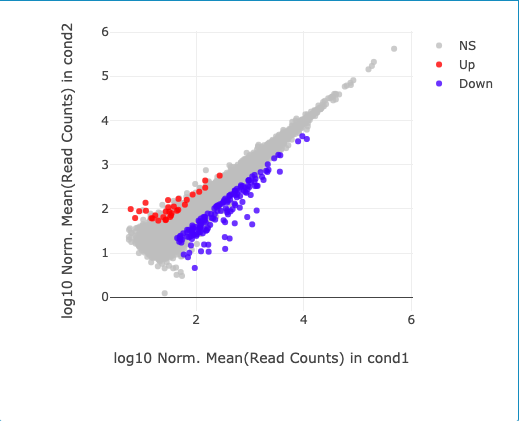
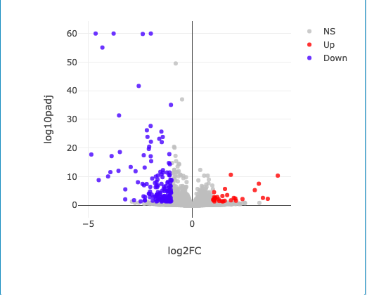
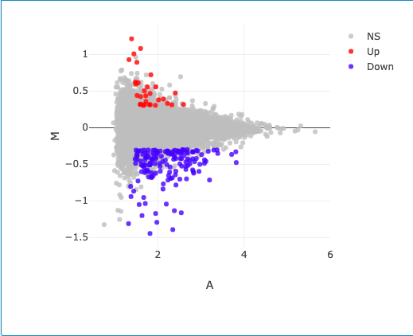

Takehome Final
================
Robert Han
29 Apr 2020

# Introduction

For the takehome final you will have 48 hours to complete the objectives
listed below. The deadline for submission is Wednesday, 6 May 2020 at
2:45pm EDT.

## Date/Time started:

April 28, 2020 10am

You will be graded on the following criteria:

  - Completion of the objectives
  - Readability (tidyness) of Rmd code
  - Summary of results from differential expression analysis
  - Acknowledgement of resources

## Loading Libraries

Load all of your libraries in this code block. Indicate why each library
is necessary.

## Objectives for Final Exam

  - \[ \] Checking downloaded data for accuracy
  - \[ \] Manipulate metadata to produce files required to run SARTools
  - \[ \] Examination of batch effect caused by sex
  - \[ \] Determination of differential expression caused by treatment
  - \[ \] Answering questions about best practices for data analysis

## Honor Code

By submitting this takehome final, I acknowledge that I will abide by
the Bucknell University Honor Code. As a student and citizen of the
Bucknell University community:

1.  I will not lie, cheat or steal in my academic endeavors.
2.  I will forthrightly oppose each and every instance of academic
    dishonesty.
3.  I will let my conscience guide my decision to communicate directly
    with any person or persons I believe to have been dishonest in
    academic work.
4.  I will let my conscience guide my decision on reporting breaches of
    academic integrity to the appropriate faculty or deans.

## Background

RNA-Seq performed by: Frahm KA, Waldman JK, Luthra S, Rudine AC,
Monaghan-Nichols AP, Chandran UR. A comparison of the sexually dimorphic
dexamethasone transcriptome in mouse cerebral cortical and hypothalamic
embryonic neural stem cells. Mol Cell Endocrinol. 2017;
<https://doi.org/10.1016/j.mce.2017.05.026>.

Abstract Fetal exposure to synthetic glucocorticoids reprograms distinct
neural circuits in the developing brain, often in a sex-specific manner,
via mechanisms that remain poorly understood. To reveal whether such
reprogramming is associated with select molecular signatures, we
characterized the transcriptome of primary, embryonic mouse cerebral
cortical and hypothalamic neural progenitor/stem cells derived from
individual male and female embryos exposed to the synthetic
glucocorticoid, dexamethasone. Gene expression profiling by RNA-Seq
identified differential expression of common and unique genes based upon
brain region, sex, and/or dexamethasone exposure. These gene expression
datasets provide a unique resource that will inform future studies
examining the molecular mechanisms responsible for region- and
sex-specific reprogramming of the fetal brain brought about by in utero
exposure to excess glucocorticoids.

Dataset download: The full dataset is available from:
<https://figshare.com/articles/kallisto_quantifications_of_Frahm_et_al_2017/6203012>

The raw reads are available from the Sequence Read Archive, although we
will not be using them for the take-home exam:
<https://www.ncbi.nlm.nih.gov/sra/SRP100701>

Kallisto has already been used to quantify transcripts and we will only
be analyzing the samples from the hypothalamus.

The Kallisto results have has been placed in a Zip file in the class
repo in the 07-Exams directory. Download the file SRP100701.zip, move it
to your repo, and then unzip the file. You can then delete the .zip file
so that it will not also be pushed to your repo.

``` r
sample_table <- read_tsv("SRP100701.sample_table.txt")
```

    ## Parsed with column specification:
    ## cols(
    ##   .default = col_character(),
    ##   AvgSpotLen_l = col_double(),
    ##   MBases_l = col_double(),
    ##   MBytes_l = col_double(),
    ##   InsertSize_l = col_double(),
    ##   LoadDate_s = col_date(format = ""),
    ##   ReleaseDate_s = col_date(format = "")
    ## )

    ## See spec(...) for full column specifications.

``` r
sample_table
```

    ## # A tibble: 24 x 29
    ##    AvgSpotLen_l BioSample_s Experiment_s MBases_l MBytes_l Run_s SRA_Sample_s
    ##           <dbl> <chr>       <chr>           <dbl>    <dbl> <chr> <chr>       
    ##  1           50 SAMN064461… SRX2588583       1727     1713 SRR5… SRS2001779  
    ##  2           50 SAMN064462… SRX2588584       1776     1750 SRR5… SRS2001780  
    ##  3           50 SAMN064462… SRX2588585       1638     1627 SRR5… SRS2001781  
    ##  4           50 SAMN064462… SRX2588586       1310     1307 SRR5… SRS2001782  
    ##  5           50 SAMN064462… SRX2588587       1560     1554 SRR5… SRS2001783  
    ##  6           50 SAMN064462… SRX2588588       1773     1754 SRR5… SRS2001784  
    ##  7           50 SAMN064462… SRX2588589       1533      957 SRR5… SRS2001785  
    ##  8           50 SAMN064462… SRX2588590       1545      959 SRR5… SRS2001786  
    ##  9           50 SAMN064462… SRX2588591       1539     1535 SRR5… SRS2001787  
    ## 10           50 SAMN064462… SRX2588592       1505     1493 SRR5… SRS2001788  
    ## # … with 14 more rows, and 22 more variables: Sample_Name_s <chr>,
    ## #   gender_s <chr>, source_name_s <chr>, tissue_region_s <chr>,
    ## #   treatment_s <chr>, Assay_Type_s <chr>, BioProject_s <chr>,
    ## #   Center_Name_s <chr>, Consent_s <chr>, InsertSize_l <dbl>,
    ## #   Instrument_s <chr>, LibraryLayout_s <chr>, LibrarySelection_s <chr>,
    ## #   LibrarySource_s <chr>, LoadDate_s <date>, Organism_s <chr>,
    ## #   Platform_s <chr>, ReleaseDate_s <date>, SRA_Study_s <chr>, age_s <chr>,
    ## #   cell_type_s <chr>, tissue_s <chr>

## SARTools

The SARTools package has been developped at PF2 - Institut Pasteur by
M.-A. Dillies and H. Varet. *SARTools: A DESeq2- and EdgeR-Based R
Pipeline for Comprehensive Differential Analysis of RNA-Seq Data*, PLoS
One, 2016, doi: <http://dx.doi.org/10.1371/journal.pone.0157022>

Help for SARTools can be found at
<https://github.com/PF2-pasteur-fr/SARTools>

# Takehome Final Part 1

As a reminder, you may consult your previous homework and group
projects, textbook and other readings, and online resources. Online
resources may be used to research ways to solve each problem, but you
may not pose questions in online forums about the specific assignment.
You may consult with Prof. Field or with other classmates about
technical problems (e.g. where to find a file), but not about how to
answer any of the questions.

## (1) Data Verification

### Check the metadata

Check the gender, treatment, and tissue values in your metadata table
against either the original paper or the SRA. Verify that the file names
in the kallisto results folder match run names in the metadata.

The SRA has the runs GSM2508021-44 which are reflected in the metadata
file. Metadata has the same information (runs, treatment, and tissue) as
the SRA <https://www.ncbi.nlm.nih.gov/sra>

### Check the kallisto count data

Load in at least two of the abundance.tsv files. Look at the top and the
bottom of your data. (Note which column has the estimated counts for
later.) Verify that both files have the same number of transcripts.
Confirm that there are no NAs present.

Neither of the two selected files had any NA’s. Both files also had the
same number of rows (105129). Note that the two files being compared
appear similar but are actually different. We should also note that
target\_id is used in place of Name.

``` r
peek <- read_tsv("SRP100701/kallisto/SRR5285048/abundance.tsv")
```

    ## Parsed with column specification:
    ## cols(
    ##   target_id = col_character(),
    ##   length = col_double(),
    ##   eff_length = col_double(),
    ##   est_counts = col_double(),
    ##   tpm = col_double()
    ## )

``` r
head(peek)
```

    ## # A tibble: 6 x 5
    ##   target_id            length eff_length est_counts   tpm
    ##   <chr>                 <dbl>      <dbl>      <dbl> <dbl>
    ## 1 ENSMUST00000177564.1     16       8.55          0     0
    ## 2 ENSMUST00000196221.1      9       5.34          0     0
    ## 3 ENSMUST00000179664.1     11       6.27          0     0
    ## 4 ENSMUST00000178537.1     12       6.73          0     0
    ## 5 ENSMUST00000178862.1     14       7.65          0     0
    ## 6 ENSMUST00000179520.1     11       6.27          0     0

``` r
tail(peek)
```

    ## # A tibble: 6 x 5
    ##   target_id            length eff_length est_counts   tpm
    ##   <chr>                 <dbl>      <dbl>      <dbl> <dbl>
    ## 1 ENSMUST00000200997.1    835       725.          0     0
    ## 2 ENSMUST00000202014.1    545       435.          0     0
    ## 3 ENSMUST00000200809.1    556       446.          0     0
    ## 4 ENSMUST00000201504.1    545       435.          0     0
    ## 5 ENSMUST00000200975.1    549       439.          0     0
    ## 6 ENSMUST00000202689.1    545       435.          0     0

``` r
cat("\nNA's", sum(is.na(peek)), "\nLength:", nrow(peek))
```

    ## 
    ## NA's 0 
    ## Length: 105129

``` r
peek <- read_tsv("SRP100701/kallisto/SRR5285059/abundance.tsv")
```

    ## Parsed with column specification:
    ## cols(
    ##   target_id = col_character(),
    ##   length = col_double(),
    ##   eff_length = col_double(),
    ##   est_counts = col_double(),
    ##   tpm = col_double()
    ## )

``` r
head(peek)
```

    ## # A tibble: 6 x 5
    ##   target_id            length eff_length est_counts   tpm
    ##   <chr>                 <dbl>      <dbl>      <dbl> <dbl>
    ## 1 ENSMUST00000177564.1     16       8.55          0     0
    ## 2 ENSMUST00000196221.1      9       5.34          0     0
    ## 3 ENSMUST00000179664.1     11       6.27          0     0
    ## 4 ENSMUST00000178537.1     12       6.73          0     0
    ## 5 ENSMUST00000178862.1     14       7.65          0     0
    ## 6 ENSMUST00000179520.1     11       6.27          0     0

``` r
tail(peek)
```

    ## # A tibble: 6 x 5
    ##   target_id            length eff_length est_counts   tpm
    ##   <chr>                 <dbl>      <dbl>      <dbl> <dbl>
    ## 1 ENSMUST00000200997.1    835       725.          0     0
    ## 2 ENSMUST00000202014.1    545       435.          0     0
    ## 3 ENSMUST00000200809.1    556       446.          0     0
    ## 4 ENSMUST00000201504.1    545       435.          0     0
    ## 5 ENSMUST00000200975.1    549       439.          0     0
    ## 6 ENSMUST00000202689.1    545       435.          0     0

``` r
cat("\nNA's", sum(is.na(peek)), "\nLength:", nrow(peek))
```

    ## 
    ## NA's 0 
    ## Length: 105129

## (2) Run SARTools or DEBrowser

Use DESeq2 for your analysis (although you are welcome to compare the
results to edgeR). Use an FDR cutoff of 0.05 to determine differential
expression (and also leave other settings in SARTools at their default
values).

### Use dplyr to construct the file(s) that you need for SARTools/DEBrowser

Use SRP100701.sample\_table.txt for the sample information. You will
need to retain only the hypothalamus samples. Keep the sample name, sex,
and treatment. For SARTools, convert this file to a target.txt file. For
DEBrowser, generate a metadata.tsv file and a transcripts counts tsv
file.

``` r
sample_table <- read_tsv("SRP100701.sample_table.txt") %>%
  dplyr::filter(tissue_region_s == "Hypothalamus") %>%
  dplyr::select(Sample_Name_s, gender_s, treatment_s ) -> hypothalamus
```

    ## Parsed with column specification:
    ## cols(
    ##   .default = col_character(),
    ##   AvgSpotLen_l = col_double(),
    ##   MBases_l = col_double(),
    ##   MBytes_l = col_double(),
    ##   InsertSize_l = col_double(),
    ##   LoadDate_s = col_date(format = ""),
    ##   ReleaseDate_s = col_date(format = "")
    ## )

    ## See spec(...) for full column specifications.

``` r
hypothalamus
```

    ## # A tibble: 12 x 3
    ##    Sample_Name_s gender_s treatment_s  
    ##    <chr>         <chr>    <chr>        
    ##  1 GSM2508033    male     Dexamethasone
    ##  2 GSM2508034    male     Vehicle      
    ##  3 GSM2508035    female   Dexamethasone
    ##  4 GSM2508036    female   Vehicle      
    ##  5 GSM2508037    female   Dexamethasone
    ##  6 GSM2508038    female   Vehicle      
    ##  7 GSM2508039    female   Dexamethasone
    ##  8 GSM2508040    female   Vehicle      
    ##  9 GSM2508041    male     Dexamethasone
    ## 10 GSM2508042    male     Vehicle      
    ## 11 GSM2508043    male     Dexamethasone
    ## 12 GSM2508044    male     Vehicle

``` r
write_tsv(hypothalamus, path = "transcript.target.tsv")
```

### Sex-differences in transcript expression

First look to see if there are major differences in gene expression
based on sex. Adapt the appropriate script from the RNASeqProject to
analyze transcript-level differential expression. Do not include the R
script in this Markdown, instead provide a link to it and run it
separately: [R script](script.R). For SARTools, link to the final report
in this file [SARTools Report](reports/DESeq2_report.html).

For DEBrowser, provide a list of all of the settings that you altered to
perform the analysis and export the key figures from the web page.

Wasn’t sure how to link DEBrowser file but its in the repo with the
final. Notable changes to the file include: removing code for gene
analysis, using recursion to find files for transcripttable and changing
indices to match data.

counts file: transcripttable.tsv metadata file: metadata.tsv

### Filter

filter CPM \< 1 in 6 samples Normalization: TMM Correction: Combat
Treatment: treatment Batch: gender \#\#\# DE analysis Meta: treatment
Conditions: can be left as are

### Treatment effects on transcript expression

Use batch to correct for sex-differences and then look for transcripts
that are differentially expressed based on dexamethasone treatment.

## (3) Summarize your differential expression analysis

Your advisor wants to know whether you found any effect of treatment.
Provide a concise summary of your analysis, including up to 3 figures
from your SARTools analysis.

We saw differential gene expression of several transcripts in response
to treatment with DEX. A good next step might be to look at some of
these genes in a genome browser to get a better idea of what the DEX is
affecting. It may also be worth importing the csv files into R and using
some of the tools there to look at the data.

``` r

```


The volcano plot lets us see how the significance of individual points
differs between the results. Here we see that there are not only more
downregulated transcripts but the significance of these points is
stronger than that of the upregulated transcripts.

``` r

```


The MA-plot appears to converge at y = 0 which indicates that the
underlying assumption that the expression of most genes or transcripts
in this case is unaffected by the treatment. We also see a fairly
symmetrical distribution of points which is good for reproducibility
(according to a forum I was reading
(<https://www.researchgate.net/post/How_to_explain_the_MA_plot_for_differential_expression_analysis_in_RNA-seq_data>).

``` r

```


# Takehome Final Part 2

If you are unable to complete Part 1 of the exam, then you will need to
submit it to your repo as TakehomeFinal.Incomplete.Rmd. At that point,
you will need to @KField-Bucknell in an issue to request access to the
files that you need. I will be granting access to the files up until
10am EDT on May 6th.

## Q1: Comparison to previous analysis

You would like to know if your results are consistent with those
described in the Frahm et al. paper. [Frahm et al.](Frahm_etal.pdf) You
do not have to carry out the comparison, but briefly describe (3-4
sentences) the process that you would need to follow to answer this (not
so simple) question.

A good starting place for comparing our results with Frahm et al. is to
look up genes (names and functions) using the same database as the
authors:
(<http://genome.ucsc.edu/cgi-bin/hgTracks?db=mm9&position=chr12:25,778,485-25,781,480&hubUrl=http://130.132.227.221/hub.txt>).
Once we’ve identified the names and functions of the genes we can make
better comparisons with the figures Frahm et al. generated. We could
also compare our results with Frahm et al’s by analyzing differential
gene expression in the other tissues Frahm et al. took data for and
analyzed. To do so we would follow the same steps but filter for those
tissues first. From there we could recreate the author’s figures.

## Q2: Improvements to Frahm et al.

Imagine that you are reviewing a draft of this manuscript prior to
submitting it for publication. Describe the 3 most important suggestions
that would incorporate best practices in data analysis and
visualization.

### Suggestion 1:

Making the actual code for the analysis available wouldn’t neccessarily
be a part of the best practices of data analysis and visualization;
however, it’s an important step for accountability and reproducability.
By making the source code readily accessible other groups could use it
to confirm the results or use it on their own data to compare, or
supplement the author’s findings.

### Suggestion 2:

I take some issues from figure 4 by Frahm et al. For starters the figure
only shows the magnitude of upregulate and downregulated genes. It does
not show which genes are actually upregulated or downregulated.
Furthermore, there are a few genes which are grossly more
upregulated/downregulated which blows the scale of the graph and results
in a lot of white space. Cutting down those genes in the graph to make
it fit better could mispresent the magnitude of the data so if the
authors were to revise that aspect it would have to be done so as to not
misrepresent the scale. Showing which genes were downregulated or
upregulated could be done with something similar to a y-axis bar plot
where downregulated genes might extend in the -x direction and
upregulated genes extend towards +x.

### Suggestion 3:

Pie charts are nice, but they aren’t great. Frahm et al. uses several
pie charts to visualize the breakdown of transcript types in their data.
Viewing a pie chart relies on the mind judging an angle whereas
something like a barchart relies on the mind judging a position. One
study (<https://info.sice.indiana.edu/~katy/S637-S11/cleveland84.pdf>)
found that positional judgments were almost twice as accurate as angular
ones making pie charts a relatively inferior method for data
visualization. To fix this, the authors might employ a barplot or even
just report percentages in a table with counts.

## Q3: Research Practices

Imagine that you conducted this analysis for your Honors/Masters thesis
project. Describe how you would handle each of the following scenarios,
citing specific QRPs where appropriate.

### Scenario 1:

You are concerned that two of the samples may have been switched during
sample preparation. What is your confidence that this did or did not
occur?

Funny story cut really short, I should not be allowed to do cell culture
assays after lunch. Especially when pipeting clear liquids into clear
liquids. Personally, my confidence for this scenario would be very very
low. The PI I had would probably have me run it anyways for “experience”
and then do it again making sure not to switch the samples.

### Scenario 2:

Your advisor is disappointed with the number of differentially expressed
transcripts that you found in the female vs male comparison. They
suggest that you should send additional samples out for sequencing and
add them to this study to increase the statistical power.

Since statistical significance has already been calculated performing
additional measures to improve upon that significance without reporting
it may count as selective reporting, p-hacking and cherry picking
because the original test results aren’t reported. This is fixed by
reporting the original test results along with the new test results.

### Scenario 3:

The transcripts that are differentially expressed between vehicle and
dexamethasone treated cells does not include several that had been found
in a previous study in your lab. Your advisor suggests re-running the
analysis using the model counts ~ sex \* treatment instead of the model
counts ~ sex + treatment. (Note that SARTools cannot handle GLM
interactions and this would have to be done with DESeq2 in R.)

I think this situation is fairly similar to Scenario 2. We would have
already generated one set of results and we are being asked to hide
those behind another set of results. In this case we have an added layer
of HARK-ing because we know what should be there before we run the
analysis/ we run the analysis for a specific known result. In this
scenario, it would be wise to include both analyses. Hiding the previous
results could invoke p-hacking and selective reporting.

## Date/Time completed:

April 29, 2020 4pm

# Acknowledgements

Cite online sources used. Understanding kallisto output a little better
<https://pachterlab.github.io/kallisto/starting> SRA for comparison
<https://www.ncbi.nlm.nih.gov/sra> other sources are cited where
directly relevant.
