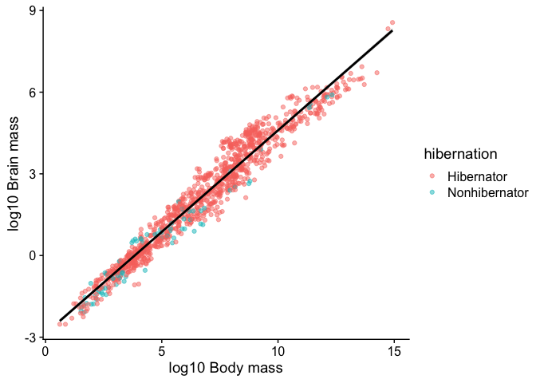
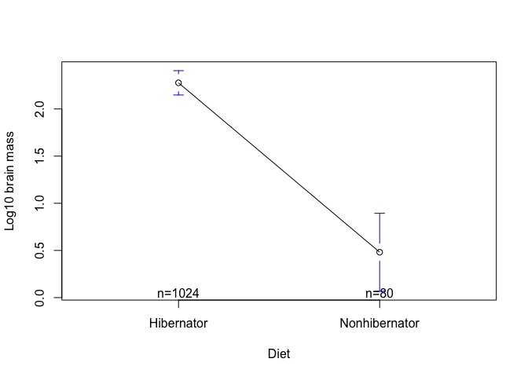
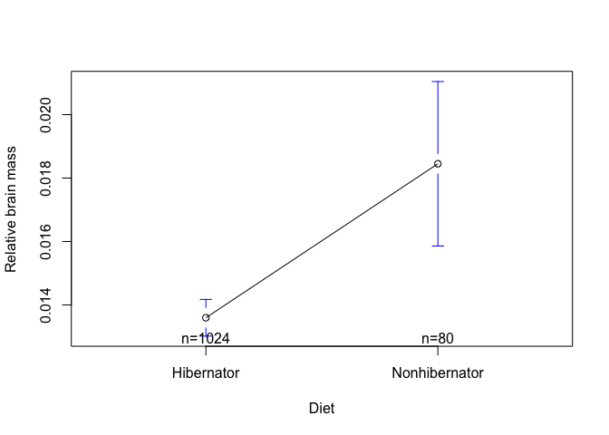

Han homework 1
================
Robert Han
1/13/2020

Install necessary libraries (and maybe some unnecessary ones I’m not
sure.)

``` r
if (!require("UsingR")) install.packages("UsingR"); library(UsingR)
```

    ## Loading required package: UsingR

    ## Loading required package: MASS

    ## Loading required package: HistData

    ## Loading required package: Hmisc

    ## Loading required package: lattice

    ## Loading required package: survival

    ## Loading required package: Formula

    ## Loading required package: ggplot2

    ## 
    ## Attaching package: 'Hmisc'

    ## The following objects are masked from 'package:base':
    ## 
    ##     format.pval, units

    ## 
    ## Attaching package: 'UsingR'

    ## The following object is masked from 'package:survival':
    ## 
    ##     cancer

``` r
if (!require("cowplot")) install.packages("cowplot"); library(cowplot)
```

    ## Loading required package: cowplot

    ## 
    ## ********************************************************

    ## Note: As of version 1.0.0, cowplot does not change the

    ##   default ggplot2 theme anymore. To recover the previous

    ##   behavior, execute:
    ##   theme_set(theme_cowplot())

    ## ********************************************************

``` r
if (!require("tidyverse")) install.packages("tidyverse"); library(tidyverse)
```

    ## Loading required package: tidyverse

    ## ── Attaching packages ──────────────── tidyverse 1.3.0 ──

    ## ✓ tibble  2.1.3     ✓ dplyr   0.8.3
    ## ✓ tidyr   1.0.0     ✓ stringr 1.4.0
    ## ✓ readr   1.3.1     ✓ forcats 0.4.0
    ## ✓ purrr   0.3.3

    ## ── Conflicts ─────────────────── tidyverse_conflicts() ──
    ## x dplyr::filter()    masks stats::filter()
    ## x dplyr::lag()       masks stats::lag()
    ## x dplyr::select()    masks MASS::select()
    ## x dplyr::src()       masks Hmisc::src()
    ## x dplyr::summarize() masks Hmisc::summarize()

``` r
if (!require("readxl")) install.packages("readxl"); library(readxl)
```

    ## Loading required package: readxl

``` r
if (!require("gplots")) install.packages("gplots"); library(gplots) 
```

    ## Loading required package: gplots

    ## 
    ## Attaching package: 'gplots'

    ## The following object is masked from 'package:stats':
    ## 
    ##     lowess

Import and read data using readxl. Provide summary statistics for the
data. This code block also replaces the binary representations of
hibernation and diet data with character ones.
<https://stackoverflow.com/questions/5824173/replace-a-value-in-a-data-frame-based-on-a-conditional-if-statement>

``` r
project_data <- read_excel("Supplementary material.xlsx")

library(plyr)
```

    ## ------------------------------------------------------------------------------

    ## You have loaded plyr after dplyr - this is likely to cause problems.
    ## If you need functions from both plyr and dplyr, please load plyr first, then dplyr:
    ## library(plyr); library(dplyr)

    ## ------------------------------------------------------------------------------

    ## 
    ## Attaching package: 'plyr'

    ## The following objects are masked from 'package:dplyr':
    ## 
    ##     arrange, count, desc, failwith, id, mutate, rename, summarise,
    ##     summarize

    ## The following object is masked from 'package:purrr':
    ## 
    ##     compact

    ## The following objects are masked from 'package:Hmisc':
    ## 
    ##     is.discrete, summarize

``` r
project_data$hibernation <- as.character(project_data$hibernation)
project_data$hibernation <- revalue(project_data$hibernation, c("0" = "Hibernator", "1" = "Nonhibernator"))

project_data$diet <- as.character(project_data$diet)
project_data$diet <- revalue(project_data$diet, c("1" = "herbivore or folivore", "2" = "frugivore/folivore or granivore", "3" = "frugivore/faunivore or omnivore", "4" = "faunivore, piscivore, carnivore or insectivore"))

summary(project_data)
```

    ##     Group           Genus species        brain mass      Ref. brain mass   
    ##  Length:1104        Length:1104        Min.   :   0.08   Length:1104       
    ##  Class :character   Class :character   1st Qu.:   1.33   Class :character  
    ##  Mode  :character   Mode  :character   Median :   8.41   Mode  :character  
    ##                                        Mean   :  60.06                     
    ##                                        3rd Qu.:  51.47                     
    ##                                        Max.   :5211.25                     
    ##    body mass         Ref. body mass     hibernation        Ref. hibernation  
    ##  Min.   :      1.8   Length:1104        Length:1104        Length:1104       
    ##  1st Qu.:     70.0   Class :character   Class :character   Class :character  
    ##  Median :    892.5   Mode  :character   Mode  :character   Mode  :character  
    ##  Mean   :  26589.1                                                           
    ##  3rd Qu.:   5673.0                                                           
    ##  Max.   :3030982.1                                                           
    ##    diurnality     Ref. diurnality    substrate use      Ref. substrate use
    ##  Min.   :0.0000   Length:1104        Length:1104        Length:1104       
    ##  1st Qu.:0.0000   Class :character   Class :character   Class :character  
    ##  Median :0.0000   Mode  :character   Mode  :character   Mode  :character  
    ##  Mean   :0.3007                                                           
    ##  3rd Qu.:1.0000                                                           
    ##  Max.   :1.0000                                                           
    ##      diet            Ref. diet        
    ##  Length:1104        Length:1104       
    ##  Class :character   Class :character  
    ##  Mode  :character   Mode  :character  
    ##                                       
    ##                                       
    ##                                       
    ##  mid-latitude of geographical distribution
    ##  Min.   :-77.500                          
    ##  1st Qu.:-10.470                          
    ##  Median :  1.385                          
    ##  Mean   :  6.433                          
    ##  3rd Qu.: 25.360                          
    ##  Max.   : 83.600                          
    ##  Ref. mid-latitude of geographical distribution
    ##  Length:1104                                   
    ##  Class :character                              
    ##  Mode  :character                              
    ##                                                
    ##                                                
    ## 

From these summary statistics we can get a general sense for what data
is present in the dataset. For example, we can tell that there are 1104
entries in the dataset as well as which variables are likely continuous
or categorical in nature.

The dataset has the given variables:

Group: Cat Genus species: Cat brain mass: Cont Ref. brain mass: Null/Cat
body mass: Cont Ref. body mass: Null/Cat hibernation: Cat Ref.
hibernation: Null/Cat diurnality: Cat Ref. diurnality: Null/Cat
substrate use: Cat Ref. substrate use: Null/Cat diet: Cat Ref diet:
Null/Cat mid-latitude of geographical distribution: ? Ref. mid-latitude
of geographical distribution: Null/Cat

To take a closer look at the data entries we can look at the data. As a
result of the earlier data manipulations some of the variables have been
changed from binary representations to character representations.

``` r
project_data
```

    ## # A tibble: 1,104 x 16
    ##    Group `Genus species` `brain mass` `Ref. brain mas… `body mass`
    ##    <chr> <chr>                  <dbl> <chr>                  <dbl>
    ##  1 Afro… Chrysochloris …        0.7   Bauchot and Ste…        49  
    ##  2 Afro… Chrysochloris …        0.736 Bauchot and Ste…        39.1
    ##  3 Afro… Echinops telfa…        0.580 Isler and van S…        72.4
    ##  4 Afro… Hemicentetes s…        0.736 Bauchot and Ste…        76.6
    ##  5 Afro… Microgale dobs…        0.558 Isler and van S…        37.9
    ##  6 Afro… Microgale tala…        0.763 Bauchot and Ste…        42.3
    ##  7 Afro… Micropotamogal…        0.8   Stephan et al 1…        64.2
    ##  8 Afro… Oryzorictes ho…        0.580 Bauchot and Ste…        44.2
    ##  9 Afro… Potamogale vel…        4.25  Bauchot and Ste…       677  
    ## 10 Afro… Setifer setosus        1.59  Isler and van S…       234. 
    ## # … with 1,094 more rows, and 11 more variables: `Ref. body mass` <chr>,
    ## #   hibernation <chr>, `Ref. hibernation` <chr>, diurnality <dbl>, `Ref.
    ## #   diurnality` <chr>, `substrate use` <chr>, `Ref. substrate use` <chr>,
    ## #   diet <chr>, `Ref. diet` <chr>, `mid-latitude of geographical
    ## #   distribution` <dbl>, `Ref. mid-latitude of geographical distribution` <chr>

To get a sense for the distribution of data entries across their
encompassing groups we can visualize counts of the later in a bar plot.
Due to the number of groups represented in the dataset (n = 25) I found
it was better to visualize the bar plot horizontally. From this
visualization its clear not all groups are equally represented in the
dataset. Rodentia, Primates, and Carnivora in particular make up close
to 70% of all the species sampled.

<https://www.statmethods.net/graphs/bar.html>
<https://www.datamentor.io/r-programming/bar-plot/>

``` r
ggplot(project_data) +
  aes(x = Group) +
  geom_bar() +
  ylab("Count") +
  coord_flip() +
  theme_cowplot()
```

<!-- -->

At a glance the Q-Q plots suggest the data is not normally distributed.
Using log10 transformations appeared to enhance the Q-Q plot slightly.
The idea of creating variables to hold column data came from Fallon.

``` r
brain = project_data$`brain mass`
body = project_data$`body mass`

qqnorm(brain, main='Normal Q-Q Plot for brain mass')
qqline(brain)
```

<!-- -->

``` r
qqnorm(log(brain), main='Normal Q-Q Plot for log10 brain mass')
qqline(log(brain))
```

<!-- -->

``` r
qqnorm(body, main='Normal Q-Q Plot for body mass')
qqline(body)
```

<!-- -->

``` r
qqnorm(log(body), main='Normal Q-Q Plot for log10 body mass')
qqline(log(body))
```

<!-- -->

``` r
qqnorm(brain/body, main='Normal Q-Q Plot for brain/body mass')
qqline(brain/body)
```

<!-- -->

``` r
qqnorm(log(brain/body), main='Normal Q-Q Plot for log10(brain/body mass)')
qqline(log(brain/body))
```

<!-- -->

To look more carefully at each of the quantitative variables, a simple
eda was used for brain mass and brain mass relative to body mass. A
log10 transformation of brain mass showed less skew and better Q-Q plot.
Log10 transformation of relative brain mass did not reduce skew very
much; however resulted in a better Q-Q
plot.

``` r
simple.eda(project_data$`brain mass`)
```

<!-- -->

``` r
simple.eda(log(project_data$`brain mass`))
```

<!-- -->

``` r
simple.eda(project_data$`body mass`)
```

<!-- -->

``` r
simple.eda(log(project_data$`body mass`))
```

<!-- -->

``` r
simple.eda(project_data$`brain mass`/project_data$`body mass`)
```

<!-- -->

``` r
simple.eda(log(project_data$`brain mass`/project_data$`body mass`))
```

<!-- -->

From the Shapiro-Wilk normality test we get p-values much smaller than
0.05. According to Fallon (she remembers more stats than I do) we would
want the p value to be larger than 0.05; since it is not, I believe we
assume the data is not normally distributed. This conclusion aligns with
with the exploratory data analysis done beforehand where the data did
not appear very normal even after log10 transformations.

``` r
shapiro.test(project_data$`brain mass`)
```

    ## 
    ##  Shapiro-Wilk normality test
    ## 
    ## data:  project_data$`brain mass`
    ## W = 0.21029, p-value < 2.2e-16

``` r
shapiro.test(project_data$`body mass`)
```

    ## 
    ##  Shapiro-Wilk normality test
    ## 
    ## data:  project_data$`body mass`
    ## W = 0.15626, p-value < 2.2e-16

``` r
shapiro.test(project_data$`brain mass`/project_data$`body mass`)
```

    ## 
    ##  Shapiro-Wilk normality test
    ## 
    ## data:  project_data$`brain mass`/project_data$`body mass`
    ## W = 0.93271, p-value < 2.2e-16

Show counts of hibernators and nonhibernators as a table There are many
hibernators\! We can see there are many hibernators in the dataset. Then
again we should probably visualize it in a graphic.

``` r
table(project_data$hibernation)
```

    ## 
    ##    Hibernator Nonhibernator 
    ##          1024            80

Visualize counts of hibernators and nonhibernators as a barplot. There
are many hibernators\! Though it is somewhat difficult to differentiate
some of the coloring, we can still see that a few groups are
overrepresented in the dataset.

``` r
ggplot(project_data) + 
  geom_bar(aes(x = `hibernation`, fill = Group)) + 
  xlab("Hibernation") + 
  ylab("Count") +
  theme_cowplot()
```

<!-- -->

Scatterplot of brain mass and body mass after log10 transformation. The
log10 transformation suggests a trend between brain mass and body mass.
The hypothesis being tested is whether or not hibernation and brain size
are related. This visualization is not directly tied to the hypothesis
but dang is it nice to look at. Interestingly, after the log
transformation we see a greater concentration of nonhibernators at the
tail of the graph. The linear model is very small and not immediately
seen. No units are provided in the dataset.

``` r
ggplot(project_data) +
  aes(y = log(`brain mass`), x = log(`body mass`)) + 
  theme(legend.position = c(0.05, 0.8)) +
  geom_point(aes(color = hibernation), alpha = 0.5) +
  geom_smooth(method=lm , color="black", se=TRUE) +
  ylab("log10 Brain mass") + 
  xlab("log10 Body mass") +
  theme_cowplot()
```

<!-- -->

The results of the linear regression statistics. The p-value calculated
is well under 0.05 which is not really relevant to the hypothesis.

``` r
mass_fit = lm(log(`brain mass`)~log(`body mass`), data=project_data)
summary(mass_fit)
```

    ## 
    ## Call:
    ## lm(formula = log(`brain mass`) ~ log(`body mass`), data = project_data)
    ## 
    ## Residuals:
    ##      Min       1Q   Median       3Q      Max 
    ## -1.43736 -0.31404 -0.03111  0.27545  1.37655 
    ## 
    ## Coefficients:
    ##                   Estimate Std. Error t value Pr(>|t|)    
    ## (Intercept)      -2.859861   0.036117  -79.18   <2e-16 ***
    ## log(`body mass`)  0.745715   0.004966  150.16   <2e-16 ***
    ## ---
    ## Signif. codes:  0 '***' 0.001 '**' 0.01 '*' 0.05 '.' 0.1 ' ' 1
    ## 
    ## Residual standard error: 0.4612 on 1102 degrees of freedom
    ## Multiple R-squared:  0.9534, Adjusted R-squared:  0.9534 
    ## F-statistic: 2.255e+04 on 1 and 1102 DF,  p-value: < 2.2e-16

The boxplot was generated to better visualize the differences between
the brain mass of hibernators and nonhibernators. a log10 transformation
was used again to better see the data. The boxplot suggests the median
brain size of hibernating species is actually larger than that of
nonhibernators.

``` r
ggplot(project_data) +
  aes(x = `hibernation`, y = log(`brain mass`)) +
  geom_boxplot() +
  guides(alpha=FALSE) +
  xlab("Hibernation") + 
  ylab("log10 Brain mass") +
  theme_cowplot()
```

<!-- -->

It may be helpful to see the actual data points so a jitter overlay was
added.

``` r
ggplot(project_data) +
  aes(x = `hibernation`, y = log(`brain mass`)) +
  geom_boxplot() +
  geom_point(alpha = 0.3, position = "jitter", colour = "blue") +
  guides(alpha=FALSE) +
  xlab("Hibernation") + 
  ylab("log10 Brain mass") +
  theme_cowplot()
```

<!-- -->

Accounting for body mass the boxplot suggests the difference in brain
size between hibernators and nonhibernators may not be as large as the
previous figure suggests. A different function for generating the
boxplot was used on a whim. A log10 transformation was used since it
made the eda data look nicer. Unsurprisingly the relative brain mass was
a low value resulting in negative values after log
transformation.

<https://www.statmethods.net/graphs/boxplot.html>

``` r
boxplot(log(`brain mass` / `body mass`) ~ hibernation , data = project_data, 
        xlab = "Hibernation", ylab = "Relative brain mass")
```

<!-- -->

Looking directly at the mean brain mass/relative brain mass suggests
nonhibernators have a smaller brain mass than hibernators; however, when
accounting for body size nonhibernators may have a greater relative
brain mass than
hibernators.

<http://www.sthda.com/english/wiki/plot-group-means-and-confidence-intervals-r-base-graphs>

``` r
plotmeans(log(`brain mass`) ~ `hibernation`, data = project_data, xlab = "Diet", ylab = "Log10 brain mass")
```

<!-- -->

``` r
plotmeans(`brain mass`/`body mass` ~ `hibernation`, data = project_data, xlab = "Diet", ylab = "Relative brain mass")
```

<!-- -->

Perform T-test to determine if the difference in means is significant.
According to the T-test results, the difference in means is significant.
With regard to the primary hypothesis being tested, hibernators have a
significantly lower brain mass relative to body mass when compared to
nonhibernators; however hibernators have a significantly greater brain
mass in general when compared to nonhibernators.

<https://www.statmethods.net/stats/ttest.html>

``` r
t.test(log(`brain mass`) ~ `hibernation`, data = project_data)
```

    ## 
    ##  Welch Two Sample t-test
    ## 
    ## data:  log(`brain mass`) by hibernation
    ## t = 8.2363, df = 95.476, p-value = 9.259e-13
    ## alternative hypothesis: true difference in means is not equal to 0
    ## 95 percent confidence interval:
    ##  1.363173 2.228948
    ## sample estimates:
    ##    mean in group Hibernator mean in group Nonhibernator 
    ##                   2.2771664                   0.4811061

``` r
t.test((`brain mass`/`body mass`) ~ `hibernation`, data = project_data)
```

    ## 
    ##  Welch Two Sample t-test
    ## 
    ## data:  (`brain mass`/`body mass`) by hibernation
    ## t = -3.6347, df = 87.264, p-value = 0.0004696
    ## alternative hypothesis: true difference in means is not equal to 0
    ## 95 percent confidence interval:
    ##  -0.007510084 -0.002200311
    ## sample estimates:
    ##    mean in group Hibernator mean in group Nonhibernator 
    ##                  0.01359560                  0.01845079

Alternative hypothesis: Predatory (carnivore, insectivore, piscivore,
faunivore) diets enhances brain size evolution.

The barplot shows a relatively even distribtion of diets amongst the
species sampled. For comparison to the original hypothesis we also see
that frugivores/foliovores or granivores have a greater ratio of
nonhibernators to hibernators than any other diet group. If the former
hypothesis were true we might expect the carnivore/piscivore/insectivore
diet to have the greatest brain mass given the greater number of
nonhibernators in that category.

``` r
ggplot(project_data) +
  aes(x = diet, fill = hibernation) +
  geom_bar() +
  theme_cowplot()
```

<!-- -->

Species which feed on other animals showed a higher maximum relative
brain mass than other diet types. That being said, the median and
interquartile range of said diet was nothing specatacular and even fell
behind two plant based diets. I would have liked to show the means of
each diet on the boxplot but was unable to figure that one out. I also
chose to visualize a boxplot of the log transformed brain mass.
Interestingly the boxplots suggests preying on other animals is
associated with less brain mass than a strictly plant based diet. The
herbivore or folivore diet in particular appeared to be linked to
animals with the greatest brain mass.

``` r
boxplot(log(`brain mass`) ~ diet , data = project_data,
        xlab = "Diet", ylab = " log10 Brain mass")
```

<!-- -->

``` r
boxplot(`brain mass` / `body mass` ~ diet , data = project_data, 
        xlab = "Diet", ylab = "Relative brain mass (units)")
```

<!-- -->

Since the range and quartiles of the data was visualized earlier, I
thought a good next step would be to see the means, especially given
that I couldnt figure out how to overlay them onto the boxplot. We can
see herbivores/foliovores have the greatest average brain mass but the
lowest relative brain mass. The carnivore/piscivore/insectivore diet
actually had the smallest average brain mass which contradicts my
hypothesis. These observations align with what was shown in the
boxplots.

``` r
# Plot the mean of teeth length by dose groups
plotmeans(log(`brain mass`) ~ `diet`, data = project_data, xlab = "Diet", ylab = " log10 Brain mass")
```

<!-- -->

``` r
plotmeans((`brain mass` / `body mass`) ~ `diet`, data = project_data, xlab = "Diet", ylab = " Relative brain mass")
```

<!-- -->

Not sure if this is the appropriate test. Obviously the datset used was
not normally distributed as discussed earlier. The calculated p-values
are much smaller than 0.05 suggesting the differences between some of
the means are statistically significant. The difference between
herbivore/folivore and any other diet is certainly noticeable.
Regardless, the alternative hypothesis is definitely not supported by
the dataset on hand. Predatory (carnivore, insectivore, piscivore,
faunivore) diets do not appear to be associated with increased brain
size whether it be in straight brain mass or relative brain
mass.

<https://www.r-bloggers.com/performing-anova-test-in-r-results-and-interpretation/>

``` r
res1.aov <- aov(`brain mass` ~ diet, data = project_data)
summary(res1.aov)
```

    ##               Df   Sum Sq Mean Sq F value   Pr(>F)    
    ## diet           3  1186499  395500   7.841 3.52e-05 ***
    ## Residuals   1100 55480820   50437                     
    ## ---
    ## Signif. codes:  0 '***' 0.001 '**' 0.01 '*' 0.05 '.' 0.1 ' ' 1

``` r
res2.aov <- aov(`brain mass`/`body mass` ~ diet, data = project_data)
summary(res2.aov)
```

    ##               Df  Sum Sq  Mean Sq F value Pr(>F)    
    ## diet           3 0.01615 0.005383   67.89 <2e-16 ***
    ## Residuals   1100 0.08721 0.000079                   
    ## ---
    ## Signif. codes:  0 '***' 0.001 '**' 0.01 '*' 0.05 '.' 0.1 ' ' 1

“A DEFINITE TREND IS EVIDENT”
<https://twitter.com/mantyne/status/1217444724656701440>
