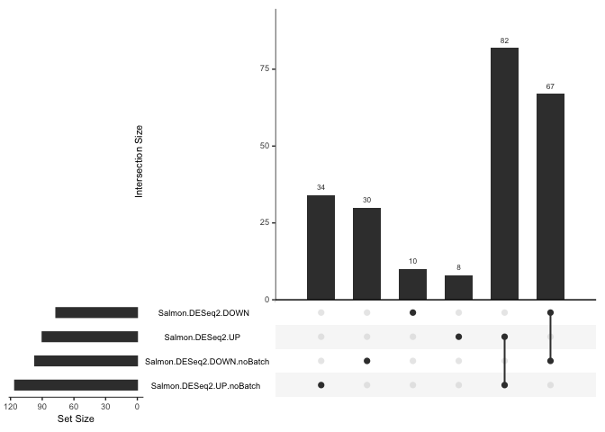
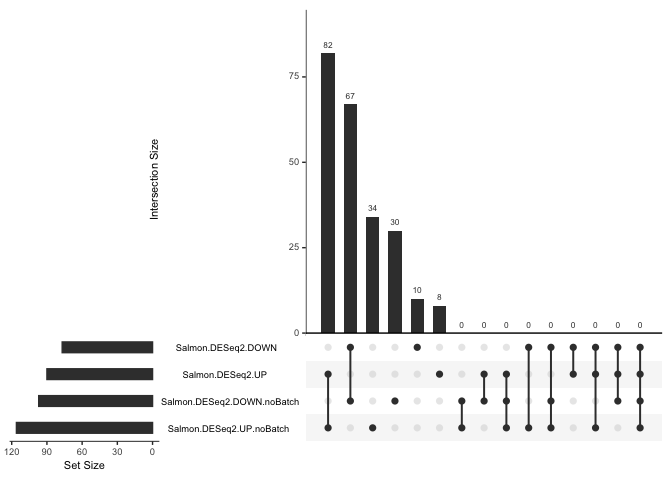
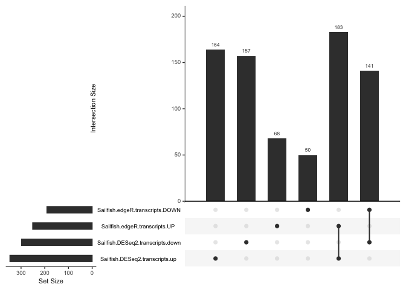
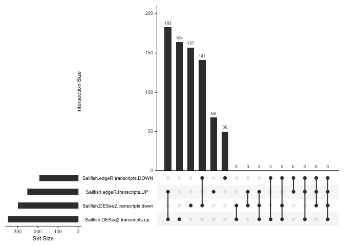

### Project 3

``` r
direct <- "/Users/robert/Documents/School/Advanced Data Analysis/Biology364-2020/02-Assignments/Project03"  
setwd(direct)

# Batch Comparison
batchfilelist <- list.files(path = "BatchResults", pattern = "*.csv", full.names = T)
batchfilenames <- list.files(path = "BatchResults", pattern = "*.csv", full.names = F)
batchfiles <- lapply(batchfilelist, read_csv)
batchfilenames <- gsub(".csv", "", batchfilenames)
names(batchfiles) <- batchfilenames
allbatchresults <- bind_rows(batchfiles, .id = "column_label")

# Genes
genefilelist <- list.files(path = "GeneResults", pattern = "*.csv", full.names = T)
genefilenames <- list.files(path = "GeneResults", pattern = "*.csv", full.names = F)
genefiles <- lapply(genefilelist, read_csv)
genefilenames <- gsub(".csv", "", genefilenames)
names(genefiles) <- genefilenames
allgeneresults <- bind_rows(genefiles, .id = "column_label")

# Transcripts
transcriptfilelist <- list.files(path = "TranscriptResults", pattern = "*.csv", full.names = T)
transcriptfilenames <- list.files(path = "TranscriptResults", pattern = "*.csv", full.names = F)
transcriptfiles <- lapply(transcriptfilelist, read_csv)
```

    ## Warning: Missing column names filled in: 'X1' [1]
    
    ## Warning: Missing column names filled in: 'X1' [1]

``` r
transcriptfilenames <- gsub(".csv", "", transcriptfilenames)
names(transcriptfiles) <- transcriptfilenames
alltranscriptresults <- bind_rows(transcriptfiles, .id = "column_label")
```

### Gene Comparisons

``` r
# Verify that each results table has expected padj and fold change cutoffs
allbatchresults %>%
  group_by(column_label) %>%
  summarise(max_padj = max(padj), min_foldchange = min(foldChange), max_foldchange = max(foldChange))
```

    ## # A tibble: 4 x 4
    ##   column_label               max_padj min_foldchange max_foldchange
    ##   <chr>                         <dbl>          <dbl>          <dbl>
    ## 1 Salmon.DESeq2.DOWN           0.0495          0.197          0.497
    ## 2 Salmon.DESeq2.DOWN.noBatch   0.0493          0.106          0.499
    ## 3 Salmon.DESeq2.UP             0.0489          2.01           9.17 
    ## 4 Salmon.DESeq2.UP.noBatch     0.0492          2.00          29.2

``` r
# Count the number of genes differentially expressed
allbatchresults %>%
  group_by(column_label) %>%
  dplyr::filter(str_detect(column_label, "DOWN")) %>%
  summarize(Down = length(ID)) -> batch_summary_down
allbatchresults %>%
  group_by(column_label) %>%
  dplyr::filter(str_detect(column_label, "UP")) %>%
  summarize(Up = length(ID)) -> batch_summary_up

#Combine
batch_summary_down$column_label <- gsub(".DOWN", "", batch_summary_down$column_label)
batch_summary_up$column_label <- gsub(".UP", "", batch_summary_up$column_label)
batch_summary <- merge(batch_summary_up, batch_summary_down, by = "column_label")
batch_summary <- rename(batch_summary, Pipeline = column_label)
batch_summary
```

    ##                Pipeline  Up Down
    ## 1         Salmon.DESeq2  90   77
    ## 2 Salmon.DESeq2.noBatch 116   97

### Gene Comparisons

Repeat the above summary for the gene-level differential
expression.

``` r
# Verify that each results table has expected padj and fold change cutoffs
allgeneresults %>%
  group_by(column_label) %>%
  summarise(max_padj = max(padj), min_foldchange = min(foldChange), max_foldchange = max(foldChange))
```

    ## # A tibble: 18 x 4
    ##    column_label               max_padj min_foldchange max_foldchange
    ##    <chr>                         <dbl>          <dbl>          <dbl>
    ##  1 Sailfish.DESEq2.genes.down  0.0481          0.195           0.498
    ##  2 Sailfish.DESeq2.genes.Up    0.0402          2.00            9.18 
    ##  3 Sailfish.edgeR.genes.DOWN   0.0483          0.0947          0.500
    ##  4 Sailfish.edgeR.genes.UP     0.0321          2.00           24.0  
    ##  5 sailfish.limma.genes.down   0.0238          0.194           0.498
    ##  6 sailfish.limma.genes.up     0.0438          2.01            9.49 
    ##  7 Salmon.DESeq2.Genes.Down    0.0495          0.197           0.497
    ##  8 Salmon.DESeq2.genes.UP      0.0489          2.01            9.17 
    ##  9 Salmon.edgeR.Genes.Down     0.0425          0.0958          0.496
    ## 10 Salmon.edgeR.Genes.Up       0.0480          2.00           24.0  
    ## 11 SALMON.limma.genes.DOWN     0.00957         0.105           0.498
    ## 12 SALMON.limma.genes.UP       0.00993         2.01            5.09 
    ## 13 STAR.DESeq2.genes.DOWN      0.0497          0.189           0.500
    ## 14 STAR.DESeq2.genes.UP        0.0401          2.01            9.55 
    ## 15 STAR.edgeR.genes.DOWN       0.0456          0.0942          0.500
    ## 16 STAR.edgeR.genes.UP         0.0369          2.00           24.6  
    ## 17 STAR.limma.genes.DOWN       0.0464          0.0704          0.497
    ## 18 STAR.limma.genes.UP         0.0339          2.01           10.5

``` r
# Count the number of genes differentially expressed
allgeneresults %>%
  group_by(column_label) %>%
  dplyr::filter(str_detect(column_label, "DOWN")) %>%
  summarize(Down = length(ID)) -> gene_summary_down
allgeneresults %>%
  group_by(column_label) %>%
  dplyr::filter(str_detect(column_label, "UP")) %>%
  summarize(Up = length(ID)) -> gene_summary_up

#Combine
gene_summary_down$column_label <- gsub(".DOWN", "", gene_summary_down$column_label)
gene_summary_up$column_label <- gsub(".UP", "", gene_summary_up$column_label)
gene_summary <- merge(gene_summary_up, gene_summary_down, by = "column_label")
gene_summary <- rename(gene_summary, Pipeline = column_label)
gene_summary
```

    ##               Pipeline  Up Down
    ## 1 Sailfish.edgeR.genes 159  131
    ## 2   SALMON.limma.genes  78   85
    ## 3    STAR.DESeq2.genes  85   73
    ## 4     STAR.edgeR.genes 158  137
    ## 5     STAR.limma.genes  88   87

### Transcript Comparisons

Repeat the above summary for the transcript-level differential
expression.

``` r
# Verify that each results table has expected padj and fold change cutoffs
alltranscriptresults %>%
  group_by(column_label) %>%
  summarise(max_padj = max(padj), min_foldchange = min(foldChange), max_foldchange = max(foldChange))
```

    ## # A tibble: 16 x 4
    ##    column_label                     max_padj min_foldchange max_foldchange
    ##    <chr>                               <dbl>          <dbl>          <dbl>
    ##  1 kallisto.edgeR.transcripts.DOWN   0.00960         0.0177          0.498
    ##  2 kallisto.edgeR.transcripts.UP     0.00987         2.02           48.0  
    ##  3 Kallisto.limma.Transcripts.DOWN   0.0499          0.0503          0.499
    ##  4 Kallisto.limma.Transcripts.UP     0.0488          2.00           29.1  
    ##  5 Sailfish.DESeq2.transcripts.down  0.0476          0.0538          0.499
    ##  6 Sailfish.DESeq2.transcripts.up    0.0467          2.00           15.4  
    ##  7 Sailfish.edgeR.transcripts.DOWN   0.0479          0.0166          0.500
    ##  8 Sailfish.edgeR.transcripts.UP     0.0455          2.00           46.4  
    ##  9 sailfish.limma.transcripts.down   0.0499          0.0414          0.496
    ## 10 sailfish.limma.transcripts.up     0.0493          2.01           17.9  
    ## 11 Salmon.DESeq2.transcripts.DOWN    0.0480          0.0899          0.499
    ## 12 Salmon.DESeq2.transcripts.UP      0.0496          2.00           10.8  
    ## 13 Salmon.edgeR.Transcripts.Down     0.0487          0.0308          0.498
    ## 14 Salmon.edgeR.Transcripts.Up       0.0478          2.00           30.4  
    ## 15 SALMON.limma.transcripts.DOWN     0.00997         0.0890          0.499
    ## 16 SALMON.limma.transcripts.UP       0.00986         2.00           15.3

``` r
# Count the number of genes differentially expressed
alltranscriptresults %>%
  group_by(column_label) %>%
  dplyr::filter(str_detect(column_label, "DOWN")) %>%
  summarize(Down = length(ID)) -> transcript_summary_down
alltranscriptresults %>%
  group_by(column_label) %>%
  dplyr::filter(str_detect(column_label, "UP")) %>%
  summarize(Up = length(ID)) -> transcript_summary_up

#Combine
transcript_summary_down$column_label <- gsub(".DOWN", "", transcript_summary_down$column_label)
transcript_summary_up$column_label <- gsub(".UP", "", transcript_summary_up$column_label)
transcript_summary <- merge(transcript_summary_up, transcript_summary_down, by = "column_label")
transcript_summary <- rename(transcript_summary, Pipeline = column_label)
transcript_summary
```

    ##                     Pipeline  Up Down
    ## 1 kallisto.edgeR.transcripts 202  117
    ## 2 Kallisto.limma.Transcripts 205  159
    ## 3 Sailfish.edgeR.transcripts 251  191
    ## 4  Salmon.DESeq2.transcripts 310  292
    ## 5   SALMON.limma.transcripts 147  191

Which pipeline resulted in the greatest numbers of genes meeting the
padj and fc cutoffs?

Star -\> edgeR

Does that necessarily mean that this pipeline was the “best”?

No

### Pipeline comparison

Compare the transcripts or genes identified in your pipeline to at least
one other pipeline.

We could use a Venn diagram to make this comparison, but like pie charts
these are not always the best visualization.

The UpSetR package includes better tools for visualizing the
intersections of multiple sets.
<https://cran.rstudio.com/web/packages/UpSetR/vignettes/basic.usage.html>

The following code plots the intersection between the Gene results for
all of the files loaded.

Use this example to compare your pipeline DE results to another
pipeline.

``` r
de_batch <- allbatchresults %>% 
  dplyr::select(Pipeline = column_label, ID)

intersection <- de_batch %>% mutate(value =1) %>% spread(Pipeline, value, fill =0 )
head(intersection)
```

    ## # A tibble: 6 x 5
    ##   ID      Salmon.DESeq2.DO… Salmon.DESeq2.DO… Salmon.DESeq2.UP Salmon.DESeq2.UP…
    ##   <chr>               <dbl>             <dbl>            <dbl>             <dbl>
    ## 1 FBgn00…                 1                 1                0                 0
    ## 2 FBgn00…                 0                 0                1                 1
    ## 3 FBgn00…                 0                 0                1                 1
    ## 4 FBgn00…                 1                 1                0                 0
    ## 5 FBgn00…                 0                 0                1                 1
    ## 6 FBgn00…                 0                 0                1                 1

``` r
intersection <- as.data.frame(intersection)
upset(intersection)
```

<!-- -->

``` r
upset(intersection, empty.intersections = "on", order.by = "freq")
```

<!-- -->

### Comparing Sailfish-\>DESeq2 and Sailfish-\>edgeR

grpl() here is used to filter rows based on whether they contain a
string or not. Shoutout to Brenna for this idea.
<https://intellipaat.com/community/7401/filtering-row-which-contains-a-certain-string-using-dplyr>

``` r
head(alltranscriptresults)
```

    ## # A tibble: 6 x 17
    ##   column_label X1    RNAi_1 RNAi_3 RNAi_4 Untreated_1 Untreated_3 Untreated_4
    ##   <chr>        <chr>  <dbl>  <dbl>  <dbl>       <dbl>       <dbl>       <dbl>
    ## 1 kallisto.ed… FBtr… 2590.   2223. 2709.       1139.      1355.       1238.  
    ## 2 kallisto.ed… FBtr… 1108.   1194.  840.         44.9      140.        140.  
    ## 3 kallisto.ed… FBtr…  142.    132.  155.         22.7       35.0        17.5 
    ## 4 kallisto.ed… FBtr…  996.    946. 1086.        630.       615.        605.  
    ## 5 kallisto.ed… FBtr…   81.4   108.   86.5        15.9        3.87        3.87
    ## 6 kallisto.ed… FBtr… 1455.   1527. 1550.        417.       320.        397.  
    ## # … with 9 more variables: padj <dbl>, log2FoldChange <dbl>, pvalue <dbl>,
    ## #   foldChange <dbl>, log10padj <dbl>, ID <chr>, untreated_1 <dbl>,
    ## #   untreated_3 <dbl>, untreated_4 <dbl>

``` r
de_transcript <- alltranscriptresults %>% 
  dplyr::select(Pipeline = column_label, ID) %>%
  dplyr::filter(grepl("Sailfish", Pipeline))

de_transcript
```

    ## # A tibble: 1,087 x 2
    ##    Pipeline                         ID         
    ##    <chr>                            <chr>      
    ##  1 Sailfish.DESeq2.transcripts.down FBtr0085105
    ##  2 Sailfish.DESeq2.transcripts.down FBtr0073120
    ##  3 Sailfish.DESeq2.transcripts.down FBtr0339391
    ##  4 Sailfish.DESeq2.transcripts.down FBtr0086613
    ##  5 Sailfish.DESeq2.transcripts.down FBtr0304990
    ##  6 Sailfish.DESeq2.transcripts.down FBtr0337020
    ##  7 Sailfish.DESeq2.transcripts.down FBtr0083467
    ##  8 Sailfish.DESeq2.transcripts.down FBtr0073974
    ##  9 Sailfish.DESeq2.transcripts.down FBtr0084465
    ## 10 Sailfish.DESeq2.transcripts.down FBtr0305263
    ## # … with 1,077 more rows

``` r
intersection <- de_transcript %>% mutate(value =1) %>% spread(Pipeline, value, fill =0 )
head(intersection)
```

    ## # A tibble: 6 x 5
    ##   ID     Sailfish.DESeq2.… Sailfish.DESeq2.… Sailfish.edgeR.t… Sailfish.edgeR.t…
    ##   <chr>              <dbl>             <dbl>             <dbl>             <dbl>
    ## 1 FBtr0…                 0                 1                 0                 1
    ## 2 FBtr0…                 0                 1                 0                 0
    ## 3 FBtr0…                 1                 0                 1                 0
    ## 4 FBtr0…                 0                 1                 0                 1
    ## 5 FBtr0…                 0                 1                 0                 1
    ## 6 FBtr0…                 1                 0                 0                 0

``` r
intersection <- as.data.frame(intersection)
upset(intersection)
```

<!-- -->

``` r
upset(intersection, empty.intersections = "on", order.by = "freq")
```

<!-- -->

## Acknowledgements

Using lapply() to run functions over a list:
<https://astrostatistics.psu.edu/su07/R/html/base/html/lapply.html>

Converting a list into a single data frame:
<https://stackoverflow.com/questions/2851327/convert-a-list-of-data-frames-into-one-data-frame>

UpSetR: <https://cran.rstudio.com/web/packages/UpSetR/>

Converting gene lists into UpSetR format:
<https://crazyhottommy.blogspot.com/2016/01/upset-plot-for-overlapping-chip-seq.html>

Upset plots for genome analysis:
<https://genomespot.blogspot.com/2017/09/upset-plots-as-replacement-to-venn.html>
