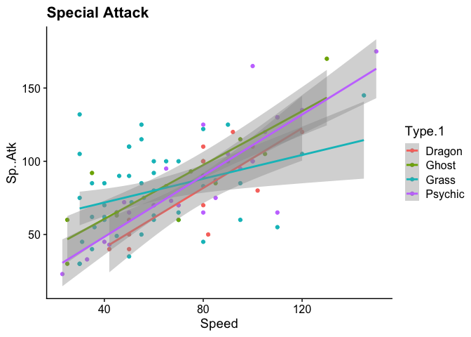
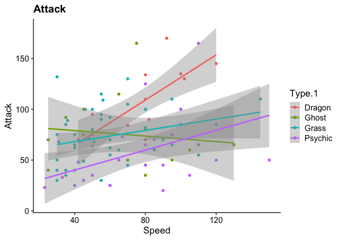
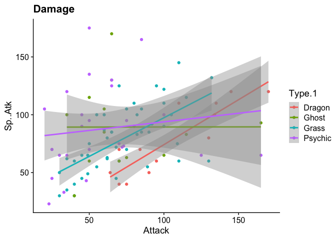
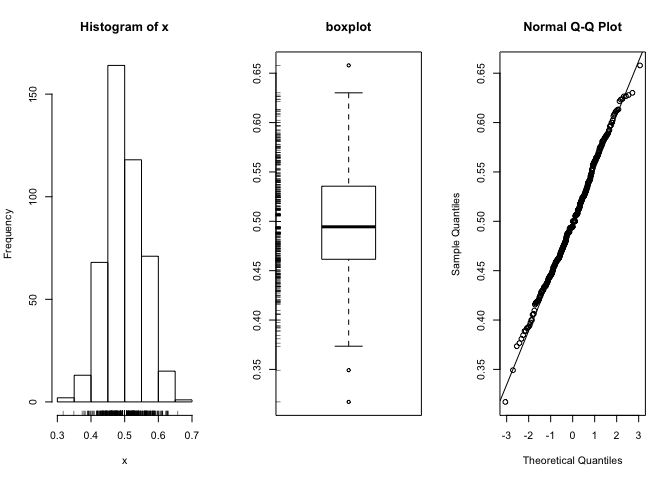

Homework 05
================
Rob Han
2/25/2020

## Loading Libraries

Use the following syntax to load any libraries that you need. This code
will prevent errors that will interfere with knitting of the Rmd file.
Also note that the `include=FALSE` option will prevent this code chunk
from appearing in the markdown file.

We will load the entire tidyverse library, which includes *dplyr*,
*ggplot2*, *readr*, and other packages.

I recently found out that competitive pokemon battling is kind of a
thing which is pretty cool and brings me back to when I was obsessed
with pokemon in middle-school. When I was a kid I really wanted to be a
gym leader… A pokemon gym leader. Many pokemon gym leaders will follow a
theme when it comes to picking their team members. So I wonder, can data
analysis help me choose what type my gym should be?

Main Database With Generation and Legendary flag.

Accessed from *<https://www.kaggle.com/abcsds/pokemon>*

## Data import and checking

The datafile itself is in csv format and is of a decent size.

``` r
project_data <- read.csv("Pokemon.csv")
```

Check the data, make sure everything has been imported.

``` r
str(project_data)
```

    ## 'data.frame':    800 obs. of  13 variables:
    ##  $ X.        : int  1 2 3 3 4 5 6 6 6 7 ...
    ##  $ Name      : Factor w/ 800 levels "Abomasnow","AbomasnowMega Abomasnow",..: 81 330 746 747 103 104 100 101 102 666 ...
    ##  $ Type.1    : Factor w/ 18 levels "Bug","Dark","Dragon",..: 10 10 10 10 7 7 7 7 7 18 ...
    ##  $ Type.2    : Factor w/ 19 levels "","Bug","Dark",..: 15 15 15 15 1 1 9 4 9 1 ...
    ##  $ Total     : int  318 405 525 625 309 405 534 634 634 314 ...
    ##  $ HP        : int  45 60 80 80 39 58 78 78 78 44 ...
    ##  $ Attack    : int  49 62 82 100 52 64 84 130 104 48 ...
    ##  $ Defense   : int  49 63 83 123 43 58 78 111 78 65 ...
    ##  $ Sp..Atk   : int  65 80 100 122 60 80 109 130 159 50 ...
    ##  $ Sp..Def   : int  65 80 100 120 50 65 85 85 115 64 ...
    ##  $ Speed     : int  45 60 80 80 65 80 100 100 100 43 ...
    ##  $ Generation: int  1 1 1 1 1 1 1 1 1 1 ...
    ##  $ Legendary : Factor w/ 2 levels "False","True": 1 1 1 1 1 1 1 1 1 1 ...

``` r
cat("rows", nrow(project_data))
```

    ## rows 800

``` r
cat("\ncolumns", ncol(project_data))
```

    ## 
    ## columns 13

``` r
head(project_data)
```

    ##   X.                  Name Type.1 Type.2 Total HP Attack Defense Sp..Atk
    ## 1  1             Bulbasaur  Grass Poison   318 45     49      49      65
    ## 2  2               Ivysaur  Grass Poison   405 60     62      63      80
    ## 3  3              Venusaur  Grass Poison   525 80     82      83     100
    ## 4  3 VenusaurMega Venusaur  Grass Poison   625 80    100     123     122
    ## 5  4            Charmander   Fire          309 39     52      43      60
    ## 6  5            Charmeleon   Fire          405 58     64      58      80
    ##   Sp..Def Speed Generation Legendary
    ## 1      65    45          1     False
    ## 2      80    60          1     False
    ## 3     100    80          1     False
    ## 4     120    80          1     False
    ## 5      50    65          1     False
    ## 6      65    80          1     False

``` r
tail(project_data)
```

    ##      X.                Name  Type.1 Type.2 Total  HP Attack Defense Sp..Atk
    ## 795 718    Zygarde50% Forme  Dragon Ground   600 108    100     121      81
    ## 796 719             Diancie    Rock  Fairy   600  50    100     150     100
    ## 797 719 DiancieMega Diancie    Rock  Fairy   700  50    160     110     160
    ## 798 720 HoopaHoopa Confined Psychic  Ghost   600  80    110      60     150
    ## 799 720  HoopaHoopa Unbound Psychic   Dark   680  80    160      60     170
    ## 800 721           Volcanion    Fire  Water   600  80    110     120     130
    ##     Sp..Def Speed Generation Legendary
    ## 795      95    95          6      True
    ## 796     150    50          6      True
    ## 797     110   110          6      True
    ## 798     130    70          6      True
    ## 799     130    80          6      True
    ## 800      90    70          6      True

Checking out the dataset we can see that we have a number of variables
which describe some basic information about each Pokemon, notably their
battle stats and Legendary status. According to the Pokemon company
there are currently 807 Pokemon. Since this dataset only includes 721
Pokemon up to generation 6, it’s likely that the dataset is missing
Pokedex entries from the most recent games. This is okay because I
stopped playing Pokemon after generation 4 so I could care less about
these new-fangled pokemons. We don’t immediately see any NA’s however
that doesn’t mean they aren’t present. We’ll check that next.

To check if we have NA’s in the dataset that aren’t found by head/tail
sampling we can use the following code to count NA instances.

``` r
sum(is.na(project_data)) 
```

    ## [1] 0

Since the number of NA’s is 0 we will not need to take care and account
for them later when making graphs.

## Data wrangling

At this stage we can proceed to cut down the dataset to suit our
purposes. Since I have no a mild attatchment to the pokemon I used when
I was a kid we’ll filter out the later generations of pokemon.

``` r
pokemon <- dplyr::filter(project_data, Generation <= 4)
```

In pokemon battles, being able to make the first move can often dictate
the flow of the entire battle. Some people will opt for pokemon that can
debuff the oponents team, but lets be honest overwhelming power is the
way to go. Our opponent needs to be utterly humiliated for full
immersion; Ash Ketchum never used a status debuff (to my knowledge) so
neither will I. What I want is an opener that can hit hard and fast so
we’ll look specificaly at the attack, special attack, and speed stats of
various pokemon.

To check the distribution of these stats we can visualie with a simple
eda and run the Shapiro normality
test.

``` r
simple.eda(pokemon$Attack)
```

<!-- -->

``` r
simple.eda(pokemon$Sp..Atk)
```

<!-- -->

``` r
simple.eda(pokemon$Speed)
```

<!-- -->

``` r
shapiro.test(pokemon$Attack)
```

    ## 
    ##  Shapiro-Wilk normality test
    ## 
    ## data:  pokemon$Attack
    ## W = 0.9773, p-value = 1.466e-07

``` r
shapiro.test(pokemon$Sp..Atk)
```

    ## 
    ##  Shapiro-Wilk normality test
    ## 
    ## data:  pokemon$Sp..Atk
    ## W = 0.96175, p-value = 8.404e-11

``` r
shapiro.test(pokemon$Speed)
```

    ## 
    ##  Shapiro-Wilk normality test
    ## 
    ## data:  pokemon$Speed
    ## W = 0.98303, p-value = 4.799e-06

``` r
skewness(pokemon$Attack)
```

    ## [1] 0.5721488

``` r
skewness(pokemon$Sp..Atk)
```

    ## [1] 0.7410125

``` r
skewness(pokemon$Speed)
```

    ## [1] 0.3936992

The Shapiro test returned results indicating that the hypothesis that
the data is normally distributed should be rejected (Attack: 1.466e-07,
Special Attack: 8.404e-11, Speed: 4.799e-06). Taking a look at the skew
we can see that all of our variables are right skewed (Attack:
0.5721488, Special Attack: 0.7410125, Speed: 0.3936992). There are some
things we could try right away to get a more normal distribution but
we’ll leave it be for now.

``` r
ggplot(pokemon, aes(x = Speed, y = Attack, color = Legendary)) +
  geom_point() +
  geom_smooth(method = "glm") +
  theme_cowplot()
```

<!-- -->

``` r
ggplot(pokemon, aes(x = Speed, y = Sp..Atk, color = Legendary)) +
  geom_point() +
  geom_smooth(method = "glm") +
  theme_cowplot()
```

<!-- -->

``` r
ggplot(pokemon, aes(x = Attack, y = Sp..Atk, color = Legendary)) +
  geom_point() +
  geom_smooth(method = "glm") +
  theme_cowplot()
```

<!-- -->

The scatterplot with glm overlay shows legendary pokemon are not only
some of the fastest pokemon, they also appear to be some of the
strongest in terms of attack/special attack power. These legendary
pokemon are definitely the ones contributing the most to the skew in our
dataset.

That being said legendary pokemon aren’t exactly the easiest to come by.
It might be more useful to look at the same relationship while excluding
legendary pokemon. In this scenario we might distinguish pokemon by
their primary type. Since there are a lot of types we should seperate
into two or three subsets.
<https://stackoverflow.com/questions/5584597/how-to-filter-a-tables-row-based-on-an-external-list/53416497>

``` r
bug_to_fighting <- c("Bug", "Dark", "Dragon", "Electric", "Fairy", "Fighting") 
fire_to_normal <- c("Fire", "Ghost", "Grass", "Ground", "Ice", "Normal")
posion_to_water <- c("Poison", "Psychic", "Rock", "Steel", "Water")
# Filter out legendary pokemon
non_legendary <- dplyr::filter(pokemon, Legendary == "False") 
# Create subset df's
Bug_Grass <- subset(non_legendary, Type.1 %in% bug_to_fighting)
Fight_Ground <- subset(non_legendary, Type.1 %in% fire_to_normal)
Posion_Water <- subset(non_legendary, Type.1 %in% posion_to_water)

#Recheck population distribution
shapiro.test(pokemon$Attack)
```

    ## 
    ##  Shapiro-Wilk normality test
    ## 
    ## data:  pokemon$Attack
    ## W = 0.9773, p-value = 1.466e-07

``` r
shapiro.test(pokemon$Sp..Atk)
```

    ## 
    ##  Shapiro-Wilk normality test
    ## 
    ## data:  pokemon$Sp..Atk
    ## W = 0.96175, p-value = 8.404e-11

``` r
shapiro.test(pokemon$Speed)
```

    ## 
    ##  Shapiro-Wilk normality test
    ## 
    ## data:  pokemon$Speed
    ## W = 0.98303, p-value = 4.799e-06

``` r
skewness(pokemon$Attack)
```

    ## [1] 0.5721488

``` r
skewness(pokemon$Sp..Atk)
```

    ## [1] 0.7410125

``` r
skewness(pokemon$Speed)
```

    ## [1] 0.3936992

After filtering out the legendary pokemon the Shaprio test still does
not give us p-values we’d like to see (Attack: 1.782e-06, Special
Attack: 1.124e-08, Speed: 1.674e-05). Checking out the skewness (Attack:
0.5268547, Special Attack: 0.6303942, Speed: 0.3784766), the right skew
seems to have been tamed a little but has not reached a level where we
can say the skew is neglibible. Although we have removed the legendary
pokemon we haven’t removed Mega-forms which were added after generation
IV. These pokemon are not counted as legendaries and are a suped up form
of a normal pokemon with legendary-level stats. Right now we can’t
remove these pokemon however they will be removed later.

``` r
ggplot(Bug_Grass, aes(x = Speed, y = Sp..Atk, color = Type.1)) +
  geom_point() +
  geom_smooth(method = "glm") +
  ggtitle("Special Attack") +
  theme_cowplot()
```

<!-- -->

``` r
ggplot(Bug_Grass, aes(x = Speed, y = Attack, color = Type.1)) +
  geom_point() +
  geom_smooth(method = "glm") +
  ggtitle("Attack") +
  theme_cowplot()
```

<!-- -->

``` r
ggplot(Fight_Ground, aes(x = Speed, y = Sp..Atk, color = Type.1)) +
  geom_point() +
  geom_smooth(method = "glm") +
  ggtitle("Special Attack") +
  theme_cowplot()
```

<!-- -->

``` r
ggplot(Fight_Ground, aes(x = Speed, y = Attack, color = Type.1)) +
  geom_point() +
  geom_smooth(method = "glm") +
  ggtitle("Attack") +
  theme_cowplot()
```

<!-- -->

``` r
ggplot(Posion_Water, aes(x = Speed, y = Sp..Atk, color = Type.1)) +
  geom_point() +
  geom_smooth(method = "glm") +
  ggtitle("Special Attack") +
  theme_cowplot()
```

<!-- -->

``` r
ggplot(Posion_Water, aes(x = Speed, y = Attack, color = Type.1)) +
  geom_point() +
  geom_smooth(method = "glm") +
  ggtitle("Attack") +
  theme_cowplot()
```

<!-- -->
When we break it down this way we can get a general sense for what
pokemon type has the highest performers are with regard to my needs for
an opener. We’ll pick a few of the best looking types and compare those
together

``` r
best1 <- c("Psychic", "Ghost", "Dragon", "Grass")
high_performers <- subset(non_legendary, Type.1 %in% best1)

ggplot(high_performers, aes(x = Speed, y = Sp..Atk, color = Type.1)) +
  geom_point() +
  geom_smooth(method = "glm") +
  ggtitle("Special Attack") +
  theme_cowplot()
```

<!-- -->

``` r
ggplot(high_performers, aes(x = Speed, y = Attack, color = Type.1)) +
  geom_point() +
  geom_smooth(method = "glm") +
  ggtitle("Attack") +
  theme_cowplot()
```

<!-- -->

``` r
ggplot(high_performers, aes(x = Attack, y = Sp..Atk, color = Type.1)) +
  geom_point() +
  geom_smooth(method = "glm") +
  ggtitle("Damage") +
  theme_cowplot()
```

<!-- -->

Comparing stats is great and all but how can we be sure that they will
tell the whole story. Obviously there are a lot of other factors which
can influence the outcome of a battle. Therefore, it would be very nice
if we had some pokemon battle data… Oh wait we do. The Weedle’s cave
challenge was originally intended as a machine learning project to
predict the outcome of a 1v1 pokemon battle using a large dataset of
random 1v1 pokemon battles. Unfortunately the algorithim determining the
dataset’s winners was unable to take into account many factors such as
pokemon moves, and trainer decisions; however since the simulation can’t
use those factors it must rely purely on pokemon stats which is exactly
what we’ve been looking at. Lets load in the data and see what we have.

Using data from the Weedle’s cave challenge we can estimate the winrate
ratio of each pokemon.
<https://stackoverflow.com/questions/5577727/is-there-an-r-function-for-finding-the-index-of-an-element-in-a-vector>

``` r
# Load data
battle_data <- read.csv("combats.csv")
# Filter out later generation pokemon
battle_data <- dplyr::filter(battle_data, Winner < 493)
battle_data <- dplyr::filter(battle_data, First_pokemon < 493)
battle_data <- dplyr::filter(battle_data, Second_pokemon < 493)
# Initialize column variables in pokemon df
pokemon$Wins <- 0
pokemon$Battles <- 0

# Populate new column variables in pokemon df
for (i in 1:length(battle_data$Winner)){
  # Battles
  pmon_index1 <- match(battle_data$First_pokemon[i], pokemon$X.) # Find index of pokemon in pokemon df using pokedex no.
  pmon_index2 <- match(battle_data$Second_pokemon[i], pokemon$X.)
  pmon_index1 <- pmon_index1[1] # In some cases there are two pokedex entries for the same pokemon bc of "Mega Evolutions" idk its too new for me lol. Anyways this makes sure we only get the index of the original pokemon form.
  pmon_index2 <- pmon_index2[1]
  pokemon[pmon_index1, 15] <- pokemon[pmon_index1, 15] + 1 # Add to relevant count
  pokemon[pmon_index2, 15] <- pokemon[pmon_index2, 15] + 1
  # Wins
  pmon_index3 <- match(battle_data$Winner[i], pokemon$X.)
  pmon_index3 <- pmon_index1[1]
  pokemon[pmon_index3, 14] <- pokemon[pmon_index3, 14] + 1}

pokemon <- dplyr::filter(pokemon, Battles != 0) # Filter out those random "Mega Evolutions"
pokemon <- dplyr::filter(pokemon, Legendary == "False")
# Handles win rate calculations
pokemon$WR <- 0
for (i in 1:length(pokemon$WR)){
  pokemon$WR[i] = pokemon$Wins[i]/pokemon$Battles[i]
  }
```

We now have simulated winrate data from the Weedle’s cave challenge
associated with our original pokemon dataset. Furthermore, the mega
forms have been removed from the data set. What does this winrate data
look like?

``` r
simple.eda(pokemon$WR)
```

<!-- -->

``` r
shapiro.test(pokemon$WR)
```

    ## 
    ##  Shapiro-Wilk normality test
    ## 
    ## data:  pokemon$WR
    ## W = 0.99564, p-value = 0.2418

``` r
skewness(pokemon$WR)
```

    ## [1] 0.09774497

According to the Shapiro test win rate is likely normally distributed (p
= 0.2418) with skewness = 0.09774497 so not very skewed. Since we know
that the winrate data looks pretty good why don’t we check out what
happens if we check our “high performers” with the winrate data.

``` r
best1 <- c("Psychic", "Ghost", "Dragon", "Grass")
high_performers <- subset(pokemon, Type.1 %in% best1)

ggplot(high_performers, aes(x = Attack, y = (WR), color = Type.1)) +
  geom_point() +
  geom_smooth(method = "glm") +
  theme_cowplot()
```

\[\](Homework05\_files/figure-gfm/WR data vs stats of “high
performers”-1.png)<!-- -->

``` r
ggplot(high_performers, aes(x = Sp..Atk, y = (WR), color = Type.1)) +
  geom_point() +
  geom_smooth(method = "glm") +
  theme_cowplot()
```

\[\](Homework05\_files/figure-gfm/WR data vs stats of “high
performers”-2.png)<!-- -->

``` r
ggplot(high_performers, aes(x = Speed, y = (WR), color = Type.1)) +
  geom_point() +
  geom_smooth(method = "glm") +
  theme_cowplot()
```

\[\](Homework05\_files/figure-gfm/WR data vs stats of “high
performers”-3.png)<!-- -->

Interestingly it seems that only dragon type pokemon benefit from
increases in either speed, attack, or special attack stats. Looking
closer, we see that the most pronounced benefit seems to come from a
higher speed stat.

To be honest, I never really saw myself as a Psychic, Ghost, or Grass
gym leader. I really liked Water, Fire, Dragon, and Fighting pokemon so
lets run the same modeling with those choices instead.

``` r
choices <- c("Water", "Fire", "Dragon", "Fighting")
my_choices <- subset(pokemon, Type.1 %in% choices)

ggplot(my_choices, aes(x = Attack, y = (WR), color = Type.1)) +
  geom_point() +
  geom_smooth(method = "glm") +
  theme_cowplot()
```

<!-- -->

``` r
ggplot(my_choices, aes(x = Sp..Atk, y = (WR), color = Type.1)) +
  geom_point() +
  geom_smooth(method = "glm") +
  theme_cowplot()
```

<!-- -->

``` r
ggplot(my_choices, aes(x = Speed, y = (WR), color = Type.1)) +
  geom_point() +
  geom_smooth(method = "glm") +
  theme_cowplot()
```

<!-- -->

I really like the way the fighting type looks out in terms of offensive
power. Especially when looking at attack, the win rate for fighting
types seems to scale heaviliy with the attack and special attack stats.
They are a little lacking speed-wise when compared to the other selected
types but there are ways to get around going second.

My hypothesis: Hitting hard and and fast is in my opinion the best way
to beat down all those pesky challengers to my hypothetical pokemon gym.

``` r
fighting <- subset(pokemon, Type.1 == "Fighting")
attack_glm <- glm(WR ~ Attack, data = fighting)
sp_attack_glm <- glm(WR ~ Sp..Atk, data = fighting)
speed_glm <- glm(WR ~ Speed, data = fighting)

cat("Attack:", attack_glm$aic)
```

    ## Attack: -27.48543

``` r
cat("\nSpecial Attack:", sp_attack_glm$aic)
```

    ## 
    ## Special Attack: -24.9825

``` r
cat("\nSpeed:", speed_glm$aic)
```

    ## 
    ## Speed: -24.53929

The AIC results for the specific attributes I’ve chosen are not hugely
different from one another (Attack: -27.48543, Sp.Atack: -24.9825,
Speed: -24.53929). The attack stat is 3 points lower than the others
indicating a superior goodness of
fit.

``` r
fighting_fullglm = glm(WR ~ Attack + Sp..Atk + Defense + Sp..Def + Speed + HP, data = fighting)
summary(fighting_fullglm)
```

    ## 
    ## Call:
    ## glm(formula = WR ~ Attack + Sp..Atk + Defense + Sp..Def + Speed + 
    ##     HP, data = fighting)
    ## 
    ## Deviance Residuals: 
    ##      Min        1Q    Median        3Q       Max  
    ## -0.09389  -0.01989  -0.01061   0.02652   0.08034  
    ## 
    ## Coefficients:
    ##               Estimate Std. Error t value Pr(>|t|)  
    ## (Intercept)  0.3437251  0.1209919   2.841   0.0295 *
    ## Attack       0.0018761  0.0015916   1.179   0.2831  
    ## Sp..Atk     -0.0006337  0.0016248  -0.390   0.7100  
    ## Defense      0.0040193  0.0026156   1.537   0.1753  
    ## Sp..Def     -0.0024768  0.0024959  -0.992   0.3593  
    ## Speed       -0.0004656  0.0019790  -0.235   0.8218  
    ## HP          -0.0002091  0.0012688  -0.165   0.8745  
    ## ---
    ## Signif. codes:  0 '***' 0.001 '**' 0.01 '*' 0.05 '.' 0.1 ' ' 1
    ## 
    ## (Dispersion parameter for gaussian family taken to be 0.005299564)
    ## 
    ##     Null deviance: 0.074386  on 12  degrees of freedom
    ## Residual deviance: 0.031797  on  6  degrees of freedom
    ## AIC: -25.281
    ## 
    ## Number of Fisher Scoring iterations: 2

In the full GLM we actually see several variables with pretty low Pr
values but not quite what we want to see. We can use the dropterm
function to see if we can improve our AIC. The objective of using
dropterm is removing superfluous predictors.

``` r
if (!require("MASS")) install.packages("MASS"); library(MASS)
dropterm(fighting_fullglm)
```

    ## Single term deletions
    ## 
    ## Model:
    ## WR ~ Attack + Sp..Atk + Defense + Sp..Def + Speed + HP
    ##         Df Deviance     AIC
    ## <none>     0.031797 -25.281
    ## Attack   1 0.039161 -24.573
    ## Sp..Atk  1 0.032604 -26.955
    ## Defense  1 0.044312 -22.966
    ## Sp..Def  1 0.037016 -25.305
    ## Speed    1 0.032091 -27.161
    ## HP       1 0.031941 -27.222

Lets try dropping the HP
variable.

``` r
fighting_fullglm2 = glm(WR ~ Attack + Sp..Atk + Defense + Sp..Def + Speed, data = fighting)
dropterm(fighting_fullglm2)
```

    ## Single term deletions
    ## 
    ## Model:
    ## WR ~ Attack + Sp..Atk + Defense + Sp..Def + Speed
    ##         Df Deviance     AIC
    ## <none>     0.031941 -27.222
    ## Attack   1 0.044888 -24.799
    ## Sp..Atk  1 0.032687 -28.922
    ## Defense  1 0.045370 -24.660
    ## Sp..Def  1 0.037505 -27.134
    ## Speed    1 0.032158 -29.134

``` r
fighting_fullglm3 = glm(WR ~ Attack + Sp..Atk + Defense + Sp..Def, data = fighting)
dropterm(fighting_fullglm3)
```

    ## Single term deletions
    ## 
    ## Model:
    ## WR ~ Attack + Sp..Atk + Defense + Sp..Def
    ##         Df Deviance     AIC
    ## <none>     0.032158 -29.134
    ## Attack   1 0.049677 -25.481
    ## Sp..Atk  1 0.035491 -29.852
    ## Defense  1 0.056797 -23.739
    ## Sp..Def  1 0.050118 -25.366

You may have noticed that the difference in AIC between each term isn’t
that large. This isn’t a surprising observation since the outcomes of
the simulated pokemon battles were likely based on a calculation using
pokemon
stats.

``` r
fighting_fullglm4 <- glm(WR ~ Attack + Defense + Sp..Def, data = fighting)
dropterm((fighting_fullglm4))
```

    ## Single term deletions
    ## 
    ## Model:
    ## WR ~ Attack + Defense + Sp..Def
    ##         Df Deviance     AIC
    ## <none>     0.035491 -29.852
    ## Attack   1 0.049783 -27.453
    ## Defense  1 0.057246 -25.637
    ## Sp..Def  1 0.050119 -27.366

Surprisingly (to me at least) it seems like the top three predictors for
win rate with a fighting type pokemon are their attack, defense and
special defense stats.
